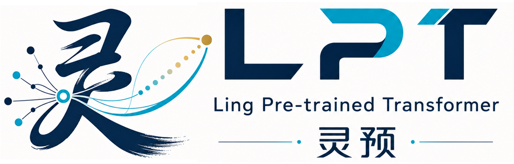

# lpt-llm

**灵预 - “灵”代表生成创意，“预”代表预训练。**  
`lpt-llm` 是一个面向研究与工程验证的原生 LLM 项目。  
模型名为 **LPT**，英文简称 **LingYure**，英文全称 **Ling Pre-trained Transformer**，中文名 **灵预**。  
当前主线是 **LPT v2-only**。

## 文档职责

README 只作为项目入口、主线边界和目录导航。

训练、推理、评测、checkpoint、实验命令和阶段性任务不在 README 中重复维护，统一以 `help/` 下文档为准。

## 权威文档

- [help/命令.md](help/命令.md)：当前 v2 命令维护入口。训练、推理、评测、checkpoint、smoke test 等命令以此文件为准。
- [help/任务清单.md](help/任务清单.md)：当前工程状态、已完成项、待办项与任务拆解。
- [help/LPTv2模型定型方案.md](help/LPTv2模型定型方案.md)：v2 架构、模块语义、状态边界和定型约束。
- [help/LPTv2模型定型方案变动记录.md](help/LPTv2模型定型方案变动记录.md)：v2 方案演进记录。
- [help/longRoPE2总结.md](help/longRoPE2总结.md)：LongRoPE2 相关设计和总结。
- [help/LPTv2扩展实验/](help/LPTv2扩展实验/)：扩展实验记录、评测报告和实验产物说明。

## 目录导航

- `lpt_config/`：v2 配置、阶段训练 recipe、规格 preset、LongRoPE2 因子工具。
- `lpt_model/`：`LPTV2`、状态结构、LongRoPE2、Paged KV、RetNetAssist、xLSTMMemory、参数统计。
- `lpt_runtime/`：Attention 后端能力描述、执行层、文件原子写入工具。
- `lpt_data/`：结构化数据 schema、manifest、批处理与转换基础。
- `lpt_protocol/`：chat template 与训练片段渲染。
- `lpt_training/`：v2 训练循环、checkpoint/trainer state、metrics/TensorBoard。
- `lpt_workflows/`：`text_pretrain`、`chat_sft`、`chat_lora` 三阶段主线入口。
- `lpt_inference/`：chat 推理、`InferenceSession` 和推理展示工具。
- `lpt_lora/`：v2 LoRA adapter 注入、保存与加载。
- `lpt_eval/`：v2 baseline、长上下文、资源、xLSTM 评测报告生成。
- `tools/`：数据转换、训练 smoke、评测、checkpoint 工具。
- `tests/`：v2 单元测试与回归测试。
- `help/`：命令、任务、定型方案和实验报告。
- `data/`：本地数据目录，默认不进入版本控制。
- `artifacts/`：本地训练与评测产物，默认不进入版本控制。

根目录入口脚本：

- `main.py`：v2 chat 推理入口。
- `main-pretrain.py`：`text_pretrain` 阶段入口。
- `main-sft.py`：`chat_sft` 阶段入口。
- `main-LoRA.py`：`chat_lora` 阶段入口。

## 项目定位

`lpt-llm` 当前是以 LPT（Ling Pre-trained Transformer，灵预）为核心的 LLM 研究工程。它适合验证模型结构、长上下文策略、训练 recipe、tokenizer/template、checkpoint schema、评测流程和执行层设计；它还不是完整生产级分布式训练系统或服务化推理平台。
