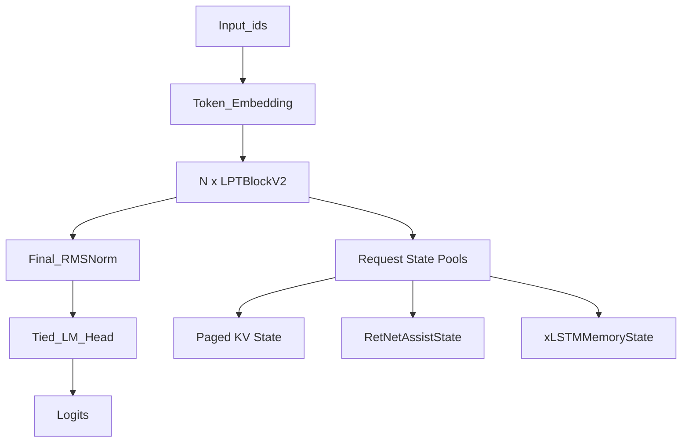
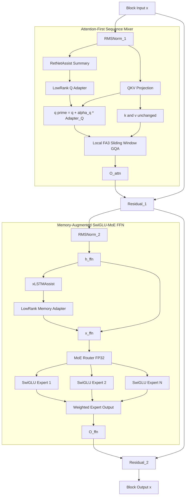
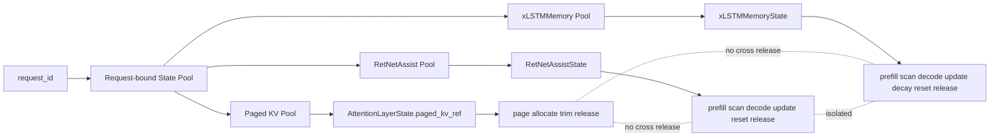

# LPT v2 模型定型方案

## 模型架构

LPT v2 定型为 `Attention-First + RetNetAssist-Q + Paged KV + Memory-Augmented SwiGLU-MoE`。

核心结构：

- `Local FlashAttention-3 Attention` 是唯一 sequence mixer 主干。
- `Paged KV Cache` 只保存局部窗口内真实 token 的 `K/V`。
- `RetNetAssist` 只维护轻量全局摘要，并通过低秩 `Q Adapter` 调制当前 token 的 `query`。
- `RetNetAssist` 不调制 `key/value`，不写入 Paged KV，不直接注入 block 输出。
- `RetNetAssist` 参数跨层共享，状态按启用层或 layer group 独立维护。
- `RetNetAssist` 与 `xLSTMAssist` 使用独立 request-bound state pool，Paged KV page 裁剪不触发 Assist state 释放或重置。
- `RetNetAssist` 只读取 Attention 前的归一化特征，`xLSTMAssist` 只读取 FFN 前的归一化特征，两条记忆路径不互相消费对方状态。
- FFN 层使用同质 `SwiGLU-MoE`，所有 MoE experts 都是无状态 SwiGLU。
- `xLSTMAssist` 是 FFN 侧外挂记忆模块，在启用层确定性更新状态，并通过低秩 adapter 生成 `x_ffn`。
- `xLSTMAssist` 不作为 MoE expert 或 router target，不作为独立主干层，不进入 Paged KV，不影响 Attention cache。
- MoE router 与 SwiGLU experts 使用 memory-augmented `x_ffn`。

架构标识：

```text
architecture_version = "lpt_v2"
block_type = "lpt_attention_retnet_q_adapter"
sequence_mixer_mode = "local_attention_with_retnet_q_adapter"
```

## LPT v2 架构全景图

```text
Input_ids
  │
  ▼
Token_Embedding
  │
  ├──────────────────────────────────────────────────────────────┐
  │                 循环 N 层：LPTBlockV2                         │
  ▼                                                              │
RMSNorm_1                                                        │
  │                                                              │
  ▼                                                              │
╔════════════════════════════════════════════════════════════════╗ │
║ Attention-First Sequence Mixer                                 ║ │
║ Local FA3 Attention 主干 + RetNetAssist Q-only 低秩辅助          ║ │
╠════════════════════════════════════════════════════════════════╣ │
║                                                                ║ │
║ [RetNetAssist，全局轻量摘要]                                  ║ │
║   s_t = SharedRetNetSummary(s_{t-1}, x_norm)                   ║ │
║   z_t = LowRankProject(s_t)                                    ║ │
║   参数: 跨层共享；支持按 layer group 共享                       ║ │
║   状态: 按启用层或 layer group 独立维护                        ║ │
║   Prefill: SP-compatible parallel/chunkwise scan                ║ │
║   Decode: recurrent update                                     ║ │
║   状态: RetNetAssistState                                      ║ │
║   边界: 不生成完整 RetNet 分支，不进入 Paged KV                 ║ │
║                                                                ║ │
║ [QKV Projection + Q Adapter]                                   ║ │
║   q, k, v = Linear_QKV(x_norm)                                 ║ │
║   q' = q + alpha_q_fp32 * Adapter_Q(z_t)                       ║ │
║   k  = k                                                       ║ │
║   v  = v                                                       ║ │
║   约束: 只改当前 q，不改 k/v，不回写已缓存 KV page               ║ │
║                                                                ║ │
║ [LocalFA3AttentionMixer]                                       ║ │
║   位置: LongRoPE2                                              ║ │
║   注意力: sliding window causal GQA                            ║ │
║   后端: FlashAttention-3 -> FlashAttention-2 -> SDPA           ║ │
║   状态: AttentionLayerState.paged_kv_ref                       ║ │
║   Paged KV: 只保存真实 token 的局部 K/V                         ║ │
║   输出: O_attn                                                 ║ │
╚════════════════════════════════════════════════════════════════╝ │
  │                                                              │
  ▼                                                              │
Residual_1: x = x + O_attn                                       │
  │                                                              │
  ▼                                                              │
RMSNorm_2                                                        │
  │                                                              │
  ▼                                                              │
╔════════════════════════════════════════════════════════════════╗ │
║ Memory-Augmented SwiGLU-MoE FFN Layer                          ║ │
║ 同质 MoE 专家 + xLSTM 外挂记忆辅助                              ║ │
╠════════════════════════════════════════════════════════════════╣ │
║ [xLSTMAssist，可选外挂记忆]                                    ║ │
║   h_ffn = RMSNorm_2(x)                                         ║ │
║   m_t = xLSTM(m_{t-1}, h_ffn)                                  ║ │
║   u_t = LowRankProject(m_t)                                    ║ │
║   x_ffn = h_ffn + beta_fp32 * Adapter_Mem(u_t)                 ║ │
║   Prefill: chunkwise recurrent scan                            ║ │
║   Decode: recurrent update                                     ║ │
║   连续性: prefill_to_decode                                    ║ │
║   状态: xLSTMMemoryState                                       ║ │
║                                                                ║ │
║ Router(input = x_ffn)                                          ║ │
║   logits 使用 FP32                                             ║ │
║   ├── SwiGLU Expert #1                                         ║ │
║   ├── SwiGLU Expert #2                                         ║ │
║   ├── ...                                                      ║ │
║   └── SwiGLU Expert #N                                         ║ │
║                                                                ║ │
║ xLSTMAssist 状态策略: selected_layers / every_n_layers         ║ │
║ xLSTMAssist 状态粒度: 按启用层独立                              ║ │
║ xLSTMAssist 遗忘策略: token interval decay + boundary zero reset║ │
╚════════════════════════════════════════════════════════════════╝ │
  │                                                              │
  ▼                                                              │
Residual_2: x = x + O_ffn                                        │
  │                                                              │
  └──────────────────────────────────────────────────────────────┘
  │
  ▼
Final_RMSNorm
  │
  ▼
Tied_LM_Head
  │
  ▼
Logits
```

## LPT v2 Mermaid 运行流程图



## LPTBlockV2 Mermaid 结构图



## LPT v2 状态池隔离图



## 配置字段

```text
attention_backend_policy = "auto"
attention_backend_priority = ["flash_attention_3", "flash_attention_2", "sdpa"]
attention_window_size = 2048 | 4096
attention_is_causal = true
attention_position_encoding = "longrope2"

cache_backend = "paged_kv"
kv_cache_scope = "local_real_tokens_only"
page_block_size = 256
cla_share_every_n_layers = 1

retnet_assist_enabled = true
retnet_assist_mode = "q_adapter"
retnet_assist_layers = "every_4_layers | selected_layers | all_layers"
retnet_parameter_sharing = "global | group"
retnet_state_sharing = "group | per_layer"
retnet_prefill_scan_policy = "sp_compatible_chunkwise_scan"
retnet_sequence_parallel_policy = "ring_state_handoff | disabled"
retnet_sp_handoff_metrics_enabled = true
retnet_state_lifecycle = "request_bound_state_pool"
retnet_state_dim = 64 | 128
retnet_adapter_rank = 16 | 32
retnet_adapter_target = ["q"]
retnet_adapter_alpha_q_init = 1e-4
retnet_adapter_alpha_q_dtype = "fp32"
retnet_adapter_alpha_q_trainable = true
retnet_k_adapter_enabled = false
retnet_context_adapter_enabled = false
retnet_context_adapter_alpha = 0.0 -> learnable
retnet_enters_paged_kv = false
retnet_kv_replacement = false
attention_logit_bias_from_retnet = false

ffn_type = "memory_augmented_swiglu_moe"
moe_num_experts = 8
moe_top_k = 2
moe_router_dtype = "fp32"
moe_load_balance_loss_enabled = true
moe_router_z_loss_enabled = true
moe_router_input_mode = "memory_augmented_input | ffn_norm_only_eval"

xlstm_memory_enabled = false | true
xlstm_memory_mode = "ffn_input_adapter"
xlstm_memory_layers = "disabled | every_n_layers | selected_layers"
xlstm_memory_state_dim = 64 | 128
xlstm_memory_adapter_rank = 16 | 32
xlstm_memory_adapter_beta_init = 1e-4
xlstm_memory_adapter_beta_dtype = "fp32"
xlstm_memory_adapter_beta_policy = "fp32_sigmoid_clamped"
xlstm_memory_adapter_beta_range = [1e-5, 1.0]
xlstm_memory_as_router_target = false
xlstm_memory_gate_enabled = false
xlstm_memory_gate_mode = "input_conditioned_eval"
xlstm_memory_granularity = "selected_layers | every_n_layers | local_global_eval"
xlstm_memory_prefill_policy = "chunkwise_recurrent_scan"
xlstm_memory_state_continuity = "prefill_to_decode"
xlstm_memory_state_lifecycle = "request_bound_state_pool"
xlstm_memory_update_policy = "deterministic_on_enabled_layers"
xlstm_memory_state_policy = "window_decay_and_boundary_reset"
xlstm_memory_state_window_size = 4096 | 8192 | null
xlstm_memory_decay_counter_unit = "tokens"
xlstm_memory_state_decay_interval = 1024 | 2048
xlstm_memory_state_decay_factor = 0.95 | 0.98
xlstm_memory_reset_trigger_mode = ["boundary_metadata", "special_token", "session_event"]
xlstm_memory_reset_boundary_policy = ["document", "file", "chapter", "session_reset"]
xlstm_memory_boundary_token_ids = []
xlstm_memory_reset_action = "zero_state"
xlstm_memory_as_expert = false
xlstm_expert_count = 0
xlstm_as_standalone_block = false
moe_router_warmup_policy = "standard_balance_only"
```

## 配置约束

- `moe_router_input_mode` 是 Router 是否读取记忆调制输入的唯一控制项。
- `xlstm_memory_enabled=false` 时，`xlstm_memory_layers="disabled"`，`moe_router_input_mode="ffn_norm_only_eval"`。
- `xlstm_memory_enabled=true` 且启用层非空时，`moe_router_input_mode="memory_augmented_input"`。
- `xlstm_memory_as_router_target=false` 表示 xLSTMAssist 不参与 expert 选择目标，与 Router 输入模式独立。
- `retnet_state_sharing` 只允许 `group` 或 `per_layer`，所有 RetNetAssist state 都绑定 request state pool。
- `xlstm_memory_state_decay_interval` 按 token 计数触发；边界 reset 使用 `zero_state`。
- `Paged KV`、`RetNetAssistState`、`xLSTMMemoryState` 三类状态池独立分配、独立释放。

## 运行 Profile

- `lpt_v2_bootstrap`
  - Local Attention + SDPA + Dense KV。
  - `retnet_assist_enabled=false`。
  - `moe_num_experts=1`。
  - `xlstm_memory_enabled=false`。
  - `moe_router_input_mode="ffn_norm_only_eval"`。

- `lpt_v2_fa3_local`
  - Local FA3 Attention + Dense KV。
  - 用于验证 FA3 后端、窗口 mask、GQA、LongRoPE2。

- `lpt_v2_paged_kv`
  - Local FA3 Attention + Paged KV。
  - 用于验证分页缓存、释放、reset、window page 裁剪。

- `lpt_v2_assist`
  - Local FA3 Attention + Paged KV + Shared RetNetAssist Q Adapter。
  - `retnet_adapter_target=["q"]`。
  - `retnet_k_adapter_enabled=false`。

- `lpt_v2_base`
  - `lpt_v2_assist` + MoE SwiGLU。
  - `moe_num_experts=8`。
  - `xlstm_memory_enabled=false`。
  - `moe_router_input_mode="ffn_norm_only_eval"`。

- `lpt_v2_memory`
  - `lpt_v2_base` + xLSTMAssist FFN 输入外挂记忆。
  - 所有 MoE experts 仍为 SwiGLU。
  - `moe_router_input_mode="memory_augmented_input"`。
  - `xlstm_memory_state_continuity="prefill_to_decode"`。
  - 必须启用状态 decay、边界 reset、request state pool 和专项评测。

## 任务清单

## P0：配置与状态骨架

- [] 1. 定义 `ModelConfig` v2 字段
  - 字段范围：`architecture_version`、`block_type`、`sequence_mixer_mode`、`attention_backend_policy`、`attention_window_size`、`cache_backend`、`page_block_size`、`retnet_assist_*`、`moe_*`、`xlstm_memory_*`。
  - 成功标准：配置可 JSON 序列化，checkpoint 可严格恢复，不兼容 schema 被明确拒绝。

- [] 2. 定义 `LayerStateV2`
  - 状态类型：`AttentionLayerState`、`RetNetAssistState`、`MoELayerState`、`xLSTMMemoryState`。
  - 成功标准：RetNetAssist state、Paged KV ref、xLSTMMemoryState 物理隔离；RetNetAssist/xLSTM state 支持 request_id 绑定和释放元数据；Paged KV 裁剪不会释放或重置 Assist state。

- [] 3. 定义 Attention backend 抽象
  - 支持：`flash_attention_3 / flash_attention_2 / sdpa`。
  - capability：training、prefill、decode_kvcache、paged_kv、sliding_window、GQA、LongRoPE2、dtype、platform。
  - 成功标准：后端选择可测试、可记录、可降级。

- [] 4. 固化 CLA 共享策略
  - 配置值：`cla_share_every_n_layers=1`。
  - 成功标准：v2 的 Attention 层不共享 KV。

## P1：主干模型实现

- [ ] 5. 实现 `LPTBlockV2`
  - 范围：LocalAttentionMixer 主干 + Shared RetNetAssist Q Adapter + Memory-Augmented SwiGLU-MoE FFN 接口。
  - 成功标准：forward、prefill、decode 形状正确，状态更新正确。

- [ ] 6. 实现 Shared RetNetAssist
  - 范围：跨层共享参数、可选 group sharing、低维 state、按层或按 layer group 维护状态、SP-compatible parallel/chunkwise prefill、recurrent decode。
  - 成功标准：prefill 不走串行 token 循环；Sequence Parallel 下 state 依赖能沿切分边界传递；decode 可增量更新；`ring_state_handoff` 延迟和吞吐影响可报告。

- [ ] 7. 实现 Q-only Adapter
  - 公式：`q' = q + alpha_q * Adapter_Q(z_t)`。
  - 配置：`alpha_q` 使用 FP32 trainable scale，初始化为 `1e-4`，`k/v` 不改。
  - 成功标准：纯 Attention 初始行为可近似复现；BF16 混合精度下 alpha 不会停在 0；adapter alpha、范数、启用层可观测。

- [ ] 8. 实现 Local FlashAttention-3 Attention
  - 范围：sliding window、causal、GQA、LongRoPE2、FA2/SDPA fallback。
  - 成功标准：SDPA 与 FA 后端 logits 近似一致，窗口 mask 行为可测。

- [ ] 9. 接入 Paged KV Cache
  - 范围：block allocator、block table、cache seqlens、slot mapping、释放、reset、window page 裁剪。
  - 成功标准：单会话和多会话 decode 正确，无 page 泄漏；RetNetAssist 不进入 page 池；window page 裁剪不影响 RetNetAssistState 与 xLSTMMemoryState。

- [ ] 10. 引入同质 SwiGLU-MoE
  - 范围：先 `num_experts=1`，再 `num_experts=4/8`、top-k=2；所有 experts 均为 SwiGLU。
  - 成功标准：router 统计可落盘，checkpoint schema 能保存和恢复 experts。

## P2：评测与治理

- [ ] 11. 建立 LPT v2 对比基线
  - 对比项：`lpt_v1_hybrid_baseline`、`lpt_v2_bootstrap`、`lpt_v2_fa3_local`、`lpt_v2_paged_kv`、`lpt_v2_assist`、`lpt_v2_base`、`lpt_v2_memory`。
  - 成功标准：输出统一 JSON / Markdown 报告。

- [ ] 12. 完成长上下文准入
  - 指标：needle、长文本 PPL、QA/retrieval、代码/数学、格式遵循。
  - 成功标准：证明 Q-only RetNetAssist 对局部窗口裁剪有收益，或明确关闭/降频。

- [ ] 13. 完成资源指标准入
  - 指标：prefill tokens/sec、decode tokens/sec、首 token 延迟、每层耗时、显存峰值、RetNetAssist state bytes、xLSTMMemoryState bytes、Paged KV page bytes、MoE router entropy、expert load balance loss、router z_loss。
  - 成功标准：RetNetAssist 额外开销可量化，当前配置收益大于成本。

- [ ] 14. 实现 RetNetAssist State Pool
  - 范围：request_id 绑定、prefill/decode 状态切换、preempt 保留、reset/release 归还、连续批处理生命周期元数据。
  - 成功标准：多 request 混合 prefill/decode 时状态不串线；request 结束后无 RetNetAssist state 泄漏。

- [ ] 15. 完成 checkpoint schema v2
  - 范围：architecture version、attention/cache backend、Paged KV runtime metadata、RetNetAssist state schema、MoE/xLSTM memory 配置。
  - 成功标准：loader 严格拒绝 schema 不匹配 checkpoint。

- [ ] 16. 更新 `help/命令.md`
  - 范围：新增 v2 训练、推理、评测、FA3、Paged KV、RetNetAssist、SwiGLU-MoE、xLSTMMemory 参数。
  - 成功标准：正式命令与 CLI 参数一致。

## P3：外挂记忆与扩展实验

- [ ] 17. 启用 xLSTMAssist 外挂记忆
  - 范围：FFN 输入 adapter、确定性启用层策略、低维 memory state、chunkwise recurrent prefill、prefill_to_decode 连续性、状态生命周期、窗口/重置策略、专项评测。
  - 成功标准：状态追踪类任务有可复现收益；不作为 MoE expert 或 router target；不污染 Attention/RetNetAssist 状态；prefill 不走不可控 Python 逐 token 循环。

- [ ] 18. 实现 xLSTMAssist 状态池、衰减与边界重置
  - 范围：按 token interval 执行 `state *= decay_factor`，按 boundary metadata、special token、session event 执行 `zero_state` reset。
  - 成功标准：长文本状态污染、过度累积和显存占用可观测、可控制。

- [ ] 19. 实现 xLSTMAssist 输入适配器
  - 公式：`h_ffn = ffn_norm(x)`，`x_ffn = h_ffn + beta_fp32 * Adapter_Mem(u_t)`。
  - 配置：`beta=1e-4` FP32 trainable scale，effective beta 使用 FP32 sigmoid clamp。
  - 成功标准：标准 MoE 初始行为可近似复现；xLSTM memory adapter 的 beta、effective beta、范数、启用层可观测；Router 与 experts 使用 `x_ffn`，并提供 `ffn_norm_only_eval` 评估开关。

- [ ] 20. 评估 xLSTMAssist Memory Gate
  - 范围：输入记忆门控 `gate_m = sigmoid(W_gate(h_ffn))`，`x_ffn = h_ffn + beta_fp32 * Adapter_Mem(gate_m * u_t)`；输出门控评估 `O_ffn = gate_o ⊙ O_moe`。
  - 成功标准：只在状态追踪任务收益稳定且不造成 router collapse 时启用；输出门控不参与 expert 选择，仅做输出缩放，不计入省计算收益。

- [ ] 21. 评估 xLSTMAssist 记忆粒度
  - 范围：`selected_layers / every_n_layers`、按启用层独立状态、local/global memory 对照评估。
  - 成功标准：找到质量收益、状态连续性、显存开销之间的最小可用配置。

- [ ] 22. 评估 K Adapter
  - 范围：比对 `q_adapter` 与 `qk_adapter`。
  - 成功标准：K 注入在 sliding window 下收益稳定且成本可控，才允许进入主干。

- [ ] 23. 评估 RetNetAssist 参数与状态共享策略
  - 范围：参数 `global sharing / group sharing / per-layer`，状态 `group / per_layer`。
  - 成功标准：选择质量收益、状态语义和参数成本最优的共享策略。

- [ ] 24. 评估 RetNetAssist 启用层与 rank
  - 范围：`all_layers / every_2_layers / every_4_layers / selected_layers`，rank 8/16/32。
  - 成功标准：找到质量收益与计算成本的最小可用配置。

- [ ] 25. 评估 RetNetContextAdapter
  - 范围：`x = x + alpha_context * Adapter_Context(z_t)` 或 FFN 输入调制，不新增第二套检索状态。
  - 成功标准：若 Q-only 无法处理窗口外压缩内容，验证轻量上下文注入是否提升长上下文任务，且不破坏局部精确任务。

- [ ] 26. 评估 CLA 共享
  - 范围：`cla_share_every_n_layers=2` 对照评估。
  - 成功标准：吞吐或显存收益大于质量损失，并通过 Paged KV alias/refcount/reset 测试。

- [ ] 27. 评估 prefix sharing 与 continuous batching
  - 范围：基于 Paged KV block table 做调度层扩展。
  - 成功标准：多会话吞吐提升，延迟、显存、page 复用指标可报告。

- [ ] 28. 评估 KV cache 量化
  - 范围：Paged KV page 级别量化，不影响 RetNetAssist state。
  - 成功标准：显存下降有报告，质量退化可量化。

- [ ] 29. 评估低秩统一状态 / MLA 类压缩
  - 范围：长期对照评估。
  - 成功标准：显存、吞吐、长上下文质量均优于当前 v2 主干，才允许进入下一轮定型讨论。
