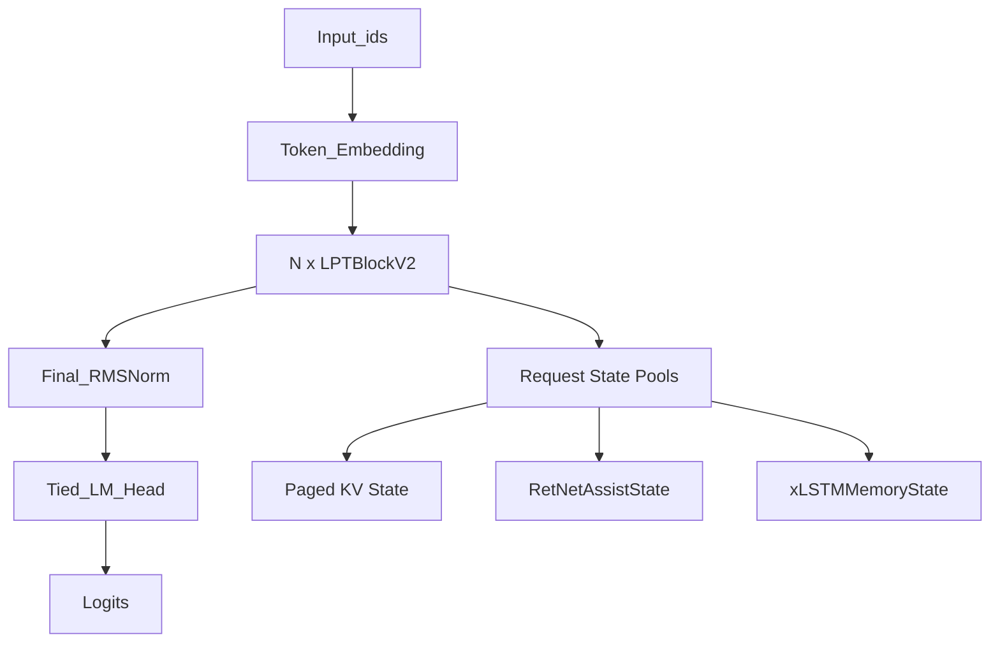
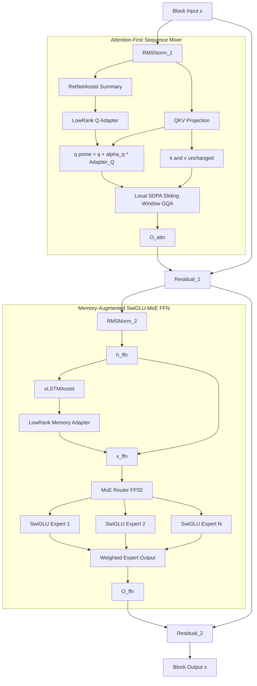
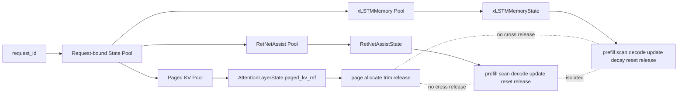

# LPT v2 模型定型方案

## 开发分支边界

- LPT v2 是独立模型开发分支，以 `architecture_version="lpt_v2"` 和当前 `model_config_schema_version` 作为唯一结构入口。
- LPT v2 不兼容 LPT v1 checkpoint、LPT v1 `ModelConfig`、旧参数名、旧训练 recipe 或旧推理加载路径。
- LPT v2 loader 对 schema、architecture version、block type、attention/cache backend、MoE/xLSTMMemory 配置执行严格校验。
- LPT v2 不提供自动迁移、参数名映射或隐式 fallback，以最干净的 v2 schema 实现训练、推理、评测和 checkpoint。
- 开发测试默认使用最小规格 `lpt_v2_dev_tiny`，功能闭环通过后再切换到更大规格。
- LPT v1 / ds-token 分支内容(`.tmp_lpt_v1_ds_archive`)只作为本地只读归档参考，归档目录不进入版本控制，也不得作为运行时 import 依赖。
- 若 LPT v2 需要复用 v1 基础件，必须从归档中复制到 v2 正式模块，并按 v2 命名、配置、状态和测试边界改造后再使用；禁止为了复用而保留 v1 兼容分支或跨目录依赖。

## 模型架构

LPT v2 语言主干定型为 `Attention-First + RetNetAssist-Q + Paged KV + Memory-Augmented SwiGLU-MoE`。多模态能力在后文定义为可选扩展，不能改变纯文本主干的默认语义和快路径。

核心结构：

- `Local SDPA Attention` 是当前定型的唯一 sequence mixer 主干。
- 当前 `model_config_schema_version=3` 纯文本路径的 `Paged KV Cache` 只保存局部窗口内真实 token 的 `K/V`；目标 `model_config_schema_version=4` 多模态路径按后文的有界固定媒体策略条件化扩展，不改变纯文本默认值。
- `Paged KV Cache` 只用于 prefill/decode 状态续接；训练 forward 固定关闭 KV cache，不向 page pool 写入训练 K/V。
- `RetNetAssist` 只维护轻量全局摘要，并通过低秩 `Q Adapter` 调制当前 token 的 `query`。
- `RetNetAssist` 不调制 `key/value`，不写入 Paged KV，不直接注入 block 输出。
- `RetNetAssist` 参数默认跨层共享，并支持按 layer group 或 per-layer 共享策略评估；状态按启用层或 layer group 维护。
- `RetNetAssist` 与 `xLSTMAssist` 使用独立 request-bound state pool，Paged KV page 裁剪不触发 Assist state 释放或重置。
- `RetNetAssist` 只读取 Attention 前的归一化特征，`xLSTMAssist` 只读取 FFN 前的归一化特征，两条记忆路径不互相消费对方状态。
- FFN 层使用同质 `SwiGLU-MoE`，所有 MoE experts 都是无状态 SwiGLU。
- `SwiGLU-MoE` 运行时按 router top-k 稀疏执行，只计算当前 token 命中的 experts；未命中的 experts 不参与当前 batch 的前向与反向计算。
- `xLSTMAssist` 是 FFN 侧外挂记忆模块，在启用层确定性更新状态，并通过低秩 adapter 生成 `x_ffn`。
- `xLSTMAssist` 不作为 MoE expert 或 router target，不作为独立主干层，不进入 Paged KV，不影响 Attention cache。
- MoE router 与 SwiGLU experts 使用 memory-augmented `x_ffn`。

架构标识：

```text
architecture_version = "lpt_v2"
model_config_schema_version = 3
block_type = "lpt_attention_retnet_q_adapter"
sequence_mixer_mode = "local_attention_with_retnet_q_adapter"
default_model_size_preset = "lpt_v2_dev_tiny"
```

## LPT v2 架构全景图

```text
Input_ids
  │
  ▼
Token_Embedding
  │
  ├──────────────────────────────────────────────────────────────┐
  │                 循环 N 层：LPTBlockV2                         │
  ▼                                                              │
RMSNorm_1                                                        │
  │                                                              │
  ▼                                                              │
╔════════════════════════════════════════════════════════════════╗ │
║ Attention-First Sequence Mixer                                 ║ │
║ Local SDPA Attention 主干 + RetNetAssist Q-only 低秩辅助         ║ │
╠════════════════════════════════════════════════════════════════╣ │
║                                                                ║ │
║ [RetNetAssist，全局轻量摘要]                                  ║ │
║   s_t = SharedRetNetSummary(s_{t-1}, x_norm)                   ║ │
║   z_t = LowRankProject(s_t)                                    ║ │
║   参数: 跨层共享；支持按 layer group 或 per-layer 共享          ║ │
║   状态: 按启用层或 layer group 独立维护                        ║ │
║   Prefill: SP-compatible parallel/chunkwise scan                ║ │
║   Decode: recurrent update                                     ║ │
║   状态: RetNetAssistState                                      ║ │
║   边界: 不生成完整 RetNet 分支，不进入 Paged KV                 ║ │
║                                                                ║ │
║ [QKV Projection + Q Adapter]                                   ║ │
║   q, k, v = Linear_QKV(x_norm)                                 ║ │
║   q' = q + alpha_q_fp32 * Adapter_Q(z_t)                       ║ │
║   k  = k                                                       ║ │
║   v  = v                                                       ║ │
║   约束: 只改当前 q，不改 k/v，不回写已缓存 KV page               ║ │
║                                                                ║ │
║ [LocalSDPAAttentionMixer]                                      ║ │
║   位置: LongRoPE2                                              ║ │
║   注意力: sliding window causal GQA                            ║ │
║   后端: PyTorch SDPA                                           ║ │
║   状态: AttentionLayerState.paged_kv_ref                       ║ │
║   Paged KV: 当前纯文本路径只保存真实 token 的局部 K/V           ║ │
║   输出: O_attn                                                 ║ │
╚════════════════════════════════════════════════════════════════╝ │
  │                                                              │
  ▼                                                              │
Residual_1: x = x + O_attn                                       │
  │                                                              │
  ▼                                                              │
RMSNorm_2                                                        │
  │                                                              │
  ▼                                                              │
╔════════════════════════════════════════════════════════════════╗ │
║ Memory-Augmented SwiGLU-MoE FFN Layer                          ║ │
║ 同质 MoE 专家 + xLSTM 外挂记忆辅助                              ║ │
╠════════════════════════════════════════════════════════════════╣ │
║ [xLSTMAssist，可选外挂记忆]                                    ║ │
║   h_ffn = RMSNorm_2(x)                                         ║ │
║   m_t = xLSTM(m_{t-1}, h_ffn)                                  ║ │
║   u_t = LowRankProject(m_t)                                    ║ │
║   x_ffn = h_ffn + beta_fp32 * Adapter_Mem(u_t)                 ║ │
║   Prefill: chunkwise recurrent scan                            ║ │
║   Decode: recurrent update                                     ║ │
║   连续性: prefill_to_decode                                    ║ │
║   状态: xLSTMMemoryState                                       ║ │
║                                                                ║ │
║ Router(input = x_ffn)                                          ║ │
║   logits 使用 FP32                                             ║ │
║   ├── SwiGLU Expert #1                                         ║ │
║   ├── SwiGLU Expert #2                                         ║ │
║   ├── ...                                                      ║ │
║   └── SwiGLU Expert #N                                         ║ │
║                                                                ║ │
║ xLSTMAssist 状态策略: selected_layers / every_n_layers         ║ │
║ xLSTMAssist 状态粒度: 按启用层独立                              ║ │
║ xLSTMAssist 遗忘策略: token interval decay + boundary zero reset║ │
╚════════════════════════════════════════════════════════════════╝ │
  │                                                              │
  ▼                                                              │
Residual_2: x = x + O_ffn                                        │
  │                                                              │
  └──────────────────────────────────────────────────────────────┘
  │
  ▼
Final_RMSNorm
  │
  ▼
Tied_LM_Head
  │
  ▼
Logits
```

## LPT v2 Mermaid 运行流程图


```mermaid
flowchart TD
    input["Input_ids"] --> embed["Token_Embedding"]
    embed --> blocks["N x LPTBlockV2"]
    blocks --> norm["Final_RMSNorm"]
    norm --> head["Tied_LM_Head"]
    head --> logits["Logits"]

    blocks --> state_pool["Request State Pools"]
    state_pool --> paged_kv["Paged KV State"]
    state_pool --> retnet_state["RetNetAssistState"]
    state_pool --> xlstm_state["xLSTMMemoryState"]
```

## LPTBlockV2 Mermaid 结构图


```mermaid
flowchart TD
    x0["Block Input x"] --> norm1["RMSNorm_1"]

    subgraph attn["Attention-First Sequence Mixer"]
        norm1 --> retnet["RetNetAssist Summary"]
        retnet --> q_adapter["LowRank Q Adapter"]
        norm1 --> qkv["QKV Projection"]
        qkv --> q_update["q prime = q + alpha_q * Adapter_Q"]
        q_adapter --> q_update
        qkv --> kv["k and v unchanged"]
        q_update --> local_attn["Local SDPA Sliding Window GQA"]
        kv --> local_attn
        local_attn --> o_attn["O_attn"]
    end

    o_attn --> res1["Residual_1"]
    x0 --> res1
    res1 --> norm2["RMSNorm_2"]

    subgraph ffn["Memory-Augmented SwiGLU-MoE FFN"]
        norm2 --> h_ffn["h_ffn"]
        h_ffn --> xlstm["xLSTMAssist"]
        xlstm --> mem_adapter["LowRank Memory Adapter"]
        h_ffn --> x_ffn["x_ffn"]
        mem_adapter --> x_ffn
        x_ffn --> router["MoE Router FP32"]
        router --> expert1["SwiGLU Expert 1"]
        router --> expert2["SwiGLU Expert 2"]
        router --> expertn["SwiGLU Expert N"]
        expert1 --> moe_out["Weighted Expert Output"]
        expert2 --> moe_out
        expertn --> moe_out
        moe_out --> o_ffn["O_ffn"]
    end

    o_ffn --> res2["Residual_2"]
    res1 --> res2
    res2 --> x1["Block Output x"]
```

## LPT v2 状态池隔离图


```mermaid
flowchart LR
    request["request_id"] --> pool["Request-bound State Pool"]

    pool --> kv_pool["Paged KV Pool"]
    pool --> ret_pool["RetNetAssist Pool"]
    pool --> mem_pool["xLSTMMemory Pool"]

    kv_pool --> kv_state["AttentionLayerState.paged_kv_ref"]
    ret_pool --> ret_state["RetNetAssistState"]
    mem_pool --> mem_state["xLSTMMemoryState"]

    kv_state --> kv_life["page allocate trim release"]
    ret_state --> ret_life["prefill scan decode update reset release"]
    mem_state --> mem_life["prefill scan decode update decay reset release"]

    kv_life -. no cross release .- ret_life
    kv_life -. no cross release .- mem_life
    ret_life -. isolated .- mem_life
```

## 配置字段

```text
model_size_preset = "lpt_v2_dev_tiny | lpt_v2_small | lpt_v2_base | lpt_v2_large"
default_model_size_preset = "lpt_v2_dev_tiny"
parameter_count_policy = "moe_aware"
parameter_count_modes = ["total_physical_params", "active_params_per_token", "shared_params", "expert_params", "router_params", "adapter_params", "state_runtime_bytes"]

attention_backend_policy = "auto"
attention_backend_priority = ["sdpa"]
attention_window_size = 2048 | 4096
attention_is_causal = true
attention_position_encoding = "longrope2"

cache_backend = "paged_kv"
kv_cache_scope = "local_real_tokens_only"  # model_config_schema_version=3 纯文本默认值
                | "local_real_tokens_plus_bounded_media"  # model_config_schema_version=4 多模态值
page_block_size = 256
cla_share_every_n_layers = 1

retnet_assist_enabled = true
retnet_assist_mode = "q_adapter"
retnet_assist_layers = "every_4_layers | selected_layers | all_layers"
retnet_assist_selected_layers = [] | [0, 4, 8, 12, 16, 20]
retnet_parameter_sharing = "global | group | per_layer"
retnet_sharing_group_size = 4
retnet_state_sharing = "group | per_layer"
retnet_prefill_scan_policy = "sp_compatible_chunkwise_scan"
retnet_sequence_parallel_policy = "ring_state_handoff | disabled"
retnet_sp_handoff_metrics_enabled = true
retnet_state_lifecycle = "request_bound_state_pool"
retnet_state_dim = 64 | 128
retnet_adapter_rank = 16 | 32
retnet_adapter_target = ["q"]
retnet_adapter_alpha_q_init = 1e-4
retnet_adapter_alpha_q_dtype = "fp32"
retnet_adapter_alpha_q_trainable = true
retnet_k_adapter_enabled = false
retnet_context_adapter_enabled = false
retnet_context_adapter_alpha = 0.0 -> learnable
retnet_enters_paged_kv = false
retnet_kv_replacement = false
attention_logit_bias_from_retnet = false

ffn_type = "memory_augmented_swiglu_moe"
moe_num_experts = 8
moe_top_k = 2
moe_router_dtype = "fp32"
moe_load_balance_loss_enabled = true
moe_router_z_loss_enabled = true
moe_router_input_mode = "memory_augmented_input | ffn_norm_only_eval"

xlstm_memory_enabled = false | true
xlstm_memory_mode = "ffn_input_adapter"
xlstm_memory_layers = "disabled | all_layers | every_n_layers | every_2_layers | every_4_layers | selected_layers"
xlstm_memory_selected_layers = []
xlstm_memory_state_dim = 64 | 128
xlstm_memory_adapter_rank = 16 | 32
xlstm_memory_adapter_beta_init = 1e-4
xlstm_memory_adapter_beta_dtype = "fp32"
xlstm_memory_adapter_beta_policy = "fp32_sigmoid_clamped"
xlstm_memory_adapter_beta_range = [1e-5, 1.0]
xlstm_memory_as_router_target = false
xlstm_memory_gate_enabled = false
xlstm_memory_gate_mode = "input_conditioned_eval"
xlstm_memory_granularity = "selected_layers | every_n_layers | local_global_eval"
xlstm_memory_prefill_policy = "chunkwise_recurrent_scan"
xlstm_memory_state_continuity = "prefill_to_decode"
xlstm_memory_state_lifecycle = "request_bound_state_pool"
xlstm_memory_update_policy = "deterministic_on_enabled_layers"
xlstm_memory_state_policy = "window_decay_and_boundary_reset"
xlstm_memory_state_window_size = 4096 | 8192 | null
xlstm_memory_decay_counter_unit = "tokens"
xlstm_memory_state_decay_interval = 1024 | 2048
xlstm_memory_state_decay_factor = 0.95 | 0.98
xlstm_memory_reset_trigger_mode = ["boundary_metadata", "special_token", "session_event"]
xlstm_memory_reset_boundary_policy = ["document", "file", "chapter", "session_reset"]
xlstm_memory_boundary_token_ids = []
xlstm_memory_reset_action = "zero_state"
xlstm_memory_as_expert = false
xlstm_expert_count = 0
xlstm_as_standalone_block = false
moe_router_warmup_policy = "standard_balance_only"
```

## 配置约束

- `kv_cache_scope` 是由 schema、多模态开关和媒体可见性策略共同确定的派生不变量，不作为可独立调节的开关：
  - `model_config_schema_version=3` 始终固定为 `"local_real_tokens_only"`。
  - `model_config_schema_version=4` 且 `multimodal_enabled=true` 且 `media_attention_policy="pinned_media_kv"` 时，派生为 `"local_real_tokens_plus_bounded_media"`。
  - `model_config_schema_version=4` 的其余有效组合，包括 `multimodal_enabled=false` 或 `media_attention_policy="local_window_only"`，均派生为 `"local_real_tokens_only"`。
  - 新配置构造时由配置层派生该值；序列化配置和 checkpoint 载入时必须校验其与上述规则完全一致，不一致即 fail closed，不得静默改写或降级。`model_config.py` 的现有硬校验必须与 schema v4 支持原子升级。
- `moe_router_input_mode` 是 Router 是否读取记忆调制输入的唯一控制项。
- `xlstm_memory_enabled=false` 时，`xlstm_memory_layers="disabled"`，`moe_router_input_mode="ffn_norm_only_eval"`。
- `xlstm_memory_enabled=true` 且启用层非空时，`moe_router_input_mode="memory_augmented_input"`。
- `xlstm_memory_layers="selected_layers"` 时必须配置 0 基索引的 `xlstm_memory_selected_layers`；其它策略下该字段必须为空。
- `every_n_layers` 是历史兼容别名，当前按每 1 层启用处理；正式层频率实验使用 `every_2_layers`、`every_4_layers` 这类显式策略。
- `xlstm_memory_as_router_target=false` 表示 xLSTMAssist 不参与 expert 选择目标，与 Router 输入模式独立。
- `retnet_parameter_sharing` 只允许 `global`、`group` 或 `per_layer`；`group` 当前使用连续 4 层一组，避免与第 26 项启用层/rank 维度混合。
- `retnet_state_sharing` 只允许 `group` 或 `per_layer`，所有 RetNetAssist state 都绑定 request state pool。
- `xlstm_memory_state_decay_interval` 按 token 计数触发；边界 reset 使用 `zero_state`。
- `Paged KV`、`RetNetAssistState`、`xLSTMMemoryState` 三类状态池独立分配、独立释放。
- `ModelConfig` 由 `model_size_preset` 展开为完整显式字段，checkpoint 保存展开后的完整配置和 preset 标识。
- 参数量统计统一使用 MoE-aware 口径，区分物理总参数、每 token 激活参数、共享参数、专家参数、router 参数、adapter 参数和运行态 state bytes。
- MoE experts 的物理参数按全部 experts 计入 `total_physical_params`，每 token 激活参数按 `top_k` 与实际启用专家计入 `active_params_per_token`。

## 训练运行约束

- 训练 forward 使用 `use_kv_cache=false`，不创建 `AttentionLayerState.paged_kv_ref`，也不保存 dense K/V state；prefill/decode 默认继续使用 KV cache。
- 训练 LM loss 使用分块 cross entropy，避免一次性构造完整 `batch * sequence_length * vocab_size` 的 FP32 logits 副本。
- `lm_head_chunk_size` 属于阶段训练 recipe 和 CLI 覆盖项，不进入 `ModelConfig`；最终解析值必须写入 checkpoint 的 `runtime_metadata["extra"]["training_config"]` 与 run metadata，并在 resume 时参与训练配置一致性校验。默认恢复沿用 checkpoint 记录值；仅当当前 dtype、loss 后端和分布式执行计划已经通过 dense/chunked 的 loss、梯度与更新等价准入时，才允许在完整 optimizer 提交边界通过显式恢复覆盖改变该值，并记录旧值、新值、覆盖原因和准入报告，静默漂移必须 fail closed。该字段是训练执行参数，不是模型或 checkpoint 格式兼容字段。分块只沿有效监督 token 维执行，loss 分母仍使用全局有效目标数，chunk 顺序或大小不得改变 dense reference 的 loss、梯度和参数更新语义。
- Tensor Parallel 的 vocab-shard loss 与 token chunk 是两个正交维度：每个 token chunk 只计算本 rank 的词表分片，通过全局 log-sum-exp、目标 token 所属分片贡献和有效目标计数汇总得到完整 cross entropy，不得重新 gather 完整 `[B,S,V]` logits。同一 token 集合的有效目标数在每个 TP group 内只计一次，不得随 TP world size 重复放大；跨数据并行样本的汇总继续遵守统一训练损失口径。单卡 dense、单卡 chunked 和多卡 vocab-shard 路径必须完成 loss、梯度及一步参数更新等价测试。
- 混合精度策略属于阶段训练 recipe：CUDA 在硬件原生支持时优先使用 bf16；fp16 路径必须保存并恢复动态 loss-scaler 状态。训练 metadata 记录参数、autocast、LM head、log-sum-exp 与 loss 累积 dtype，以及非有限值、溢出次数和 dtype fallback 原因；禁止静默退回 fp32。
- MoE 前向只执行 router top-k 命中的 SwiGLU experts；参数统计仍按全部 experts 计算物理参数，激活参数和计算开销按 `top_k` 计算。
- 训练日志必须记录当前 batch 的 `sequence_length`；CUDA 训练时额外记录 `cuda_memory_allocated_mib`、`cuda_memory_reserved_mib` 和 `cuda_peak_memory_allocated_mib`，用于定位长样本触发的显存峰值。

## 模型规格预设

| preset | 用途 | layers | hidden_size | heads / kv_heads | experts / top_k | attention_window |
|---|---|---:|---:|---:|----------------:|---:|
| `lpt_v2_dev_tiny` | 默认开发测试 | 4 | 256 | 4 / 2 | 2 / 1 | 512 |
| `lpt_v2_small` | 单机功能验证 | 12 | 768 | 12 / 4 |  4 / 2 | 2048 |
| `lpt_v2_small_base` | 小规格单机主训练规格 | 24 | 1024 | 16 / 4 | 6 / 2 | 2048 |
| `lpt_v2_base` | 主训练规格 | 24 | 1536 | 16 / 4 | 8 / 2 | 4096 |
| `lpt_v2_large` | 扩展训练规格 | 32 | 2048 | 32 / 8 | 8 / 2 | 4096 |

规格约束：

- `lpt_v2_dev_tiny` 是代码开发、单元测试、shape 测试、checkpoint schema 测试的默认规格。
- 所有规格共享同一 `LPTBlockV2`、Attention backend、Paged KV、RetNetAssist、SwiGLU-MoE 与 xLSTMAssist 配置语义。
- 规格预设只负责生成初始 `ModelConfig`，训练恢复和推理加载以 checkpoint 内的完整 `model_config` 快照为准。

## 运行 Profile

- `lpt_v2_bootstrap`
  - Local Attention + SDPA + Dense KV。
  - `retnet_assist_enabled=false`。
  - `moe_num_experts=1`。
  - `xlstm_memory_enabled=false`。
  - `moe_router_input_mode="ffn_norm_only_eval"`。

- `lpt_v2_sdpa_local`
  - Local SDPA Attention + Dense KV。
  - 用于验证 SDPA 后端、窗口 mask、GQA、LongRoPE2。

- `lpt_v2_paged_kv`
  - Local SDPA Attention + Paged KV。
  - 用于验证分页缓存、释放、reset、window page 裁剪。

- `lpt_v2_assist`
  - Local SDPA Attention + Paged KV + Shared RetNetAssist Q Adapter。
  - `retnet_adapter_target=["q"]`。
  - `retnet_k_adapter_enabled=false`。

- `lpt_v2_base`
  - `lpt_v2_assist` + MoE SwiGLU。
  - `moe_num_experts=8`。
  - `xlstm_memory_enabled=false`。
  - `moe_router_input_mode="ffn_norm_only_eval"`。

- `lpt_v2_memory`
  - `lpt_v2_base` + xLSTMAssist FFN 输入外挂记忆。
  - 所有 MoE experts 仍为 SwiGLU。
  - `moe_router_input_mode="memory_augmented_input"`。
  - `xlstm_memory_state_continuity="prefill_to_decode"`。
  - 必须启用状态 decay、边界 reset、request state pool 和专项评测。

## 纯文本路径工程与运行时定型约束

### 定型范围与默认语义

本节定义 LPT v2 纯文本路径在运行时、训练治理、数据管线和后续架构评估中的独立技术约束。它不改变当前已经定型的 `Local SDPA + RetNetAssist Q-only + SwiGLU-MoE + xLSTMAssist` 默认拓扑，也不把尚未通过准入的优化后端、连续批处理或模型实验写成当前已支持能力。

- 纯文本参考路径始终保留：CPU/单请求 smoke 使用确定性的参考 Attention、连续 K/V 物化和当前语义基线；优化路径只有在对应准入矩阵通过后才可启用。
- 任何执行优化都必须绑定显式 execution plan，并记录实际后端、降级原因、设备、dtype、窗口和缓存策略；禁止通过环境变量、线程局部状态或隐式 fallback 改变模型行为。
- `InferenceSession` 是单请求状态和资源所有权的事实源；Paged KV、RetNetAssist、xLSTMAssist、增量解码、采样和结构化输出状态必须按 request/lifecycle generation 归属，互相释放不得越界。
- 纯文本路径的 schema、checkpoint、tokenizer、manifest 和训练阶段语义保持 v2-only。新增实验或导出格式不得放宽既有严格 loader，也不得形成旁路训练或推理主线。

### 技术采用与统一测速原则

LPT v2 对技术吸收按“正确性约束直接采用、成熟兼容项组合采用、互斥或条件项隔离准入”治理：

- 训练提交边界、原子 checkpoint、RNG 恢复、拒绝账本、事务回滚、状态所有权、增量解码和终态唯一等正确性约束直接进入实施与回归测试，不设置是否采用的收益消融。
- 具备版本化技术规范、依赖与目标硬件满足、接口和状态语义兼容、可观测且可回滚的技术，按同一训练阶段或运行生命周期组成版本化候选包。候选包必须登记组件、规范标识与版本、依赖关系、配置差异、reference/fallback 和适用 profile。
- 候选包和统一基准套件由 P2 第 10 项实验治理提供版本化 manifest；每次正式运行必须在 run metadata 绑定两者的 id、版本和内容摘要。实际配置、候选包声明与基准套件覆盖范围不一致时 fail closed，不能只依赖报告正文还原实验身份。
- 首轮只比较冻结的当前基线与组合候选，使用同 checkpoint 或同初始化口径、数据、token 预算、seed、硬件、dtype 和 execution plan，统一报告正确性、质量、稳定性、长上下文、吞吐、延迟、显存和恢复结果；不建立开关的全排列或全因子实验矩阵。
- 组合候选出现回归、故障或指标冲突时，依据观测指标和依赖图沿最短怀疑链执行定向关闭、二分拆包或单因素复测。独立开关用于回滚和定位，不构成默认的排列组合测试计划。
- 不跨越必需的依赖门强行组合：KV0-KV5 仍按阶段完成正确性准入；从头初始化与 checkpoint 派生使用不同基线；互斥 Attention/reducer/connector 路线分别比较；低精度和专用 kernel 必须在目标硬件实测；DPO/GRPO 只在对应后训练阶段评估。page-size sweep、LongRoPE2 factor sweep 和 reference/optimized 数值等价属于参数定型与正确性验证，不视为排列组合式架构消融。

组合候选通过统一准入后可以形成默认 recipe/profile 候选；未通过时保持当前主干和 reference 路径，不因候选包内单项的离线收益绕过整体准入。

### Attention 执行计划与后端分层

Attention 能力选择必须实际进入执行层，而不是只生成能力描述。执行计划至少区分以下四类调用语义：

- 训练 forward/backward：不创建推理 KV，不改变训练梯度图。
- prefill：批量写入当前请求的有效 token，并返回用于首个采样的正确 logits 或等价结果。
- 普通 decode：只追加新 token，保持 prefill 到 decode 的位置和状态连续性。
- paged decode：直接消费合法 block table 和物理页描述，不能在优化路径中隐式恢复整段连续 K/V。

每个后端必须声明并接受统一的 Q/K/V 布局、GQA、causal/local mask、LongRoPE2 位置语义、Paged KV 描述、输出布局和 dtype。`auto` 选择在能力不足时只能按登记原因确定性降级到参考路径；显式指定的后端不可用时必须 fail closed，不能静默改用其它后端。报告必须同时记录请求后端、实际后端和 fallback reason。Paged descriptor 在 reference/SDPA 中可以先物化为连续 K/V，只有后端直接消费页表且通过等价测试时才可标记为 direct paged decode。

P2 分布式执行层是 execution plan 的控制面，负责能力矩阵、选择/fallback、fail-closed 和报告口径，并驱动 training、prefill 与普通 decode；P3-KV2 是分页数据面，复用该计划实现 Paged KV descriptor、block table、materialize/reference 与 direct paged decode，不重复定义后端选择语义。

优化后端的准入矩阵至少覆盖：

- reference 与优化路径的 logits、forward 梯度和 backward 梯度容差。
- 单请求、异长 batch、sequence packing、GQA、Local Attention 和窗口边界。
- LongRoPE2 原始/目标窗口、RetNet Q adapter、xLSTM prefill/decode 状态连续性。
- 端到端贪心生成的逐 token 一致性，以及优化路径不可用时的 CPU/SDPA 回退。

### 分页式 KV 数据面阶段

纯文本 Paged KV 采用以下串行准入阶段。阶段是技术边界，不代表所有阶段必须立即实现：

| 阶段 | 目标 | 必须冻结的语义 |
|---|---|---|
| KV0 | 冻结 dense、当前轻量页池和未来物理页池的参考基线 | 每个 token 只处理一次；Local Attention、LongRoPE2、prefill/decode、reset/rebuild、RetNet/xLSTM 状态和逐 token logits 等价 |
| KV1 | 单请求固定容量物理页池和增量尾页写入 | 逻辑位置与物理 slot 解耦；新增 token 不重写完整窗口 |
| KV2 | 将 Attention 执行计划接入 reference/materialize 与 direct paged decode | 后端能力不足时确定性降级；页表、mask 和输出布局可审计 |
| KV3 | 多请求 continuous batching 所需的页表、准入和回收 | 逐 row request id、页预算、Assist state 预算、取消和单行故障隔离 |
| KV4 | 安全 prefix sharing | 完整身份、精确复核、状态束等价；共享页不可变 |
| KV5 | 页级量化、抢占/恢复和多模态两区复用评估 | 不改变 KV0-KV4 的正确性；媒体区和纯文本 rolling 区分别计量 |

物理页池必须满足：

- 固定容量、稳定 slot、显式 page/block size 和容量预算；page size 通过实际负载 sweep 决定，不继承任何外部常量。
- request block table 只表达逻辑 token 到物理页的映射；跨层、模型并行和不同 device/layer group 的物理编号不得隐式共用。
- allocator 使用 `reserve -> commit / rollback` 事务语义，覆盖 prefill、decode 扩页、取消、异常和抢占；失败后 request row、页表、引用、Assist state 和空闲页回到调用前状态。
- 请求级资源预留与 GPU 执行租约是两个独立契约：资源预留按 `request_id + generation` 记录冻结预算快照、已取得资源的稳定引用和 `reserved|committed|rolled_back` 状态，负责准入与取得阶段的事务回滚；`commit` 后资源所有权转移给对应 request/session，预留状态不能作为设备访问已经结束或资源可以复用的证明。
- 执行租约至少绑定 `lease_id`、`request_id`、generation、受保护资源类型与稳定引用、device/execution context、覆盖相关在途工作的 completion fence/event、取得时间、deadline/timeout policy、`active|expired|quarantined|released` 状态和释放原因。必须先取得租约再向设备提交资源引用；只有 completion fence 已完成或所属 executor 明确确认设备不再访问后，租约才能进入 `released` 并允许资源回池。
- deadline 到达只把租约转为 `expired`，触发停止新提交、取消、隔离和告警；设备上下文丢失、fence 无法确认或执行状态不明时转为 `quarantined`，相关资源池保持 fail closed，禁止按墙钟超时强制复用物理页。
- `quarantined` 资源不得重新进入原页池。永久无法确认 fence 时，恢复边界必须是所属 executor/device context 已被确定性销毁或进程重启；随后从空状态创建新的页池代次，并使所有旧 page、block table 和 lease 引用因代次不匹配而失效。受影响请求只能进入明确错误终态，或使用已经提交的 token/control/media 历史和可信状态通过 reference prefill 重建；缺少可验证重建输入时 fail closed。P3 执行层负责页池重建、代次隔离和启动自检，P2 服务层负责 readiness、请求终态与显式重放策略；旧上下文未确认销毁前不得恢复接流量。
- 引用计数必须防止下溢、重复释放、ABA 和陈旧 generation；`refcount=0` 还必须等待 GPU 执行租约结束后才能重新分配。
- 完整只读前缀页可以共享；部分尾页追加时默认转为请求独占，若启用共享尾页必须使用写时复制或等价隔离。
- LRU 只能管理零活跃引用且已完成设备租约的缓存页；活跃页、rolling 工作集和请求拥有页不得被通用 LRU 驱逐。
- 首版不引入自动 CPU/磁盘换页、运行时透明 page fault 或不可审计的跨设备迁移；容量不足必须返回结构化资源错误并完成回滚。
- preempt/resume 优先释放可重算页并保存轻量请求状态；恢复后的 token、位置、Assist 边界和终态必须与不中断参考路径一致。
- page size 只能通过代表性 prompt/decode/continuous-batching 负载 sweep 定型；报告内部碎片、block table 字节、分配/回收延迟、有效占用率和峰值显存，不能只按单一吞吐结果选择页大小。
- KV1/KV2 必须对 `reserve/map/prefill/decode/release` 各阶段执行故障注入；每个失败点都要验证页数、block table、generation、执行 lease、request row 和 RetNet/xLSTM 状态恢复到调用前不变量。

KV0-KV5 进入实现前必须留下独立的设计决策记录，至少冻结：跨层物理 slot 是否隔离、模型并行 block table 的归属、请求准入时的页预留策略、部分头页的有效长度表示、页大小候选集合、CPU reference 的物化形态、prefix sharing 的缓存范围、LongRoPE2 跨窗口阈值重建的原子性、媒体 anchor/文本 rolling 两区是否共池，以及 GPU 执行租约结束的回收时点。任何一项未决时，只能使用 reference 路径。

### 文本生成、终态与请求生命周期

流式输出必须使用 tokenizer 感知的有状态增量解码器：

- decoder state 绑定 request、lifecycle generation 和 channel，至少保存待定 token/byte/text 片段、当前 stop matcher 前缀状态、最后已提交文本边界以及 flush/terminal 标记；只提交不会被后续 token 改写的文本。
- thinking、answer 和工具参数等原生通道拥有独立边界；通道切换不能污染另一个通道的解码缓冲。
- 所有流式 delta 拼接结果必须等于同一 token 序列的一次性最终解码，覆盖中文、Emoji、byte fallback、连续空白、特殊 token 和结束 flush。
- 停止串匹配必须跨 token 工作。首版匹配视图冻结为：按已登记 tokenizer revision、特殊 token 与通道过滤、byte fallback、非法字节和 flush 规则产生的最终可见 answer 文本标量流；在该视图上按 Unicode 标量值序列精确匹配，不额外执行 NFC/NFKC、大小写折叠或空白规整。停止串必须是非空、合法的 Unicode 标量值序列，并使用同一匹配策略；`max_stop_sequence_length` 是全部停止串的最大 Unicode 标量值数量，`stop_holdback_capacity=max(0, max_stop_sequence_length-1)` 使用相同单位，不按 UTF-8 字节、UTF-16 code unit、token 或字素簇计数。运行时可以只保留仍可能成为停止串前缀的最短文本后缀，但不得超过该上界；不完整 UTF-8 与 BPE/byte fallback 在独立 byte pending 区处理，只有形成按既定非法字节策略确定且不会被后续 token 改写的 Unicode 标量值后，才能进入 stop matcher 或可见提交。未来若引入 Unicode 归一化，必须作为版本化策略对停止串和匹配视图一致应用，按变换后的标量值重新计算预算，并重新通过流式/一次性等价准入。
- 终态原因至少区分 `eos`、`stop_sequence`、`length`、`cancelled`、`error` 和 `tool_call`；终态只能提交一次，终态后不得追加 delta。

增量解码必须定义不完整 UTF-8、BPE/byte fallback 片段和非法字节的 holdback/替换策略；停止匹配基于最终可见 answer 文本，命中的停止文本及其前缀不进入可见输出。EOS 与 stop 同时命中时使用固定优先级并写入终态协议。流式终态与一次性最终 decode 必须共享同一 token 序列和 flush 规则。

请求生命周期至少包含 waiting、prefill、decode、terminal 四类状态。每个 generation 使用单调代次和事件序号，所有正常完成、取消、超时、客户端提前退出和可捕获异常都进入幂等清理。外部调用方只能提交取消意图，实际状态提交和资源释放由拥有执行权的 session/executor 在安全点完成。单个 row 的错误不得终止其它请求或整个调度器。

终态账本同时记录 sampled token 数、emitted token 数、thinking/answer 各通道可见 token 数、客户端可见字符数、首 token 时间、生成结束时间和终止原因；不得通过重新编码文本片段推断 token 数。

### Continuous batching 与逐请求采样

continuous batching 只能在 KV3、请求生命周期和逐请求采样契约通过后启用。调度循环必须分离清理、准入、chunked prefill、decode 和补位，并满足：

- 准入按 prompt token、输出预算、物理 KV 页、RetNet/xLSTM state bytes、临时工作区和设备余量联合计算，不能只按请求数量。
- 长 prompt 使用 token budget 和 chunked prefill，不能无限阻塞已有 decode；长度分桶要兼顾缓存起点和执行计划。
- 每个 row 独立保存 temperature、top-k、top-p、repetition/frequency/presence 约束、结构化解码状态、seed/RNG、已生成 token 和终止状态。
- batch 成员加入、退出、排序或失败不能改变其它 row 的 RNG 结果；贪心路径必须严格确定。
- 流队列有界并提供慢消费者背压；公平性、最大等待时间、补位、分配失败、回滚、取消和逐 row 错误必须可观测。
- 在线指标只允许使用低基数标签，例如 execution plan、backend、profile、dtype、窗口桶、长度桶和终态类别；禁止把 request id、prompt 摘要、完整 token 序列或媒体指纹写入指标标签。

chosen-token logprob 必须拆成两个明确字段，并冻结计算公式：

- `raw_logprob = log_softmax(raw_logits)[chosen_token]`：对未经过温度、惩罚、top-k/top-p 或 grammar 处理的模型 logits 定义。
- `behavior_logprob = log_softmax(behavior_logits)[chosen_token]`：对实际采样前已应用温度、惩罚、top-k/top-p 和结构化约束的 logits 定义，供 rollout 使用。

两种口径不得共用一个未标识字段；是否计入 EOS、stop token、被截断 token，以及隐藏 thinking 与可见 answer 的计数规则必须写入原生协议。

实现与测试必须覆盖贪心、temperature、重复/frequency/presence 惩罚、top-k、top-p、grammar/结构化约束及其组合顺序；`raw_logprob` 必须始终由未变换 logits 计算，`behavior_logprob` 必须反映最终实际采样分布。被过滤 token、EOS/stop 同步命中、隐藏通道和截断边界均需与独立 reference 公式对照，流式与非流式路径不得产生不同口径。

P2 服务化任务先冻结上述单请求采样顺序、公式、字段与终态计数；P3-KV3 只把同一契约扩展到 batch row，增加逐 row RNG、成员变化不干扰和错误隔离，不得创建第二套 sampler 或 logprob 定义。

prefix sharing 只能作为 KV4 后置能力。缓存身份至少绑定 base/derived checkpoint、全部 adapter、tokenizer/template、完整 token/control 序列、位置和 LongRoPE2、thinking/channel/segment、dtype、执行计划、缓存/量化策略、租户安全域以及对应 RetNet/xLSTM 边界状态。摘要只用于索引，命中后仍需精确比较；只恢复 K/V 而不能恢复状态束时不得跳过前缀计算。

### 训练提交边界、数据管线与恢复

训练 checkpoint 的提交单位是完整 optimizer step，必须共同包含：模型参数、optimizer、scheduler、scaler（如启用）、RNG、训练指标和已提交数据游标。`micro_step` 表示当前梯度累积内的位置，`optimizer_step` 表示已完成的参数更新次数，`global_step` 只能在约定的 optimizer 提交边界递增；三者的关系必须写入 trainer-state schema。训练状态显式区分：

- `consumed_cursor`：已读取或已完成 micro-batch 的位置。
- `committed_cursor`：已经反映到参数更新并允许写入可恢复 checkpoint 的位置。

默认只在梯度累积为零、optimizer/scheduler 已提交后发布 checkpoint。中断发生在累积中间时，首版丢弃未提交梯度并从最后 committed 边界重放；若未来保存中间态，必须同时保存全部未提交梯度、micro-step 和 scaler 状态。SIGINT/SIGTERM 只登记停止请求，训练循环在安全点处理；Windows/Linux 使用同一个协调停止语义，分布式还需全 rank 共识、超时和部分 rank 失效处理。

恢复必须保存并恢复 Python、Torch CPU、各 CUDA、长度窗口采样、数据顺序、dataset shuffle buffer/iterator、packing、数据采样和分布式 rank 流相关 RNG；后续新增随机源（例如 NumPy）必须登记到 RNG schema/version。吞吐使用区间 token 增量与区间耗时，分开记录本次 run 与跨 resume 累计值。正式 checkpoint manifest 对关键文件按登记算法（默认 SHA-256）执行内容摘要校验，并记录覆盖文件、字段、算法版本和 schema；损坏、错配或摘要缺失时 fail closed。

数据转换和训练预处理采用批量分词；批量失败后可缩小范围或逐记录定位，但禁止静默丢弃。rejection ledger 使用版本化、可机读 schema；每条记录至少包含 `ledger_schema_version`、稳定 `sample_id` 或 ordinal、`source_digest`、`failure_stage`、稳定 `reason_code`、`retry_count` 和枚举化 `disposition`，并绑定 tokenizer/template/schema/manifest 指纹。ledger 不复制可能包含敏感内容的原文。转换报告满足：

```text
输入总数 = 接受数 + 拒绝数 + 显式策略过滤数
```

转换程序必须把守恒式作为提交前断言，而不是只在报告中打印：accepted、rejected 和 filtered 集合按稳定样本身份两两不相交，其并集等于输入集合；rejection ledger 行数、各原因码计数和 rejected 集合必须一致。相同输入与配置在批量、逐记录定位和 resume 路径上必须产生相同集合指纹。

拒绝策略属于版本化数据转换配置或 manifest 引用的 preprocessing policy，不进入 `ModelConfig`。策略至少冻结 `reason_code_schema_version`、`max_rejection_rate`、拒绝率分母和显式过滤规则，并将策略 id、版本和摘要写入 source manifest/run metadata；正式转换缺少该策略或实际拒绝率超过阈值时 fail closed。默认拒绝率口径为 `rejected_count / input_count`，显式策略过滤单独计数且不伪装成拒绝。

accepted/rejected 集合指纹必须绑定 tokenizer、template、schema、manifest 和拒绝策略摘要。长度感知 packing 作为可选 benchmark，至少比较现行顺序 first-fit、确定性 BFD（best-fit decreasing）以及需要时的 BFD-split；长度相同使用稳定样本 id 或 ordinal 排序。所有 input、label、thinking/channel、position、segment 字段共享同一装箱计划，保持样本内 position reset 和 segment 隔离，并统一报告 token 利用率、吞吐、显存峰值、样本顺序稳定性和质量变化。

### 分布式、优化器与实验边界

通用 trainer-state、optimizer 提交边界、`committed_cursor` 和 RNG schema 是单机及所有训练模式共享的唯一事实源。分布式执行适配层只在其上扩展 rank/world size、global/local cursor、shard、drop policy、rank RNG 和全 rank 停止共识，并负责 wrap、`no_sync`、backward、全局梯度裁剪、state gather 和 rank-0 副作用；optimizer 在正确 wrap 后创建。world size 变化首版 fail closed，显式重分片必须有独立恢复测试，禁止静默重放或丢样本，也不得另建一套通用步数或数据游标。

Muon 只作为 AdamW 的可选替代。矩阵投影与 embedding/tied head、norm、bias、router、RetNet/xLSTM、LoRA 和其它 adapter 按参数角色互斥分组；每个可训练参数恰好归属一次，共享参数按对象身份去重。checkpoint 保存 optimizer 类型、分组 schema、参数摘要和全部子状态，恢复时身份或分组不一致必须拒绝。

WSD 只作为长周期 text pretrain 的可选 recipe，独立定义 warmup/stable/decay 预算和恢复状态，与 cosine 在相同 token、数据、seed、峰值学习率下比较。显式残差初始化与模型总深度缩放、Q/K 归一化、Attention 输出门控和 embedding 噪声在接口、训练阶段与恢复语义兼容时组成版本化训练稳定性候选包，首轮执行基线与组合候选的统一测试，不穷举开关组合；各组件仍保留独立开关和 reference 路径，只用于回滚与回归定位。候选包不改变当前纯文本默认拓扑，不使用未审计公式/常量。每个初始化策略必须记录 `init_policy_version`；残差初始化等必须从头生效的策略使用同一 text-pretrain recipe、数据、token 预算和 seed 建立等价基线，可由 checkpoint 派生的候选则以训练后的 `artifacts/lpt_v2/text_pretrain`、chat SFT workflow 和同预算 base-continued 为基线。从已有 checkpoint 派生时只初始化新增白名单参数，不重新初始化已存在权重。方法定义、公式、初始化和超参数口径必须由版本化技术规范或独立推导冻结，不能以任何未审计实现作为规范。embedding 噪声若进入候选包，必须冻结噪声分布、缩放规则、seed 派生、padding/packing mask、控制向量是否扰动以及 eval 阶段关闭语义。DPO 作为可选的离线偏好训练阶段单独立项，必须冻结 chosen/rejected、response mask、reference checkpoint 和 logprob 口径，不能把奖励最高/最低样本默认转换为偏好对。

P4 架构研究保持候选包与准入矩阵，不直接替换主干：

- Hybrid Attention、MLA、mHC、MoE routing、MTP 和 native thinking 治理在依赖、状态与训练阶段兼容时按版本化架构/运行时候选包统一评估；FP4/FP8 按目标硬件形成独立低精度 profile，GRPO 按后训练阶段独立准入。互斥结构不放入同一候选包，组合回归时再沿依赖链定向拆分。
- MoE 的 load-balance loss、router z-loss 和其它辅助项必须明确是可微训练目标还是仅观测指标；只有实际参与总 loss、梯度和 checkpoint 恢复语义都通过测试时，才能进入路由实验结论。
- MLA 必须实际证明 latent KV cache bytes/token 和 decode wall-clock 收益，不能只在缓存前展开完整 K/V。
- FP4/FP8 评估包含非 RoPE 维的 Hadamard activation rotation、block-wise scale、训练期 fake quant/QAT 与推理精度对齐。
- MTP 同时评估数据效率、草稿验证、token-id rollout 对齐和主自回归 loss 兼容性，不改变 v2 checkpoint schema。草稿 token 的接受/拒绝必须是事务操作：被拒绝 token 不得永久改变 Paged KV、RetNet/xLSTM、控制通道或终态，接受时只提交一次，stream/logprob/终态账本与最终提交序列一致。
- P4 候选包必须建立候选类型到最低准入指标的固定映射：Hybrid Attention 至少报告窗口内命中/利用率、压缩后 KV bytes/token、窗口吞吐与质量；MLA 至少报告 latent KV bytes/token 和 decode wall-clock；mHC 至少报告残差约束信号、梯度/激活稳定性及通信与 kernel 成本；MTP 至少报告数据效率、草稿接受/验证、额外显存和错误回退；FP4/FP8 至少报告量化误差、溢出/算子 fallback、端到端质量、吞吐与显存；MoE routing 至少报告 expert utilization、overflow/drop、通信/显存及辅助项是否实际进入 LM 总 loss。所有候选仍绑定同一 checkpoint 或初始化口径、数据、token 预算、seed、硬件、dtype 和 execution plan，先按组合候选统一测速，只有回归或归因不清时才定向拆分。
- Native thinking 历史裁剪只能在 thinking/answer/tool 的语义边界执行；删除 token 后必须重建或恢复对应 K/V、RetNetAssist 和 xLSTM 边界状态，不能只裁剪 token id 而保留陈旧状态。
- YaRN 不另立默认位置编码路线；需要比较时仅作为 LongRoPE2 的独立版本化对照方案，不能混入默认配置。
- TP 分片只在 P2/P4 分布式执行层中评估，必须有单卡/多卡 logits 和状态等价测试。
- 预分词 mmap、独立推理权重导出和离线 DPO 只作为条件专项；它们必须有版本化 manifest、纯张量/严格元数据和可恢复训练边界，不能形成第二套权威数据、checkpoint 或偏好训练主线。
- 凡后训练阶段需要生成 token-id rollout，包括 GRPO 以及 DPO 的在线数据构造或 rollout 评测，必须通过 `InferenceSession` 或与其共享同一生命周期、资源所有权和采样契约的正式 executor 核心执行，复用正式采样、KV 和状态路径。纯离线 DPO 不强制生成 rollout，但策略与参考模型 logprob 计算必须复用正式模型前向及同一 token、response mask 和 logprob 契约；两类路径均不得建立第二套 sampler、KV cache 或状态实现。DPO 冻结 chosen/rejected、response mask、reference checkpoint 和策略/参考模型 logprob 口径；偏好数据若由在线采样生成，还必须记录 raw/behavior sampling logprob、采样配置及其来源。GRPO 冻结行为/参考策略、奖励版本、KL 修正、轨迹账本和回滚 checkpoint。rollout、奖励异常、取消或失败处理必须事务化，未提交轨迹不得永久改变模型、Paged KV、RetNet/xLSTM 状态或终态。

### 纯文本路径不吸收的边界

- 不引入自动 CPU/磁盘换页、透明 page fault 或无协调的活跃页 LRU 驱逐。
- 不继承任何外部 page size、容量、LRU、采样或调度常量。
- 不把“每 token 一页”设为默认粒度；也不把某种 allocator、位图或内核实现细节写成架构契约。
- 不把短摘要作为 prefix cache 唯一身份，不在命中后跳过精确比对。
- 不把未经 LPT 自有基准验证的自定义 CUDA/C++ kernel、通用 factory/registry 或宽松 checkpoint loader 作为 LPT 主线。
- 不把未经同预算验证的其它优化器、全参数常驻二阶/梯度统计或额外状态跟踪设为默认能力。
- 不静默跳过坏记录、左截断 prompt、在 KV 申请失败后返回空结果，或因单个请求异常终止整个批次。
- 不在 signal handler、异常回调或结束回调中直接写入并发布 checkpoint；这些入口只能登记停止/失败意图，训练循环必须在已提交 optimizer 安全点完成唯一一次原子保存。

### 纯文本准入总则

上述能力进入默认路径前，必须通过同一 checkpoint、tokenizer、manifest、seed、硬件、dtype 和 execution plan 绑定的报告。至少验证：流式/非流式文本一致、终态唯一、资源幂等释放、reference/optimized logits 与梯度等价、连续批成员变化不影响其它 row、恢复后样本/RNG/参数轨迹一致、拒绝集合稳定、Paged KV 不再整窗重写以及无优化收益时参考路径可继续运行。

## LPT v2 原生多模态扩展定型方案

### 方案状态与目标

本章定义 LPT v2 的目标多模态架构，当前状态为**尚未实现**。任务清单中的 P5 第 14 项是当前唯一已立项的多模态交付范围，本章负责细化其技术方案，不能自行改变任务状态、优先级或完成标准。在配置、模型、数据、训练、推理、checkpoint 和测试全部完成前，不得把本章字段写成当前已支持能力，也不得提前修改现有纯文本 checkpoint 的严格加载语义。

目标模型采用“统一语言主干、独立感知前端、结构化早期融合、可选输出渲染器”的分层设计：

- 语言主干继续使用 `LPTV2`，保留 Local SDPA、LongRoPE2、Paged KV、RetNetAssist、xLSTMAssist、SwiGLU-MoE、native thinking、结构化输出和 Function Call。
- 第一交付目标是**图像输入、文本输出**，支持单图、多图、OCR/图表问答和多轮图文对话。
- 音频输入、语音输出和实时会话只保留架构边界，不属于当前 P5 任务；只有任务清单显式新增任务后才能进入配置 schema、实现或完成度统计。
- 实时端点检测、打断、传输、背压和播放队列属于运行时会话层，不进入 `LPTBlockV2`。
- 视频理解、图像生成、端到端全双工语音、语音克隆和多模态偏好训练不属于图像 MVP。

任务映射固定如下：

| 范围 | 输入 | 输出 | 任务状态 |
|---|---|---|---|
| P5 第 14 项 / `MM0-MM4` | 文本、图像 | 文本、结构化事件 | 已立项，当前多模态主线 |
| 音频理解候选 | 文本、音频 | 文本、结构化事件 | 未立项，仅保留接口边界 |
| 语音输出候选 | 文本、可选媒体 | 文本、流式语音 | 未立项，仅保留模块边界 |
| 实时会话候选 | 实时音频与会话事件 | 文本、音频、取消事件 | 未立项，依赖服务化任务 |

多模态能力只按已登记的有限“能力声明项”对外声明。能力声明项与前文表示模型配置档的“运行 Profile”是两个概念；每个能力声明项必须独立标记输入组合、输出组合、交互模式、原生或显式级联路径，以及 schema、数据、训练、评测、运行时和发布状态。单组件前向、离线演示或相邻能力声明项通过均不能推导未登记的端到端能力。未立项能力只保留架构边界，不产生配置字段、训练阶段、完成度或服务承诺；能力声明项按实际用途与依赖登记，不执行无边界的模态全排列。

### 与既有任务清单的一致性裁决

任务清单对任务范围、状态和优先级具有最高约束力。本章只在技术收益明确且可验证时细化 P5；收益不明确或原任务更完整时沿用原任务。当前裁决如下：

| 既有任务 | 本章处理方式 | 裁决 |
|---|---|---|
| P0 request-bound state、严格 checkpoint 与长上下文准入 | 多模态 session 继续封装状态，loader 继续 strict；只增加显式派生和媒体布局；长图文质量等待 P0 真实 checkpoint 准入闭环 | 沿用 P0，禁止新建宽松加载或伪质量路径 |
| P1 recipe、packing、LongRoPE2、native thinking | 新增 recipe 复用现有训练循环；只在多模态 recipe 默认关闭 packing；媒体 token 计入窗口并同步 thinking/channel 张量 | 沿用 P1，不建立第二套训练协议 |
| P1.5 训练工程与显存优化 | 多模态训练复用训练提交、拒绝账本、chunked LM loss、`return_states=false`、activation checkpointing、局部 mask、micro-batch/梯度累积、长度分桶、RoPE cache 和 dtype 审计；优化器/offload 继承其评测结论 | 沿用 P1.5，不重复实现或抢先改默认值 |
| P2 分布式、服务化、实验治理 | 感知前端和 projector 接入统一 execution plan；事件扩展现有流式协议；报告遵守 P2 元数据契约并在公共实验目录落地后直接接入 | 沿用 P2，不代办其未完成项，也不建立独立服务或报告 schema |
| P3 prefix sharing、continuous batching、KV 量化 | 图像 MVP 先实现 request 独占固定视觉 KV；共享、批调度和量化继续由 P3 独立评估 | 沿用 P3，不提前合并实验能力 |
| P4 Hybrid Attention、MLA、mHC、MoE routing、MTP、量化/kernel、thinking 治理与 RL | 固定视觉可见性是逻辑契约，物理缓存允许后续被 P4 优化替换；多模态继承获准的语言主干和 thinking 治理；DPO/GRPO 依赖 P4 后训练闭环 | 沿用 P4，避免重复架构或训练实验 |
| P5 图像模型、数据、workflow、准入 | 固定视觉塔、三阶段 recipe、图像安全、LoRA smoke、质量报告和 Post-MVP 项全部保留 | 以 P5 为交付基线 |

P5 与新增方案的差异按“明确收益才替换，否则沿用原任务”裁决如下：

| 差异 | 原有任务的优点与局限 | 新增方案的收益与代价 | 裁决 |
|---|---|---|---|
| `vision_raw_num_tokens` | 放在配置中便于集中查看，但它随图像和 processor 输出变化，不是模型结构常量 | 放入 batch/metrics/report 可表达逐图真实值，代价是报告链路必须完整透传 | 采用新增方案，移出 `ModelConfig` |
| `image_slot_token_id` | 哨兵替换实现直观，但会把媒体边界耦合到 tokenizer、特殊 token 与 memory reset | 结构化 span + `inputs_embeds` 多维护一组布局张量，但彻底消除词表污染和 id 冲突 | 采用新增方案 |
| 单一 `vision_token_budget` | 单图预算简单，但多图时无法区分单图上限与请求总上限 | 拆成 per-image/per-sample 两级预算，多一个字段换取固定 KV 的确定上界；具体默认值由实施方案确定 | 采用新增方案 |
| `visual_prefix_policy` 多名称 | `local_window_only|pinned_prefix|global_visual_kv` 便于枚举实验，但“存储可见范围”和“视觉段因果性”混杂且 pinned/global 语义重叠 | `media_attention_policy` 只管可见范围，`mm_attention_mode` 独立管 causal/bidirectional，组合更少、测试更清楚 | 采用新增方案，保留原双向消融 |
| `images/image_id` 与通用 `assets/kind` | 原协议已完整覆盖图像 MVP，字段具体、校验简单 | 通用 asset 表有未来扩展性，但当前没有可验证收益，并为未立项模态增加抽象 | 沿用原任务的 `images/image_id` |
| 固定 schema 事实是否重复进入配置 | 原任务未要求融合模式、启用模态列表和 id mapping 等冗余字段 | 重复字段利于展示，却会与 schema version 形成双重事实源 | 沿用原任务范围，由 schema v1 固定这些事实 |
| 音频、语音输出与实时阶段 | 原任务只立项图像理解，范围和完成状态清楚 | 预设阶段有长期参考价值，但会制造未授权任务和虚假进度 | 沿用原任务，仅保留不进入配置/进度的架构边界 |

### 不变约束

- `architecture_version` 继续为 `lpt_v2`，多模态是同一语言架构的显式配置变体，不另建不兼容的语言主干。
- checkpoint 外层继续使用 `checkpoint_format="lpt_v2_checkpoint"` 和 `checkpoint_schema_version=2`；载荷结构未变化时不得仅因增加模态字段升级外层 schema。
- 多模态落地时原子升级 `model_config_schema_version`，目标版本为 4，并新增 `multimodal_schema_version=1`。版本升级必须与严格 loader、派生工具和测试同批完成。
- `multimodal_enabled=false` 时不得导入、下载、实例化或执行视觉/音频模型，纯文本 logits、状态生命周期、训练工作流和推理性能必须保持原有语义。
- 媒体控制信息必须走结构化张量和 span 元数据，不向 tokenizer 增加用户可见的 `<image>`、`<audio>`、`<think>` 等控制文本。
- 媒体 token 不进入语言模型监督，所有媒体位置的 `labels` 固定为 `-100`。
- 多模态运行时、测试和文档只允许依赖正式登记的项目模块与第三方依赖，不得依赖开发期临时目录或只读归档。
- 大型感知编码器默认冻结。首轮训练只对齐轻量连接层，之后才允许通过独立实验评估 LPT LoRA 或编码器顶层解冻。
- 第三方代码、模型权重、processor、codec 和数据集分别审计许可证。项目自身 MIT 许可证不自动覆盖外部资产。

### 总体架构

```text
Structured Request
  │
  ├── Text parts ───────────────────────────────► Token Embedding
  │
  ├── Image inputs ► Image Decoder/Processor ► Frozen Vision Encoder
  │                                              │
  │                                              ▼
  │                                    Mask-aware Token Reducer
  │                                              │
  │                                              ▼
  │                                      Vision Projector
  │
  └── Audio inputs ► Audio Processor ► Frozen Audio Encoder      [未来任务]
                                                 │
                                                 ▼
                                       Temporal Reducer/Projector

Token Embedding + Projected Media Features
  │
  ▼
Multimodal Sequence Assembler
  │  同步生成 embeddings、mask、position、segment、modality、span、监督与控制张量
  ▼
LPTV2 Language Core
  │
  ├── Text logits / native thinking / structured output / tool calls
  │
  └── Answer-channel semantic states ► Optional Speech Renderer  [未来任务]
                                      ► Typed audio events
```

组件职责固定如下：

| 组件 | 职责 | 明确不负责 |
|---|---|---|
| 媒体加载器 | 路径约束、格式校验、解码、指纹和资源限额 | 神经网络推理 |
| 感知前端 | processor、冻结编码器、有效 token mask 和布局元数据 | 文本模板、LM loss |
| token reducer | 在预算内压缩有效媒体序列并保留 mask/布局 | 静默截断或补造特征 |
| projector | 将模态特征映射到 LPT `hidden_size` | 维护会话状态 |
| 序列装配器 | 按 `content_parts` 原顺序组装统一序列和全部控制张量 | 读取自然文本占位符 |
| `LPTV2` | 统一语义推理和文本生成 | 图像/音频文件解码、VAD、PCM 播放 |
| 语音渲染器 | 将 answer-channel 语义状态转换为 codec 序列和波形 | 生成 thinking/tool 通道内容 |
| 实时会话层 | 端点检测、取消、背压、传输和状态清理 | 修改模型隐藏状态语义 |

感知前端与 `LPTV2` 之间使用项目自有的 `EncodedMediaBatch` 契约，至少携带 `image_features`、`image_token_mask`、`spatial_shapes`、图像到样本的映射和指纹；mask 以 processor 的实际有效 patch 为准。冻结编码器可以作为外部运行时组件，不进入 `LPTV2.state_dict()`；reducer/projector 由 `LPTV2` 持有并由多模态 facade 调用，确保参数进入模型 forward、优化器分组和严格 checkpoint。facade 的公开前向支持 `pixel_values`，以及仅限可信路径的 `image_features + image_token_mask`；它把两类输入归一为结构化序列，核心模型只接收 `inputs_embeds`，不负责文件解码或第三方 processor。这样既保留 P5 的前向能力，又保持 checkpoint 体积、纯文本依赖和模型职责边界清晰。

感知调度只能依据已冻结 schema 中的结构化 `part.type` 和显式媒体映射选择处理路径，不能从 MIME、文件扩展名、tensor shape、全零值或第三方 processor 类型猜测模态。P5 只登记图像处理路径；未知、未启用或字段不完整的 part 在进入感知 encoder 前直接拒绝。未来模态必须先升级数据/模型 schema 并登记独立处理契约，不能通过通用注册表暗中扩展当前能力。

多模态 facade、reducer/projector 和外部视觉塔都必须接入 P2 的统一 execution plan、device/dtype 放置与分布式生命周期；跨设备 feature handoff 必须显式、可计量。P5 的单卡图像 MVP 可以先完成，但不得据此宣称多卡/FSDP 已通过，真实多卡 smoke 仍由 P2 的既有任务验收。

### 图像理解 MVP

图像主线固定为 `SigLIP2-NaFlex 视觉编码器 + mask-aware reducer + projector + LPTV2`：

- 默认视觉编码器标识为 `google/siglip2-so400m-patch16-naflex`，按 patch16、输出维度 1152 和变长 patch 序列规划。
- 这里的 1152 专指该 SigLIP2 SO400M Patch16 NaFlex 视觉编码器输出的特征嵌入维度，不是 LPT 语言主干的 hidden size；projector 的输入维度固定取该视觉特征维度，输出再映射到 LPT `hidden_size`。
- 1152 只表示当前所选 SO400M-NaFlex 视觉塔的期望输出维度；其它视觉塔或语言主干的 768/4096 等维度不得迁入本配置。
- 运行时必须从实际 encoder config 读取并校验输出维度、patch 配置、processor revision 和输出字段；任何不一致都 fail closed，不能只信静态默认值。
- 使用 patch-level dense features 和对应有效 mask，不允许用单个 pooled embedding 替代整幅图像的空间特征。
- processor 侧保留可配置的 `vision_max_num_patches`；进入 LPT 前的单图 `vision_token_budget_per_image` 同样可配置。两者可以在某个实施方案中相等，但语义必须分离：前者约束视觉塔输入，后者约束 reducer 输出。
- 单样本总预算由 `vision_token_budget_per_sample` 显式给出，并受当前 recipe/preset 的 `max_length` 约束，不能简单用单图预算乘图像数量得到无界上限。
- **vision token budget 数学约束**：
  - `vision_token_budget_per_sample >= vision_token_budget_per_image`（单样本预算不小于单图预算）
  - 多图时：`sum(actual_compressed_image_tokens) <= vision_token_budget_per_sample`（实际压缩后图像 token 总和不超过单样本预算）
  - 融合后：`actual_vision_tokens + actual_text_tokens <= max_length`（视觉 + 文本总 token 不超过训练/推理窗口）
  - 当前图像 MVP 中，`max_pinned_media_tokens` 直接由 `vision_token_budget_per_sample` 派生，不提供可漂移的重复配置项。
- NaFlex processor 保留原始宽高比和有效 patch mask。若原始有效 token 超过预算，reducer 必须依据二维布局做 mask-aware 压缩；禁止直接截取序列头部或尾部。
- `vision_token_reduction="naflex_masked_budget"` 的 MVP 约束如下：
  - 输入必须包含 patch-level features、有效 patch mask 和二维布局；缺任一字段直接 fail closed。
  - 若有效 token 数不超过单图预算，reducer 只做 mask 压实和顺序保持，不改变 token 内容。
  - 若有效 token 数超过预算，按原始宽高比选择满足 `h_out * w_out <= budget` 的最大二维输出网格，对每个网格单元做 mask 加权平均；空单元丢弃，非空单元按稳定 row-major 顺序输出。
  - reducer 输出必须记录原始 token 数、压缩 token 数、二维池化网格、丢弃比例和策略名，写入 batch metrics 与报告。
  - pixelshuffle、query pooling、learned resampler 或 cross-attention connector 只作为 Post-MVP 候选包中的互斥组件选择，不进入 MVP 默认路径。
  - **重要**：`spatial_shapes = (h_patches, w_patches)` 直接来自 SigLIP2-NaFlex processor 的返回字段（`pixel_values / pixel_attention_mask / spatial_shapes`），不做反向推导。MM1 必须用真实 `google/siglip2-so400m-patch16-naflex` processor 处理多种分辨率图像，记录每种输入的 `pixel_values.shape`、`pixel_attention_mask`、`spatial_shapes` 和实际有效 patch 数，验证三字段的对应关系并明确写入 `EncodedMediaBatch` 契约，避免 reducer 实现漂移。
- projector 基线使用“输入归一化 + 两层 MLP + 非线性激活”，输出维度严格等于 LPT `hidden_size`。连接层结构可消融，但 MVP 不引入 cross-attention connector。
- 视觉塔默认全冻结；图像编码在 prefill 只执行一次。冻结并不代表零成本，资源报告仍需统计其物理参数、编码 FLOPs、峰值显存和延迟。
- LPT 内部默认使用 `mm_attention_mode="causal_prefix"`。视觉编码器输出已经包含图像内部上下文化信息，MVP 不再给视觉 span 增加双向 LPT Attention 或二维 RoPE；`vision_bidirectional` 保留为 Post-MVP 互斥模式对照。

### 统一多模态序列契约

序列装配器以结构化 `content_parts` 为唯一顺序来源。`multimodal_schema_version=1` 只允许 `text|image` part，每个 image part 在出现位置展开成连续视觉 span；未来轮次的图像不能提前移动到整个会话前方，避免历史 assistant 标签看到未来信息。音频 part 只有后续任务升级 schema 后才能启用。

装配结果定义为 `MultimodalSequenceBatchV1`，至少包含：

| 字段 | 语义 |
|---|---|
| `inputs_embeds` | 文本 embedding 与投影后媒体特征组成的 `[B, L, H]` 序列 |
| `attention_mask` | 有效位置 mask，不承载局部窗口或固定媒体 KV 的完整策略 |
| `position_ids` | 每个 segment 内对所有真实文本/媒体 token 单调递增的一维位置 |
| `segment_ids` | packed row 内样本隔离 id；0 只表示 padding |
| `modality_ids` | P5 稳定枚举：0 padding、1 text、2 image；后续模态通过新 schema 扩展 |
| `media_span_ids` | 样本内媒体 span id；非媒体位置为 0 |
| `media_anchor_mask` | 需要在局部窗口外继续可见的媒体 key |
| `thinking_mode_ids` | 与最终序列等长；媒体和普通 prompt 使用默认模式 |
| `target_channel_ids` | 在最终融合序列上重新计算的 next-token 目标通道 |
| `labels` | 仅监督目标 assistant 文本；媒体、prompt、历史非目标区域为 `-100` |
| `assist_update_mask` | 控制 RetNet/xLSTM 是否在当前位置更新长期状态 |
| `memory_reset_mask` | 显式边界重置位置，替代让内部媒体 sentinel 参与 token id 判断 |
| `media_layout` | 媒体 id、span 范围、原始/压缩 token 数、shape、mask 与指纹 |

核心前向接口必须支持 `input_ids` 与 `inputs_embeds` 二选一：

- 纯文本路径继续传 `input_ids`，保持当前 embedding 和控制张量逻辑。
- 多模态路径传 `inputs_embeds` 及完整的模态元数据，不能再用媒体 sentinel 索引词表 embedding。
- 两者同时存在或同时缺失时直接报错。
- 需要依据特殊文本 token 生成 memory reset 的逻辑，在序列装配前转换成显式 `memory_reset_mask`。
- 训练 loss 继续使用现有 next-token shift；装配器必须在媒体插入后重新对齐 labels 和目标通道，不能先按文本长度生成后再局部拼接。

截断必须以结构边界为单位：

- 先执行媒体 token budget，再执行会话历史裁剪。
- 不允许截断半个媒体 span、留下无引用图像，或让 `content_parts` 与 `media_layout` 数量不一致。
- 无法在预算内保留当前用户问题及其媒体时，整条样本失败并记录原因，不能静默退化为纯文本样本。
- LongRoPE2 的训练窗口和推理长度按融合后的实际有效 token 计算；P5 中图像 token 占用位置预算，未来模态只有在独立任务升级 schema 后才按同一原则接入。

### Local Attention 与固定媒体 KV

现有尾部滑窗会在长回答中裁掉早期媒体 K/V，因此图像 MVP 的默认 `media_attention_policy` 固定为 `pinned_media_kv`。`local_window_only` 只用于 smoke、消融和总长度不超过窗口的短输入；原有 `pinned_prefix` 与 `global_visual_kv` 收敛为一个覆盖所有更早结构化视觉 span 的固定媒体策略。`mm_attention_mode` 独立控制视觉 span 内部的 causal/bidirectional 语义。

`pinned_media_kv` 是逻辑可见性契约，不永久绑定某一种物理 Attention 实现。MVP 以双区 Paged KV 落地；P3/P4 后续可以用 prefix sharing、量化页、压缩 KV、MLA 或 sparse retrieval 替换物理存储，但必须继续满足同一可见性、隔离和释放测试。

训练时，对 query 位置 `q` 和 key 位置 `k`，可见性定义为：

```text
visible(q, k) = valid(q)
             and valid(k)
             and same_segment(q, k)
             and position(k) <= position(q)
             and (
                   position(q) - position(k) < attention_window_size
                   or media_anchor(k)
                 )
```

该规则保证：

- 文本 query 始终可见同一样本内所有更早的固定媒体 token，以及最近的局部文本窗口。
- 未来媒体、其它 packed 样本和 padding 永远不可见。
- 媒体 span 在 LPT 内仍按因果顺序处理，训练与 prefill/decode 保持同一语义。
- Attention 复杂度从局部 `O(L*W)` 变为有界的 `O(L*(W+M))`，其中 `M` 受单样本固定媒体 token 总预算约束。

推理时，基线 Paged KV 按 request/layer 分成两个逻辑区：

- `anchor_pages`：只保存有效媒体 token 的 K/V，prefill 后只读，不参与尾部窗口裁剪。
- `rolling_pages`：保存最近 `attention_window_size` 个非固定 token 的 K/V，沿用滚动释放策略。

Attention cache 引用必须同时记录两类 page id、各自 token 数、绝对 position、segment、modality、有效 mask、generation 句柄和 GPU 执行 lease。陈旧 generation、lease 未结束或跨请求引用必须拒绝；两类页仍属于 `AttentionLayerState`，不新增伪造的“视觉神经状态”。reset、preempt、resume、release、refcount、资源统计和泄漏测试必须覆盖两类页。

两区 page 生命周期固定如下：

| 事件 | `anchor_pages` | `rolling_pages` | 必要校验 |
|---|---|---|---|
| prefill 开始 | 清空旧引用或确认 request 新建 | 清空旧引用或确认 request 新建 | request_id、segment 和媒体布局一致 |
| 媒体 span 写入 | 只写有效媒体 K/V，写后只读 | 不写入 | 有效 token 数与 layout 一致；page 数为 `ceil(token_count / page_block_size)`，禁止 anchor/rolling 混页 |
| 文本 prefill/decode | 不追加文本 K/V | 追加文本 K/V 并按窗口裁剪 | rolling 裁剪不得影响 anchor 引用 |
| preempt/resume | 保留并增加可观测引用计数 | 保留最近窗口或按策略重建 | resume 后 logits 与未抢占路径在容差内一致 |
| rebuild | 释放旧 anchor 后按 layout 重算或从可信 cache 恢复 | 释放后重新 prefill 文本上下文 | 不允许旧媒体页泄漏或跨请求复用 |
| reset/release/error | 撤销全部 anchor 请求引用 | 撤销全部 rolling 请求引用 | 请求侧引用与 Assist/feature 生命周期进入幂等清理；仍受执行租约保护的物理页先隔离，租约安全结束后方可回池 |

固定媒体 KV 还有以下强约束：

- Paged KV 写入前必须应用逐样本有效 mask，不能把动态 padding 写入页池。
- 超过 `max_pinned_media_tokens` 时 fail closed 或重新按明确 reducer 策略构建请求，不允许无提示淘汰仍被对话引用的媒体。
- 训练无 KV cache，但 attention mask 必须与推理两区 cache 的可见性等价。
- `InferenceSession` 重建时必须持有媒体布局和指纹，并能从 request cache 取回或重新编码媒体；只保存 token id 不足以重建多模态上下文。
- thinking 模式切换、LongRoPE2 策略切换、中断和 session reset 都必须正确重建或释放固定媒体页。
- MM2 必须对媒体 decode、feature handoff、anchor/rolling reserve/map/prefill/decode/release 和 session rebuild 注入失败，验证两区页表、generation/lease、feature 引用、Assist 状态和终态账本回到调用前不变量；preempt/resume 后 token 序列、logits、状态边界和终止原因必须与不中断路径一致。
- `model_config_schema_version=4` 且 `multimodal_enabled=true`、`media_attention_policy="pinned_media_kv"` 时，`kv_cache_scope` 派生为 `local_real_tokens_plus_bounded_media`；schema v4 的其它有效组合以及现有 schema v3 纯文本配置均保持 `local_real_tokens_only`。
- 长序列训练不能默认物化完整 `[B, 1, L, L]` dense mask。开发规格允许 dense correctness fallback，正式训练必须复用 P1.5 的局部/block layout 优化并报告 mask bytes 与 kernel fallback。

### RetNetAssist、xLSTMAssist 与 MoE

媒体 token 数量远大于普通控制 token，直接按文本语义更新长期状态可能造成摘要饱和和路由偏移。功能 bootstrap 使用以下保守策略，但它不是未经实验即可进入主线的最终默认值：

- `assist_media_update_policy="text_only"`：P5 的 image token 不更新 RetNetAssist 或 xLSTMAssist 长期状态。
- `assist_media_apply_policy="text_only"`：媒体 token 不接收 RetNet Q adapter 或 xLSTM memory adapter 增量，仍正常经过 Attention 和 SwiGLU-MoE。
- 后续文本 token 通过固定媒体 K/V 读取媒体信息；其隐藏状态可在正常文本更新中间接写入 Assist 状态。
- 状态计数按每个 batch row 的有效更新 mask 计算，不能用包含 padding 和媒体 span 的共享标量长度。
- xLSTM special-token reset 采用双路径规则：多模态 `inputs_embeds` 路径必须读取显式 `memory_reset_mask`；纯文本 `input_ids` 路径未传该 mask 时继续按边界 token 推导，保持 v2 纯文本语义；媒体内部 id 不得误触发 reset。
- P5 不增加视觉专用 expert，不把视觉编码器注册为 MoE expert，也不新增默认 router bias；未来模态同样必须先经过独立任务评审。

训练和评测必须按 `modality_ids` 分桶记录：

- router entropy、expert load、top-k 命中率和 dropped token 数。
- RetNet summary norm、Q adapter delta norm 和实际更新 token 数。
- xLSTM memory norm、adapter delta norm、decay/reset 次数和实际更新 token 数。
- 文本、图像 token 的数量、占比和每样本分布；未来模态在新 schema 中扩展同一指标维度。

在 projector 对齐后，必须以同一 checkpoint、数据、训练预算和 seed，将语义兼容的 Assist 更新/应用策略、memory decay counter 与 router bias 组成版本化多模态交互候选包，先与 `text_only`、视觉 token 不推进 decay、router bias 关闭的冻结基线统一比较，再决定正式多模态 profile。`text_only|include|scaled` 等互斥策略在候选包内只能选择一个；组合候选发生质量、记忆或路由负载回归时，才按分模态指标定向关闭或拆分。该统一测试及定向诊断能力属于 P5 必做项，不得下放到 Post-MVP。模态 embedding 或媒体专用状态属于新增结构，只在候选包仍证明存在问题后作为下一版本候选，不与首轮问题定位混入。P4 若调整基础 MoE routing，多模态实验必须先重新建立无模态偏置基线。

### 配置与 recipe

目标 `ModelConfig` 新增的结构字段如下。逐样本实际 token 数、文件路径、冻结状态和学习率属于运行时/recipe，不写入静态模型结构。

```text
multimodal_enabled = false | true
multimodal_schema_version = 1
mm_attention_mode = "causal_prefix | vision_bidirectional"
media_attention_policy = "pinned_media_kv | local_window_only"
assist_media_update_policy = "text_only | include | scaled"
assist_media_apply_policy = "text_only | include | scaled"

vision_encoder_family = "siglip2_naflex"
vision_encoder_name_or_path = "google/siglip2-so400m-patch16-naflex"
vision_encoder_revision = "immutable revision"
vision_processor_name_or_path = "google/siglip2-so400m-patch16-naflex"
vision_processor_revision = "immutable revision"
vision_hidden_size = 1152
vision_patch_size = 16
vision_max_num_patches = <MM0 实施方案确定>
vision_token_budget_per_image = <MM0 实施方案确定>
vision_token_budget_per_sample = <MM0 实施方案确定>
vision_projector_type = "norm_mlp2"
vision_token_reduction = "naflex_masked_budget"
vision_weight_policy = "external_frozen | adapter | full"
```

配置约束：

- `multimodal_schema_version=1` 唯一规定结构化早期融合、`text|image` 输入和 `{padding: 0, text: 1, image: 2}` 映射；这些固定事实不在 `ModelConfig` 重复保存为可漂移字段。`model_config_schema_version=4` 不预埋尚未立项的 audio/speech 模型字段。
- `vision_encoder_revision` 与 `vision_processor_revision` 必须是不可变 revision 或本地资产摘要；浮动分支名不能进入可复现 checkpoint。
- `vision_hidden_size=1152` 专指 SigLIP2 SO400M Patch16 NaFlex 输出的视觉特征嵌入维度，不是 LPT 语言主干的 hidden size；它是期望结构值，加载时必须与实际 encoder config 严格比对，不一致直接失败。
- `vision_max_num_patches` 约束 processor/encoder 输入，`vision_token_budget_per_image` 约束 reducer 输出，两者不能互相冒充运行指标。
- `vision_token_budget_per_sample` 必须不小于单图预算；多图时先受单图上限约束，再在样本总上限内按显式 reducer 策略分配，融合后的视觉与文本 token 总数不能超过当前训练/推理窗口。具体默认值和分档由 MM0 实施方案根据资源 smoke 与质量评估确定。
- `max_pinned_media_tokens` 直接由单样本视觉预算派生，不再提供可能与其漂移的重复配置项。
- `media_attention_policy="local_window_only"` 时，融合后的必需媒体和问题必须始终位于窗口内，否则拒绝训练/推理。
- `mm_attention_mode="causal_prefix"` 是 MVP 唯一准入模式；`vision_bidirectional` 作为 Post-MVP 消融，不阻塞图像闭环。
- `vision_raw_num_tokens` 是 batch/metrics 字段，不进入 `ModelConfig`；未来模态的逐样本观测值遵循同一规则。
- `vision_weight_policy` 只描述视觉权重的 checkpoint 所有权与分发方式；实际冻结矩阵和学习率仍属于 recipe/runtime metadata，二者不得混用。
- 感知 encoder 的冻结策略、各参数组 learning rate、replay 比例、增强和 dropout 属于阶段 recipe，但其最终解析值必须写入训练 checkpoint metadata。

新增三类图像主线 recipe，对应 workflow 名固定为 `multimodal_projector_align`、`multimodal_sft` 和 `multimodal_lora`：

- `MultimodalProjectorAlignConfig`：冻结 LPT 和视觉塔，只训练 reducer/projector。
- `MultimodalSFTTrainingConfig`：默认冻结视觉塔，训练 projector 与 LPT LoRA 或明确白名单参数，并混入纯文本 replay。
- `MultimodalLoRATrainingConfig`：加载已完成对齐的多模态 checkpoint，训练 LPT LoRA 和 projector 白名单，用于领域适配。

所有 recipe 与现有三阶段工作流保持相同约束：主函数不传 `args` 时使用阶段默认 recipe，支持 argparse-like 参数注入；支持 manifest、eval、resume、gradient accumulation、TensorBoard、LongRoPE2 混合窗口和原子 checkpoint。

优化器参数组至少区分：

| 参数组 | projector align | multimodal SFT | multimodal LoRA |
|---|---|---|---|
| 视觉 encoder | frozen | frozen，顶层解冻仅消融 | frozen |
| reducer/projector | train | train | train 或显式冻结 |
| LPT 主干 | frozen | LoRA 或白名单低学习率 | frozen base + LoRA |
| RetNet/xLSTM adapter | 随 LPT 冻结 | 显式列入或排除 | 由 LoRA target policy 决定 |
| LM head/token embedding | frozen | 默认 frozen，独立实验后再开 | frozen |

LoRA target 必须按模块角色或完整路径白名单解析，不能仅靠通用参数后缀匹配，以免误把视觉 projector 或 RetNet/xLSTM adapter 纳入同一策略。

projector alignment 中“冻结 LPT”只表示 LPT 参数 `requires_grad=false` 且不进入优化器，不能对 LPT forward 使用 `no_grad` 或在 projector 输出处 `detach`，否则 LM loss 无法回传到 reducer/projector。冻结视觉塔则允许在 encoder forward 使用 `no_grad`，并按下述指纹规则复用 encoder feature cache。

实现约束（具体接口与伪代码由实施方案定义）：冻结视觉塔时 encoder 前向可用 `no_grad`，projector/reducer 与 LPT forward 必须保持可微；禁止在 projector 输出处 `detach` 切断 LM loss 到 reducer/projector 的梯度。

LoRA target 白名单示例：

```text
allowed_lora_targets =
  layers.*.attention_mixer.q_proj
  layers.*.attention_mixer.v_proj
  layers.*.attention_mixer.o_proj

forbidden_lora_target_patterns =
  *.proj
  *projector*
  *vision*
  *retnet*
  *xlstm*
```

### 数据协议与安全

新增 `multimodal_chat` schema v1，沿用 P5 的 `content_parts` 与独立 `images` 表。schema v1 的 part 只允许 `text|image`；未来新增模态时升级数据 schema，不复用或放宽本版本。以下示例只定义 LPT 自有协议：

```json
{
  "schema_version": 1,
  "type": "multimodal_chat",
  "id": "sample-001",
  "messages": [
    {
      "role": "user",
      "content_parts": [
        {"type": "image", "image_id": "image-1"},
        {"type": "text", "text": "请概括图中的关键信息。"}
      ]
    },
    {
      "role": "assistant",
      "thinking": "可选的内部推理监督。",
      "content": "图中展示了……"
    }
  ],
  "images": [
    {
      "id": "image-1",
      "source_type": "path",
      "path": "images/sample-001.png",
      "sha256": "可选但推荐"
    }
  ],
  "source": "dataset-name"
}
```

协议约束：

- 单条消息的 `content` 与 `content_parts` 二选一；`content_parts` 严格保序。
- 每个 image part 必须使用 `image_id` 引用 `images` 中唯一存在的图像；未引用图像、重复 id、数量错配、空媒体和 schema v1 中的其它 part 类型一律拒绝。
- `source_type` 只允许 `path|base64`。`path` 模式必须提供相对 manifest 或声明数据根目录的 `path`，禁止 `data_base64`；`base64` 模式必须提供 `data_base64` 与 `mime_type`，禁止 `path`。
- assistant 继续使用现有 `thinking/content/tool_calls` 语义；媒体不能伪装成自然文本控制标签。
- 训练文件默认使用相对路径，基于当前 JSONL 文件所在目录解析。路径经 `resolve()` 后必须仍位于声明的数据根目录内，并拒绝符号链接逃逸。
- 核心训练管线不主动抓取远程 URL。base64 只用于受限 API、调试或小样本，必须设置编码前后大小上限。
- 图像解码校验 MIME、magic bytes、解码后尺寸、像素总数、帧数、颜色空间、EXIF 方向、透明通道和异常截断；动画图在 MVP 拒绝或按显式首帧策略处理。
- 始终计算原始图像文件 bytes 的 SHA-256；base64 场景对解码后的原始 payload 计算。样本提供摘要时必须比对一致，摘要也作为缓存与报告指纹。
- 数据 manifest 延续 `weight/sample_limit`、流式读取和 `data_progress`；数据版本同时绑定 JSONL 摘要、图像摘要和 schema version。
- 数据许可证、来源、语言、拆分和去重信息必须可审计。模型许可与训练数据许可分别记录。
- 训练和生产请求期间禁止感知模型隐式联网下载；运行资产必须预先准备并校验摘要。第三方模型加载默认禁用远程自定义代码，确需启用时必须经过独立代码与许可证审计。
- 视觉路径仅加载视觉子模型，不加载 SigLIP2 文本塔、tokenizer 或完整双塔；图像预处理使用与视觉塔配套的图像 processor，具体实现类由 MM0 实施方案确定。相关加载路径以及 Pillow/torchvision 图像能力通过可选依赖和延迟导入隔离；`multimodal_enabled=false` 时不得因这些依赖未安装而影响纯文本 import、CLI 或测试收集。

schema 版本治理：

- `multimodal_chat` schema v1 固定只支持 `text|image` part、`images[]` 表和 `modality_ids={padding:0,text:1,image:2}`。
- 未来 audio/video 等模态必须升级到新的数据 schema 版本，并提供离线转换工具；训练、推理和数据 loader 不做运行时多版本兼容分支。
- 旧 v1 数据升级到新 schema 时必须输出转换报告，记录样本数、被拒绝样本、字段映射、asset 摘要变化和 schema diff。
- 纯文本 replay 继续使用现有 `chat` schema，不要求把无图样本改写成 `multimodal_chat`；多模态 loader 可以在 manifest 层混合两种已登记 schema。若为了 smoke 生成统一视图，必须是临时测试夹具，不能新增正式转换任务、重复存储数据或改变纯文本数据的权威格式。
- 长对话构造训练子样本时，只能在完整 user-assistant 轮次边界裁剪，并重新计算保留消息的媒体引用闭包、part 顺序、labels、样本权重和媒体/token 预算。不得留下孤立媒体、提前引入未来媒体或复制不属于当前子会话的资产；采样权重必须避免长对话因可裁剪终点更多而被隐式过采样。

### 动态 batch、packing 与特征缓存

- batch sampler 按融合后成本组织样本，P5 至少计入文本 token、压缩后图像 token 和视觉编码成本分桶，不能只按样本数计费；未来模态在独立任务中扩展成本模型。
- 图像按近似分辨率/有效 patch 数分桶，减少 processor padding；presence mask 与长度 mask 必须显式提供，禁止根据张量是否全零推断媒体是否存在。
- 异构 batch 只压实并执行 presence mask 为真且已通过校验的媒体行，encoder/reducer/projector 输出再按显式 `media -> sample -> span` 映射恢复；纯文本行不得运行感知前端，也不得用零图、零音频或占位 feature 维持 batch 形状。
- 现有纯文本 recipe 的 sequence packing 默认值保持不变；只有新增多模态 recipe 在 MVP 默认关闭 packing。启用前必须保证同一原始样本的媒体、问题、thinking 和 answer 使用同一非零 `segment_id`，固定媒体可见性也受 `same_segment` 限制。
- 不同 packed 样本不得共享图像、媒体 feature、anchor page 或 `media_span_id`。position ids 在每个 segment 内从 0 重启。
- 混合纯文本/多模态 batch 必须验证冻结参数、unused parameter 和梯度累积语义，不能要求每个样本伪造一张零图。
- 未在当前阶段执行的模块必须从 execution plan、可训练参数白名单和优化器状态中显式排除；禁止把其参数乘零并入 loss、构造零值伪梯度或以其它方式伪造“参数已参与图计算”。分布式 unused-parameter 行为必须由阶段 recipe 明确并通过真实梯度测试验证。
- 多模态训练直接复用 P1.5 的 chunked LM head/loss、训练 `return_states=false`、activation checkpointing、长度分桶、bf16/fp16 审计和显存指标；新增媒体张量必须进入相同 benchmark，不能另建一套不可比较口径。

离线多模态预处理允许在批处理失败后回退到逐记录校验，以定位单条坏样本，但不能静默跳过。每条拒绝记录必须写入可恢复的 rejection ledger，至少绑定样本 id、媒体摘要、失败阶段、稳定原因码、重试次数、处置结果和 schema/processor 指纹；`data_progress` 同时记录 accepted/rejected 计数，拒绝率超过 MM0 预登记阈值时整次运行失败。正式训练 manifest 冻结后遇到未登记的解码或映射失败必须 fail closed，避免 resume 时因机器、worker 或批次边界不同而产生数据漂移。

冻结感知编码器时允许缓存 **projector 之前**的 encoder features。缓存要求：

- key 绑定原始图像 SHA-256、解码策略、encoder 标识及不可变 revision、encoder 配置与实际权重摘要、processor 配置摘要、dtype、有效 mask、空间 shape 和 feature schema version。
- projector 训练期间不得缓存 projector 输出，否则缓存会绕过新权重。
- 缓存采用安全的结构化 tensor 格式、原子写入、checksum 和并发锁；拒绝加载来源不明的可执行序列化对象。
- 任一 key 字段变化都视为 cache miss。shape、dtype、NaN/Inf、mask 或摘要不一致时删除/隔离该条缓存并重新编码。
- 外部 API 默认不接受任意预计算 feature。内部可信调用即使提供 feature，也必须校验 schema、shape、mask、dtype、数值范围和 provenance。

### 训练目标与防遗忘

图像 projector alignment 首先复用自回归 LM 目标：视觉 span 和 prompt 不监督，只对目标 assistant 文本计算 cross entropy。MVP 不额外引入对比学习头或图文检索主线。

训练指标分开记录：

- `lm_loss`、有效监督 token 数、perplexity。
- MoE load balance loss、router z-loss 和按模态路由指标。
- projector/reducer 梯度范数、输出范数和有效视觉 token 数。
- 各参数组 learning rate、冻结/可训练参数量和更新步数。
- 图像预处理、编码、projector、LPT forward/backward 的分段耗时与峰值显存。
- 纯文本 replay loss 与多模态 eval loss，不能只报告加权总 loss。

训练顺序固定为：

1. 使用随机或预计算特征完成 CPU forward/backward smoke，验证装配、mask、loss 和梯度。
2. 从严格纯文本 v2 checkpoint 显式派生多模态 checkpoint，验证无媒体 logits 等价。
3. 冻结视觉塔和 LPT，训练 reducer/projector，使图像条件下的目标文本 loss 可稳定下降。
4. 冻结视觉塔，训练 projector + LPT LoRA/白名单参数，执行多模态 SFT，并按 recipe 混入纯文本 replay。
5. 在固定预算和基线下，按训练阶段、互斥关系和依赖将视觉塔顶层解冻、token reducer、模态 embedding 和 Assist 策略组成版本化 Post-MVP 候选包统一评估；只有回归或归因不清时才定向拆分。
6. 质量、遗忘、显存和吞吐全部通过后，才允许产出领域多模态 LoRA。

文本 replay 是防遗忘措施，不是可选报告项。每次多模态训练必须记录 replay manifest、采样比例和实际 token 数，并与同训练预算的“无 replay”或纯文本 continued baseline 做受控比较。

#### P5 Post-MVP 实验保留项

P5 明确列出的 Post-MVP 实验全部保留，本章新增的非必要结构也归入此处；这些项目不阻塞 `MM0-MM4`，并遵守“兼容项组合候选统一测速、互斥项隔离对照、回归后定向拆分”的治理原则：

- `mm_attention_mode="vision_bidirectional"` 对照 causal prefix，验证收益是否覆盖 mask/cache 复杂度。
- pixelshuffle、mask-aware pooling 等 token reducer 对照，以及 connector 类型消融。
- 视觉塔、projector/reducer、LPT/LoRA 的独立学习率与视觉塔顶层小比例解冻。
- NaFlex `vision_max_num_patches`、单图和单样本 token budget sweep。
- 可选模态 embedding、媒体专用状态等超出 P5 原任务的结构扩展；必做的 Assist/decay/router bias 矩阵不在此列。
- 多模态 DPO/GRPO 的数据与训练组织。该项必须复用 P4 已通过准入的奖励、KL、checkpoint 审计和回滚能力，不在 P5 自建第二套 RL 循环。

不同 token reducer/connector、`causal_prefix|vision_bidirectional` 等占用同一语义槽位的候选互斥对照；联合 RL 依赖 P4 后训练准入并使用独立阶段。其余接口、状态和训练阶段兼容的项可组成版本化候选包。候选包使用同一多模态基座 checkpoint、数据、训练 token 预算、seed、硬件和 dtype，与 base-continued 统一比较；出现回归时才沿依赖链定向拆分，结论只允许“保留、放弃、扩大验证、进入默认候选”四类。

所有正式多模态训练、消融和准入报告遵守 P2 的统一实验目录与元数据契约，不新建旁路 schema。P2 公共目录尚未落地时，P5 先在现有报告入口写出同名、可迁移的完整元数据，但不得据此把 P2 标记完成；公共目录落地后直接接入。每次运行至少绑定 base/derived checkpoint、完整配置 diff、source/eval/replay manifest、tokenizer metadata、视觉 encoder/processor 指纹、execution plan、seed、硬件、dtype、依赖版本和 Git commit；随机初始化模型只允许做机制 smoke，质量结论必须来自通过 strict loader 的真实训练 checkpoint。长上下文部分直接扩展 P0/P2 既有 suite 和报告格式，避免生成不可比较的第二套指标。

### Checkpoint 与显式派生

多模态 checkpoint 继续严格保存完整 `ModelConfig`、LPT/reducer/projector 权重和 runtime metadata。冻结的外部视觉塔默认不复制进 `model_state_dict`，但必须记录可复现引用和摘要。

多模态信息写入既有 `runtime_metadata["extra"]["multimodal"]`，不能新增与 `extra` 平行的训练元数据入口。该对象至少包含：

- `multimodal_schema_version`、启用模态和 modality id mapping。
- encoder/processor 的标识、不可变 revision、配置摘要、权重摘要和许可证记录 id。
- projector/reducer 类型、单媒体及单样本 token 预算、固定媒体 KV 策略。
- 外部权重策略 `external_frozen|adapter|full` 和实际冻结矩阵。
- feature cache schema、训练期间 raw/reduced token 分布和 cache hit 统计。
- 纯文本 source checkpoint 的文件摘要、配置摘要、派生 seed 和逐键复制报告。
- replay manifest、replay 实际 token 数与多模态数据统计。

既有 `runtime_metadata["extra"]` 必需字段全部保留：`training_stage`、`run_id`、`global_step`、`optimizer_step`、`tokens_seen`、`source_manifest`、`eval_manifest`、`initial_checkpoint`、`tokenizer_metadata`、`training_config`、`longrope2_training_strategy` 和 `optimizer_group_summary`。多模态 metadata 只能补充这些字段，不能改名、下沉或省略。

外层 `checkpoint_schema_version=2` 保持不变；纯文本 `model_config_schema_version=3` checkpoint 到目标 `model_config_schema_version=4` 多模态 checkpoint 只能通过一次性显式派生流程完成：

1. 源 checkpoint 保持只读，并由一次性离线派生工具按源 `model_config_schema_version=3` 的完整约束严格校验；该校验器不进入训练、推理或通用 loader，也不构成运行时兼容分支。
2. 目标配置显式开启多模态并生成全新模型；新增参数使用记录在 metadata 中的固定 seed 初始化。
3. 仅复制名称和 shape 都匹配的语言主干权重；新增 projector/reducer 及明确启用的 Post-MVP 参数必须落入精确 missing-key 白名单，unexpected keys 必须为空。
4. 记录源/目标配置 diff、逐 tensor 摘要、复制/初始化键列表、dtype/device 和工具版本。
5. 保存为外层 `checkpoint_schema_version=2` 的当前完整 checkpoint，并使用默认 strict loader 重新加载；运行时不得提供 `model_config_schema_version=3` fallback 或 `strict=false` 偷加载路径。
6. 在相同设备、dtype、输入和执行计划下比较源模型与目标模型的无媒体 logits、layer state 数量和状态指标，达到预定数值容差后才允许训练。

派生工具采用离线 CLI，不进入训练或推理热路径：

```text
tools/derive_multimodal_checkpoint.py
  --source-checkpoint artifacts/lpt_v2/text_pretrain/checkpoint_final.pt
  --target-config lpt_config/multimodal_sft_config.py
  --seed 42
  --output artifacts/lpt_v2/multimodal_base/derived_checkpoint.pt
  --report artifacts/lpt_v2/multimodal_base/derivation_report.json
```

失败处理必须 fail closed：

- 源 checkpoint、schema、architecture、tokenizer metadata 或 config 摘要不匹配时，不创建目标 checkpoint。
- shape 不匹配、unexpected key 非空或 missing key 超出白名单时，只写失败报告，不写半成品权重。
- 无媒体 logits、state 数量或状态指标超过容差时，保存 diff 报告并拒绝输出可训练 checkpoint。
- 每次派生尝试追加到实验目录的 `reports/multimodal_derivation_attempts.jsonl`，记录输入摘要、参数、失败阶段和错误原因。

视觉权重策略：

- `external_frozen`：checkpoint 只保存引用、revision、摘要和 projector；加载时必须验证外部资产完全一致。
- `adapter`：额外保存视觉 adapter 权重及其 base encoder 摘要；base 不匹配时拒绝加载。
- `full`：显式导出完整视觉权重并记录来源许可；只在确有独立分发需求且许可允许时使用。

### 推理与会话生命周期

多模态 CLI 与 `InferenceSession` 都必须接收结构化 messages 和 images，不接受用户在 prompt 中手写媒体控制 token。公共 API 默认只接收受限原始图像；假特征测试、feature cache 和受信本地 CLI 可以传入预计算 `image_features`，但必须校验 provenance、encoder/processor fingerprint、shape、mask、dtype 和有限值。一次请求流程为：

1. 校验、解码并指纹化媒体。
2. 命中可信 feature cache 或执行一次感知编码。
3. reducer/projector 生成 LPT 媒体 embedding。
4. 序列装配器按内容顺序生成 prefill batch 和媒体布局。
5. `LPTV2.prefill` 写入固定媒体页、滚动页及 Assist 状态。
6. decode 只处理新文本 token，不重复运行媒体 encoder/projector。
7. 完成、取消、异常或超时后发起幂等清理；未提交设备的资源立即回滚，已受执行租约保护的 rolling/anchor pages 等资源先撤销请求引用并停止新工作，只有设备完成可证明后才允许回池。

请求激活前必须完成 request-level 预算预检：联合核算编码文件大小、解码后像素、有效 patch、感知编码成本、压缩后媒体 token、anchor/rolling KV、feature cache 引用和输出 token 预算。实际资源按阶段取得并立即绑定 `InferenceSession`；任一阶段失败时发起幂等清理，未提交资源立即回滚，已经提交给设备且仍受执行租约保护的资源先隔离并延迟到安全结束后回收，禁止留下半写 session、部分 feature、单区 KV 或已推进的 Assist state。P5 首版不要求共享资源池、排队或公平调度，这些能力仍由 P2/P3 落地。

`InferenceSession` 是请求生命周期和资源所有权的唯一事实源。每个请求使用单调且可观测的生命周期代次，校验、媒体处理、感知编码、序列装配、prefill、decode 与终态之间只允许已登记迁移。取消、超时和可捕获异常可从任意非终态幂等进入终态；同一代次只能选定一个 `completed|interrupted|error` 终止原因，终态后禁止继续提交媒体完成或文本增量。单个请求或共享执行批次的可捕获失败不得改变其它 row 的媒体映射、状态或事件顺序；进程级崩溃后的恢复、重连和持久化清理账本属于 P2 服务化任务，P5 不承诺进程失效后的网络终态投递。

`InferenceSession` 需新增：

- `normalized_messages`：结构化 messages 快照，不含用户手写媒体控制 token。
- `media_layout: list[MediaSpan]`：媒体 id、span 范围、原始/压缩 token 数、shape、mask、position、segment 和 fingerprint。
- `image_fingerprints: dict[str, str]`：`image_id -> SHA-256`，用于重建与报告绑定。
- `feature_cache_handles: list[FeatureCacheHandle]`：可信 encoder feature 引用，记录 schema、dtype、shape、mask 和 provenance。
- `anchor_page_refs: list[PageRef]` 与 `rolling_page_refs: list[PageRef]`：两区 Paged KV 的 page 引用、refcount 和释放状态。
- `effective_token_count / position_ids / modality_ids / media_anchor_mask`：重建 prefill 所需的控制张量摘要。
- `lifecycle_generation / lifecycle_phase / next_event_index / terminal_status`：约束合法状态迁移、事件去重和单生命周期内终态唯一。
- `acquired_resource_summary / cleanup_status`：记录实际取得、已释放和待重试清理的 request-bound 资源，不承担 P2/P3 全局调度职责。
- reset、rebuild、preempt、resume 和 release 的明确所有权。

首版 stateful prefill/decode 限定一个 `request_id` 对应一个 batch row，避免现有状态池和页表把动态 padding 或不同请求合并。continuous batching 只有在 P3 任务完成并满足以下条件后才能启用：接口支持逐 row request id、独立 block table、逐样本状态计数、anchor/rolling page 独立 refcount、跨请求异常释放测试和 prefix sharing/调度报告。

P3 后续启用 continuous batching 时，媒体解码/感知编码与 LPT prefill/decode 使用独立队列和资源配额，避免慢媒体占住 decode 槽位；分桶键必须覆盖 processor/encoder 身份、dtype、空间规模、融合后长度、缓存起点、媒体可见性策略和 execution plan。未来 prefix sharing 不能使用仅由 token id 或单一摘要构成的身份：cache key 必须绑定 base/derived checkpoint、全部生效 adapter、tokenizer、LongRoPE2、Attention/媒体策略、完整控制张量摘要、媒体/feature 指纹、dtype/execution plan 和租户安全域；摘要命中后仍需精确比对，跨租户媒体 KV 默认禁止共享。

会话中新增媒体时，先追加结构化消息并执行受控 prefill rebuild；MVP 不允许在单 token decode 中间直接注入新媒体 embedding。重建前后不得泄漏旧 anchor page，且已有对话顺序和 future-media 因果性保持不变。

现有 `GenerationStreamEvent` 流式协议继续复用，并增加与模型 tensor 解耦的事件：`media_encode_started`、`media_encode_completed`、`text_delta`、`completed`、`interrupted` 和 `error`。每个事件必须绑定 request id、生命周期代次和单调事件序号；协议保证单个生命周期内终止原因只选定一次且清理操作幂等，不承诺网络层恰好一次投递。资源清理是独立的 `finally` 义务，部分清理失败必须记录并进入可重试状态，不能因此吞掉终态或继续输出 delta。事件记录 media decode、encoder、prefill、首 token、decode 和总耗时。P2 服务层负责有界事件队列、背压、超时、慢消费者、断线重连和去重，并把 HTTP/SSE 或兼容 API 的 multipart/content parts 映射为该原生协议；它不能绕过 schema、安全校验或会话所有权。

- 服务适配至少冻结 OpenAI 兼容的 `/v1/chat/completions`、Anthropic 兼容的 `/v1/messages` 和 SSE 流式映射；请求中的 multipart/content parts、结构化 `tool_calls`、采样参数、logprob、事件代次和终态原因均映射到同一 native protocol。兼容层只能转换协议和传输，不得反向修改模型内部终态、缓存身份或状态所有权；MCP 等外部工具协议仍停留在服务适配层。

### 参数、资源与可观测性

MoE-aware 参数报告扩展为：

- LPT 共享参数、全部 expert 参数、每 token 激活 expert 参数和 adapter 参数。
- 外部感知 encoder 物理参数、常驻/按需加载显存和可训练参数。
- reducer/projector 参数；Post-MVP 模态 embedding 只有在单项实验启用时单独列出。
- 固定媒体 KV bytes、滚动 KV bytes、RetNet state bytes、xLSTM state bytes 和 feature cache bytes。
- 每图编码 FLOPs/耗时、每请求压缩前后媒体 token 数、LPT prefill tokens/s、decode tokens/s 和 TTFT。

报告不得把“冻结”写成“无参数/无计算”，也不得只用 LPT active params 表示多模态请求总成本。训练和推理分别报告 CPU、GPU、dtype、batch、图像数量、有效 patch 数、文本长度和窗口大小。`multimodal_enabled=false` 时，现有纯文本物理总参数、每 token 激活参数和分类统计必须保持完全一致；启用后新增参数按 reducer/projector、可选 adapter 和外部视觉塔分别列示。

### 评测与准入矩阵

#### 功能与数值准入

- `multimodal_enabled=false` 且未安装视觉依赖时，现有纯文本 import、训练、推理、checkpoint 和全部测试通过。
- 目标多模态 checkpoint 的无媒体路径与源纯文本 checkpoint logits 在约定容差内一致；相同输入的 prefill/decode 结果一致。
- CPU 假视觉塔或预计算 feature 覆盖单图、多图、变长 mask、纯文本混合 batch、forward/backward 和 checkpoint round-trip。
- projector/reducer 梯度非零且 finite；冻结视觉塔和冻结 LPT 参数没有梯度或优化器状态。
- 冻结视觉塔与 LPT base 的小 batch LoRA smoke 必须验证 projector/LoRA 白名单参数有非零 finite 梯度、优化器只持有白名单状态，并完成 save、resume 和 strict checkpoint round-trip。
- `multimodal_enabled=false` 的参数名集合、物理总参数、每 token 激活参数及 MoE/adapter 分类统计与升级前纯文本基线完全一致。
- 每个媒体 span 的 embedding、mask、position、segment、modality、channel 和 label 严格对齐；错配、空图和非法 shape fail closed。
- schema、encoder/processor fingerprint、权重键、cache key 或外部资产不匹配时严格拒绝加载。

#### Attention 与状态准入

- 构造文本尾部超过 `attention_window_size` 的样本，更换图像后 `pinned_media_kv` 的末端 logits 仍发生可重复变化，证明视觉信息未被窗口裁掉。
- `local_window_only` 对照在视觉 token 离开窗口后呈现预期边界，且该策略不能误报为长图文可用。
- 固定媒体页只包含有效媒体 token，不含 padding；rolling page 裁剪不释放 anchor page。
- packed 样本之间不存在媒体可见性、KV、RetNet、xLSTM 或 label 泄漏。
- thinking/LongRoPE2 rebuild 前后 logits 和媒体布局一致；reset/interruption 后所有 request-bound state 释放且可观测计数归零。
- RetNet/xLSTM 的 text-only update mask、逐样本 token count 和 boundary reset 正确；媒体 id 不触发文本特殊 token 行为。

#### 质量与防遗忘准入

- 图像描述、通用 VQA、OCR、图表/文档理解、空间关系、计数、中英图像问答、多图比较、图文匹配/检索代理和长图文上下文分别报告；检索只作为 P5 质量探针，不新增双塔训练主线或对比学习头。
- 使用相同 prompt 的正确图、打乱图、空白图、无图和无关图对照。正确图指标必须显著优于无图/打乱图，避免只凭语言先验获得虚假收益。
- 多图和多轮样本增加可唯一判定的成对反事实：保持文本不变分别交换 `image_id -> asset` 绑定、交换 image part 顺序、删除或复制一张图、把未来轮图像前移。报告分别衡量引用绑定、顺序敏感性、重复鲁棒性和 future-media 泄漏，不能把这些不同故障合并成单一“打乱图”分数。
- 对语义等价且不存在“上图/下图”等位置指代的样本，增加同一用户轮内 image part 位于相关文本前后位置的成对测试，单独报告合法布局鲁棒性。变换必须保持媒体身份、用户到 assistant 的因果边界和未来媒体不可见性；不得把跨 assistant 边界随机移动媒体作为训练增强。
- 报告对象幻觉、属性幻觉、OCR 忠实度、拒答和不确定性校准；开放式图像任务不能只用字符错误率评价。
- 纯文本 baseline、chat、native thinking、结构化输出和 Function Call 回归不得超过预先登记的退化阈值。
- 每个报告绑定 checkpoint、encoder/processor revision、数据 manifest、image/cache 摘要、seed、硬件和完整 recipe。
- 长图文压力测试复用既有长上下文 suite 的长度、窗口、needle/retrieval 和资源报告入口，以 strict 加载的真实训练 checkpoint 运行；随机初始化结果只能标记为机制验证，不能用于质量准入。

MM4 量化门槛必须在 MM0 随 eval manifest 预登记，并至少覆盖：

- 正确图相对无图、空白图、无关图和打乱图的指标提升；开放式任务使用人工或模型裁判时必须保留抽样复核。
- OCR/图表类任务的忠实度、字段级准确率和拒答率；不能只报告字符错误率。
- 空图、坏图和无关图的安全拒答率，避免模型强行编造视觉内容。
- 纯文本回归阈值，包括 baseline eval loss、chat 指令遵循、native thinking、结构化输出和 Function Call。
- 成本阈值，包括 TTFT、decode tokens/s、峰值显存、固定 KV bytes 和 encoder cache hit rate。

这些门槛不能只写成“显著提升”或“无明显回归”。MM0 必须在 eval manifest 中登记可解析的有限数值字段，并把比较方向、置信区间、样本数和统计方法一并固定；至少包括：

| 阈值字段 | 比较语义 |
|---|---|
| no_media_logits_atol、no_media_logits_rtol | 派生前后无媒体 logits 的最大绝对/相对误差上限 |
| quality_effect_min、quality_ci_level | 正确图相对无图/打乱图的最小配对效果量及置信区间 |
| text_regression_max_delta | 纯文本 loss、指令遵循和结构化输出相对基线允许的最大退化 |
| safety_reject_min | 空图、坏图、无关图场景的最低安全拒答率 |
| ttft_max_ratio、peak_memory_max_ratio、cache_hit_min | 相对纯文本或已登记多模态基线的成本上限与缓存命中率下限 |

缺少字段、值为 NaN/无穷或未登记比较方向时，MM0 不通过；开发 smoke 可以使用临时值，但不得替代正式 manifest 门槛。

开发 smoke 可使用较宽松的临时门槛验证方向，例如正确图指标显著高于无图/打乱图、空间关系打乱图明显退化、纯文本回归不超过预登记容差；正式发布门槛必须由真实 checkpoint、固定 eval manifest 和统计置信区间决定。

长图文压力测试默认覆盖以下形态，并允许按当前 `attention_window_size` 等比例扩展：

| 场景 | token 组织 | 验证目标 |
|---|---|---|
| 单图短文本 | 单图视觉预算 + 短文本 | 基础图文理解和短上下文成本 |
| 单图长文本 | 单图视觉预算 + 长文本 | 长回答中固定媒体可见性 |
| 多图对话 | 多图在单样本视觉预算内共享额度 + 多轮文本 | 多图预算分配和布局一致性 |
| 超窗口验证 | 视觉预算 + 超出当前窗口的长文本 | `pinned_media_kv` 对比 `local_window_only` |

#### 安全与跨平台准入

- 覆盖坏图、空文件、超大文件、解压炸弹、错误 MIME、伪造扩展名、动画图、EXIF 异常、base64 超限、路径/符号链接越界和缓存投毒。
- 媒体内容视为不可信输入。图像中的指令不能绕过 system policy、工具授权或结构化输出校验。
- Windows 与 Linux 均使用标准库路径语义；测试覆盖路径分隔符和大小写差异，生成脚本使用跨平台路径 API。
- 真实视觉塔只作为 GPU/联网资产准备后的集成验证；默认单元测试使用假塔或预计算 features，在 CPU 和无视觉依赖环境可运行。

#### 性能准入

- 分段报告图像 decode、processor、encoder、projector、prefill、首 token、decode 和总延迟。
- 报告单图/多图、不同 token budget、短/长文本下的峰值显存、固定 KV bytes、吞吐和 cache hit rate。
- 性能基线必须包含纯文本同长度对照、无 reducer 对照和 `local_window_only` 短输入对照。
- 任何默认 token budget、reducer 或固定 KV 策略变更都需要质量与成本联合报告，不能只凭单一吞吐指标定型。

### 音频/语音/实时后续阶段边界

**本节不属于 P5 交付范围，不产生当前配置字段，不进入 `MM0-MM4` 阶段，也不计入进度。只有任务清单新增对应任务后，才能进入实现。**

未来扩展只冻结与具体感知模型、renderer 和 codec 实现无关的顶层契约。具体字段、默认值、阶段编号和实现细节必须在对应任务正式立项后由实施方案确定。

#### 结构化音频输入边界

- 音频理解必须升级独立数据/模型 schema，分配稳定且不复用 padding/text/image 的 `modality_id`。音频 part 使用稳定媒体身份与所属消息/轮次、有效时间范围、帧 mask、原始时间基准和媒体到样本/span 的显式映射；同轮 text/image/audio part 严格按结构化顺序融合，不能从自然文本标记、MIME、tensor shape、全零值或 processor 类型猜测模态。
- 音频输入必须冻结解码与规范化契约：容器/编码与内容一致性、原始和目标采样率、声道与下混策略、重采样规则、有限值、削波、时长/样本数/解码资源上限、原始内容摘要，以及原始样本时间到 processor 有效帧的映射。具体采样率和阈值属于后续实施方案，不进入当前模型结构常量。
- 原生音频能力声明项使用独立 processor、感知 encoder、temporal reducer/projector、有效帧 mask 和时长/token budget，把声学特征结构化融合到语义主干；异构 batch 只编码真实存在且通过校验的音频行。强制语音转写不得成为唯一前置瓶颈；转写只能作为带原音频身份、ASR 版本和置信度的派生字幕、历史压缩、检索、评测信号或显式级联 fallback，不能静默替换原始用户输入。

#### 训练、监督与能力保护边界

- 新能力按依赖逐步接入：先完成新增 connector/adapter 或 renderer 的隔离对齐，再在低学习率和参数白名单下联合训练。每增加一个已登记能力声明项，都必须回放纯文本和全部既有已准入能力声明项，并通过逐项回归门；不预设固定模态训练顺序，也不允许一次打开全部未验证链路。
- 图像、输入音频、参考声学条件和历史上下文只作为条件；当前 assistant 的 answer 文本、目标声学帧和终止目标必须绑定同一 answer span。三类目标分别记录有效目标数和 loss；采用多声学流时，各流按自身有效帧归一并单独报告提前/延迟停止，不能用加权总 loss 掩盖无监督或失衡分支。
- 音频鲁棒训练可把波形级增强、特征级遮蔽、audio-only/transcript-only/联合视图和受控模态 dropout 组成版本化候选包。recipe 必须记录增强类别、强度、概率、seed 和实际应用结果；可能改变语义、韵律、情绪或说话人标签的增强必须禁用或进入独立对照。
- 缓解 teacher forcing 暴露偏差的 self-conditioning 或 scheduled sampling 只作为基础对齐稳定后的候选。候选必须逐步回灌 renderer 自身历史，禁止扰动结构化条件、媒体 span、answer-channel 状态和控制信息，并与纯 teacher-forcing reference 统一测速。

#### 语音渲染与流式解码边界

- 语音输出必须使用独立 `SpeechRenderer` 或等价运行时模块，不把声学码加入文本词表，不修改 `LPTBlockV2`，初始训练通过 stop-gradient 的 answer states 保护文本质量。渲染输入必须是带 checkpoint/schema 版本、有效 mask、位置范围和 answer-channel 标记的已提交语义状态；禁止消费 thinking/tool 状态。最终层、中间层或可学习层混合占用同一桥接语义槽位，只允许作为互斥候选对照，不预设固定桥接层。
- LPT 只暴露稳定、版本化的 answer-channel 语义状态契约。声学表示、单流或多流拓扑、时间对齐和增量解码由 renderer 与 codec adapter 私有管理；LPT 不依赖固定声学流数量、码本常量或延迟表，声学状态也不得回写 LPT、Paged KV、RetNet 或 xLSTM state。
- codec adapter 必须声明一个可播放声学帧所需的完整流集合和终止汇聚语义。只有同一声学时间点的全部必需分量已经提交时才能发布该帧；任一分量缺失、提前结束或异常时不得泄漏半帧、padding 或控制信息。应用级停止由 LPT 自有 renderer 协议定义并与 codec 能力校验，不能把 codec 私有常量当作应用终态。
- 增量 codec 解码必须选择并声明状态式连续解码或带历史上下文的分块解码策略。对外发布的音频时间区间必须单调、无重叠、无缺口，重复上下文不得重复播放，尾部残余只允许 flush 一次；流式拼接结果必须与整段解码在登记的数值或感知容差内一致。
- 文本生成结束、renderer/codec 产出结束和客户端播放确认是三个不同水位。流式音频事件必须携带单调序号、answer id、语义状态范围、音频时间范围和终止原因；服务端没有客户端确认时不得推断播放完成，也不能把播放完成作为模型终态的默认前提。
- renderer trace 必须绑定 bridge 契约、renderer/codec revision、声学拓扑与调度计划标识、文本与声学各自的 sampling config、seed/RNG 派生、chunk/continuity/flush 策略。其它请求加入、取消或恢复不得改变本请求已经提交的文本与声学帧；取消或重建后到达的旧代次音频块必须丢弃，播放队列与 renderer/codec state 必须幂等清理。
- 多流 renderer 可把共享声学主体加逐流轻量 adapter、从兼容的语言主干高层初始化 renderer、结构化说话人/风格条件和条件 dropout 保留为互斥或兼容候选。它们不成为 LPT 主干常量；权重迁移必须逐键审计，音色条件只进入 renderer 且不得改变文本答案，涉及语音克隆时继续受授权、审计和撤销门约束。

#### 实时会话与轮次事务边界

- 实时会话属于模型外状态机；VAD、端点检测、取消、背压、播放队列、迟到事件丢弃和资源释放在 runtime/service 层实现，不改变模型隐藏状态语义。端点基线必须显式处理有界 pre-roll、开始/结束驻留或迟滞、尾部保留/裁剪和 reset，避免首音素丢失、重复尾音或跨轮污染。
- 异步到达的文本、图像和音频先绑定 request generation 与目标 turn，经过暂存、校验和原子提交后才能生成结构化消息；消费、取消、超时或新一轮开始必须终结未提交资产。迟到媒体不得进入下一轮，已提交媒体不得被重复消费；这里的恰好一次仅约束服务端内部资产所有权与消费，不承诺网络事件恰好一次投递。
- barge-in 输入同时具有“取消旧输出”和“形成下一轮用户输入”两种职责。触发打断的音频必须按时间戳恰好一次归属下一轮，取消旧 renderer/播放队列不能连带丢弃该输入；旧代次输出也不得混入新轮次。
- 简单声学阈值和端点后整段 prefill 只能声明为端点检测与可打断的轮流对话基线，不能据此宣称流式音频编码、语义打断、并发收听与发声或端到端全双工。

#### 后续评测与准入边界

- 后续报告按已登记能力声明项、语言、输入时长、回答时长、噪声条件和交互模式分桶；音色能力另按已见/未见条件分桶。原生音频理解必须增加“相同转写但不同韵律/说话方式”和“不同音频但相同文本条件”的成对评测，不能仅用转写正确率证明保留了非文本声学信息。
- 同一 answer-channel 状态同时产生文本和语音时，分别评测语义答案正确性与 renderer 忠实度。图像到语音不能用语音转写一致性替代视觉正确率；实体、数量、OCR 字段、否定关系等媒体事实必须先在语义答案侧验收，再检查语音是否遗漏、重复或篡改。
- 混合输入使用可回答的确定性样本执行逐模态反事实：只替换图像、只替换音频、删除其中一路、交换媒体绑定或切换已登记显式级联路径，分别衡量每个通道的增量贡献。模型只在某组合上可执行 forward 或存在演示结果，不构成能力准入。
- 准入继续分别报告文本目标、声学目标和终止目标，并至少覆盖首个可播放音频延迟、端点延迟、误/漏打断、取消到静音延迟、取消后音频泄漏、短中长回答内容一致性、逐流停止偏差、流式/整段解码一致性、边界伪影、自然度与韵律。自动转写只能作为内容代理，不能替代音质和交互评估。
- 同轮媒体布局鲁棒性只允许对语义等价、无位置指代的样本做成对评测或候选增强；不得改变原始请求顺序、跨 assistant 边界移动媒体或把未来媒体前移。多轮训练子样本只能在完整 user-assistant 边界裁剪，并重新计算媒体引用闭包、预算、标签和样本权重。
- 语音克隆、端到端全双工、多流并发生成和实时音频服务不属于图像 MVP；启用前必须先完成独立立项、安全、授权、审计、撤销和专项准入。

### 明确不采用的方案

- 不使用用户可见媒体占位文本，不依赖固定连续占位 token 数替换 embedding。
- 不把 pooled image embedding 当作完整视觉输入。
- 不在 MVP 引入 cross-attention、视觉二维 RoPE、视觉双向 LPT mask、视觉专用 MoE expert 或默认 router bias。
- 不把图像、音频 encoder、codec 或语音 decoder 塞进 RetNet/xLSTM state，也不让 Paged KV 裁剪触发其它状态释放。
- 不通过 `strict=false`、未知键忽略或运行时 schema fallback 加载纯文本 checkpoint。
- 不在媒体错配时静默截断、补零或退化为纯文本。
- 不用零媒体、零 feature、参数乘零或零值伪梯度掩盖未执行模态分支、错误参数白名单或分布式 unused-parameter 问题。
- 不用 loss 下降单独证明模型使用了媒体，必须有打乱/空白/无媒体对照。
- 不把未经复现的字符错误率、检索指标或主观 demo 当作多模态发布准入。
- 不把某个组合能够执行 forward、存在训练样本或运行演示等同于该能力声明项已完成端到端训练、评测和发布准入。
- 不把强制语音转写伪装成未来原生音频能力声明项的声学融合能力，不让声学流拓扑或停止协议成为 LPT 文本主干的结构常量。
- 不发布缺少必需声学分量的半帧，不重复播放分块解码的重叠区，也不把 codec 私有停止常量直接当作应用终态。
- 不把端点检测、端点后整段 prefill 或可打断的轮流对话宣称为流式音频编码、语义打断或端到端全双工。
- 不用未绑定模型、控制张量、媒体身份和安全域的 token 摘要实现多模态 prefix sharing，也不把摘要命中视为无需精确校验的缓存等价证明。
- 不引入隐藏层随机标量扰动、物理随机源或“认知开关”。生成随机性继续由可记录 seed 和 sampling config 控制，保证训练、评测与事故复现。
- 不在图像 MVP 同时引入语音 codec、多流生成、VAD、语音克隆或完整实时服务。

### 实施阶段与完成定义

`MM0-MM4` 是 P5 第 14 项内部的串行准入门，不是任务清单之外的新任务编号，也不改变 P5 的未完成状态：

| 阶段 | 主要产物 | 完成定义 |
|---|---|---|
| `MM0` 契约冻结 | `model_config_schema_version=4` 设计、`multimodal_schema_version=1`、媒体 batch、mask 公式、checkpoint 派生规范、eval manifest 阈值字段、`inputs_embeds` 路径设计、训练数据规划、依赖资产清单、预算 smoke 计划、请求生命周期与反事实评测契约 | 外层 `checkpoint_schema_version=2` 不变；schema/config diff、派生流程、任务同步、量化门槛模板、纯文本不变约束测试计划、`inputs_embeds` 等价测试设计、数据样本量/配比/replay/拒绝策略、完整轮次子样本与权重、依赖版本与权重校验清单、预算预检、事件终态、多图反事实和合法同轮布局设计均评审通过；无未登记字段 |
| `MM1` 特征前向 | 假视觉塔、真实 image processor 契约、projector、序列装配、`inputs_embeds` 路径 | CPU 单图/多图/变长 mask forward/backward 与有效媒体行分发通过；真实 processor 的三字段布局关系完成集成验证；媒体 label 全为 `-100`、projector/reducer 梯度非零 finite、checkpoint round-trip 成功 |
| `MM2` 固定媒体 KV | 两区 Paged KV、显式位置/mask、session 媒体重建 | 使用当前 recipe 的窗口配置构造至少 2 倍窗口的图文样本；视觉替换能改变末端 logits，reset/rebuild/preempt/release 无 page 或状态泄漏 |
| `MM3` 图像训练 | projector align、multimodal SFT/LoRA recipe、feature cache、拒绝账本、Assist/decay/router 兼容组合包与回归定向诊断矩阵 | 固定 smoke manifest 上 loss 可重复下降；resume 后 step/lr/optimizer 与 accepted/rejected 进度连续；不使用零媒体或零值伪梯度；strict checkpoint 可加载；组合候选统一测速，replay、状态和路由指标完整 |
| `MM4` 图像准入 | 请求生命周期事件、多图与合法布局反事实、质量/安全/性能报告、P0 真实 checkpoint 长图文报告 | 单生命周期终态唯一、取消/异常清理和逐请求隔离通过；多图绑定/顺序/future-media 与合法同轮布局反事实通过；满足 MM0 预登记的质量、纯文本回归、安全和成本门槛 |

`MM0` 同时负责同步现有多模态任务条目：删除 tokenizer 媒体槽位方案，将逐样本 raw token 数移出静态模型配置，将 token budget 拆为单图/单样本上限，并把视觉保留策略收敛为独立于 `mm_attention_mode` 的 `media_attention_policy`。`images/image_id` 等无明确改进收益的原有契约保持不变。任务清单始终是范围与状态的权威来源；上述四项只有在文档同步并通过评审后才能编码。

音频理解、语音输出和实时会话没有阶段编号或完成定义；其边界章节只用于避免未来破坏 LPT 核心，不能计入 P5 进度。若后续立项，必须先在任务清单新增范围、依赖、准入和优先级，再分配独立阶段。

图像 MVP 只有在 `MM0-MM4` 全部完成后才可声明“LPT v2 支持多模态”。仅完成视觉塔加载、embedding 拼接或单个演示脚本均不构成完成。

#### MM0 契约冻结方向

`MM0` 的契约冻结包含以下五类方向性交付物，必须在进入 `MM1` 前完成评审。具体数值、文件组织、工具与脚本细节由 MM0 实施方案在启动前编写，不进入定型方案正文：

1. **`inputs_embeds` 路径设计**：新增 `inputs_embeds` 前向路径（与 `input_ids` 互斥）及双路径数值等价测试；序列装配器负责生成 `thinking_mode_ids`、`target_channel_ids` 和 `memory_reset_mask`；xLSTM reset 采用双路径规则——`inputs_embeds` 路径必须显式传 `memory_reset_mask`，`input_ids` 路径未传时继续从边界 token 推导保持纯文本行为，两者同时提供时校验一致，不一致直接报错（fail closed）。
2. **训练数据规划**：明确多模态训练与 eval 的样本规模、任务配比、纯文本 replay 比例、最低样本量、稳定拒绝原因码和拒绝率阈值，作为 MM3/MM4 的数据基线；长对话子样本只在完整轮次边界裁剪并校正媒体引用闭包与采样权重；projector align 阶段冻结 LPT 与视觉塔，multimodal SFT 默认训练 projector 与 LPT LoRA/白名单低学习率参数，解冻 LPT 全参数只作为 Post-MVP 独立实验。
3. **依赖资产清单**：建立可复现的依赖兼容性与资产校验要求（需支持 SigLIP2-NaFlex 且 processor 返回 `pixel_values / pixel_attention_mask / spatial_shapes`），并覆盖视觉塔权重校验与 CPU 假塔资产；精确版本与锁定文件组织由实施方案决定。
4. **预算 smoke 与早期基线**：支持可配置的单图和单样本视觉预算，评估不同预算下的资源与任务适配性；具体默认值与分档由资源 smoke 和质量评估确定，视觉 token 预算与二维网格、像素尺寸无固定换算，逐图以 processor 实际返回字段为准，多图预算分配算法由实施方案定义。
5. **请求与评测契约**：冻结 `InferenceSession` 的生命周期/资源所有权、request-level 预算预检、失败回滚、事件代次/序号/终态/清理语义，以及多图绑定、顺序、future-media 和合法同轮布局反事实矩阵；共享资源池、公平调度、断线重连和网络去重仍属于 P2/P3。

## 已实现基线与历史任务索引（非状态源）

本节只保留模型定型时的已实现基线和历史任务编号，便于追溯架构来源，不是当前未完成任务清单。任务状态、优先级、成功标准和新增任务以同级的 `help/任务清单.md` 为唯一来源；本节不产生第二套任务状态，也不要求与其逐项同步。

历史任务 29-32 已合并映射到当前任务清单 P3 第 11 项；下文旧编号和既有结论仅供历史追溯，不代表新增独立任务。

## P0：配置与状态骨架

- [x] 1. 定义 `ModelConfig` v2 字段
  - 字段范围：`architecture_version`、`block_type`、`sequence_mixer_mode`、`attention_backend_policy`、`attention_window_size`、`cache_backend`、`page_block_size`、`retnet_assist_*`、`moe_*`、`xlstm_memory_*`。
  - 成功标准：配置可 JSON 序列化，checkpoint 可严格恢复，不兼容 schema 被明确拒绝。
  - 当前结果：`lpt_config/model_config.py` 已升级到 `model_config_schema_version=3`，新增 v2 架构、规格 preset、参数统计口径、Attention backend、Paged KV、RetNetAssist、MoE、xLSTMAssist 与原生 Thinking 控制配置字段，并加入 v2 约束校验；checkpoint 继续按当前 schema 严格拒绝不兼容配置。

- [x] 2. 定义 `LayerStateV2`
  - 状态类型：`AttentionLayerState`、`RetNetAssistState`、`MoELayerState`、`xLSTMMemoryState`。
  - 成功标准：RetNetAssist state、Paged KV ref、xLSTMMemoryState 物理隔离；RetNetAssist/xLSTM state 支持 request_id 绑定和释放元数据；Paged KV 裁剪不会释放或重置 Assist state。
  - 当前结果：`lpt_model/state_v2.py` 已定义 request-bound 状态骨架、Paged KV 引用、Assist 释放元数据和裁剪接口；测试覆盖 Paged KV 裁剪不释放 RetNetAssist/xLSTM 状态。

- [x] 3. 定义 Attention backend 抽象
  - 支持：当前定型默认 `sdpa`；`flash_attention_3 / flash_attention_2` 只作为后续性能评估候选保留在 capability 描述中。
  - capability：training、prefill、decode_kvcache、paged_kv、sliding_window、GQA、LongRoPE2、dtype、platform。
  - 成功标准：后端选择可测试、可记录、可降级。
  - 当前结果：`lpt_runtime/attention_backend.py` 已定义后端 capability、环境探测、自动/固定策略选择和可落盘决策日志；`ModelConfig` 默认 priority 固定为 `("sdpa",)`，避免环境差异静默切换后端；测试覆盖 SDPA 默认、固定 FA 后端不静默降级和显式 capability 过滤。

- [x] 4. 固化 CLA 共享策略
  - 配置值：`cla_share_every_n_layers=1`。
  - 成功标准：v2 的 Attention 层不共享 KV。
  - 当前结果：`ModelConfig` v2 默认并强制 `cla_share_every_n_layers=1`，且 v2 主干 `layer_block_types` 必须全部为 `attention`；v1 Hybrid/RetNet 主干已移入本地归档目录，不再保留主线兼容配置。

- [x] 5. 定义 LPT v2 多规格 `ModelConfig` 预设
  - 范围：`lpt_v2_dev_tiny`、`lpt_v2_small`、`lpt_v2_base`、`lpt_v2_large`；默认 preset 为 `lpt_v2_dev_tiny`。
  - 成功标准：每个 preset 可展开为完整 `ModelConfig`；默认无参数运行使用最小规格；checkpoint 保存完整展开配置和 preset 标识。
  - 当前结果：`ModelConfig()` 默认展开为 `lpt_v2_dev_tiny`；`build_lpt_v2_model_config_preset()` / `ModelConfig.from_preset()` 支持四档规格展开，配置快照包含完整字段和 `model_size_preset` 标识。

- [x] 6. 实现 MoE-aware 模型参数统计器
  - 范围：统计 `total_physical_params`、`active_params_per_token`、`shared_params`、`expert_params`、`router_params`、`adapter_params`、`state_runtime_bytes`。
  - 成功标准：MoE experts 的物理参数按全部 experts 计入总参数；每 token 激活参数按 `top_k` 计入；报告能区分 Dense 层、Attention、RetNetAssist、SwiGLU experts、Router、xLSTMAssist 与 adapter 参数。
  - 当前结果：`lpt_model/parameter_count.py` 已实现 `estimate_moe_aware_parameter_counts()`，报告区分物理总参数、每 token 激活参数、共享参数、专家参数、router 参数、adapter 参数和运行态 state bytes，并提供模块级 breakdown。

## P1：主干模型实现

- [x] 7. 实现 `LPTBlockV2`
  - 范围：LocalAttentionMixer 主干 + Shared RetNetAssist Q Adapter + Memory-Augmented SwiGLU-MoE FFN 接口。
  - 成功标准：forward、prefill、decode 形状正确，状态更新正确。
  - 当前结果：`lpt_model/model_v2.py` 已实现 `LPTBlockV2` 与 `LPTV2`，支持 prefill/decode、训练禁用 KV cache、request-bound `LayerStateV2` 更新、Attention/RetNetAssist/MoE/xLSTM 状态组合和 tied LM head；新增测试覆盖 forward 形状、decode 续接、训练无 KV cache 和状态更新。

- [x] 8. 实现 Shared RetNetAssist
  - 范围：跨层共享参数、可选 group sharing、低维 state、按层或按 layer group 维护状态、SP-compatible parallel/chunkwise prefill、recurrent decode。
  - 成功标准：prefill 不走串行 token 循环；Sequence Parallel 下 state 依赖能沿切分边界传递；decode 可增量更新；`ring_state_handoff` 延迟和吞吐影响可报告。
  - 当前结果：`SharedRetNetAssist` 作为跨层共享模块接入每个 `LPTBlockV2`，prefill 使用向量化 `cumsum` 维护低维摘要，decode 通过上一轮 `RetNetAssistState` 增量更新；状态按 request/layer 绑定且独立于 Paged KV。真实跨 rank `ring_state_handoff` 指标仍留给后续分布式评测接入。

- [x] 9. 实现 Q-only Adapter
  - 公式：`q' = q + alpha_q * Adapter_Q(z_t)`。
  - 配置：`alpha_q` 使用 FP32 trainable scale，初始化为 `1e-4`，`k/v` 不改。
  - 成功标准：纯 Attention 初始行为可近似复现；BF16 混合精度下 alpha 不会停在 0；adapter alpha、范数、启用层可观测。
  - 当前结果：`QOnlyRetNetAdapter` 只调制当前 query，不修改 key/value，也不回写 KV cache；`alpha_q` 以 FP32 参数保存，并在模块 dtype 转换后保持 FP32。测试覆盖跨层共享 Assist、Q-only 配置约束和 FP32 scale。

- [x] 10. 实现 Local SDPA Attention
  - 范围：sliding window、causal、GQA、LongRoPE2、Dense KV / Paged KV materialize fallback。
  - 成功标准：SDPA 后端在 CPU/CUDA、FP32/FP16/BF16 下形状、窗口 mask、GQA、LongRoPE2 与 prefill/decode 行为可测。
  - 当前结果：`LocalAttentionMixerV2` 已实现 PyTorch SDPA 路径，覆盖 LongRoPE2、sliding-window causal mask、GQA、Paged KV 窗口裁剪和 Dense KV fallback；CUDA 实测通过 FP32、FP16、BF16 forward/backward。FA3/FA2 不再作为 P1 定型阻塞项，后移为 P3 可选性能评估。

- [x] 11. 接入 Paged KV Cache
  - 范围：block allocator、block table、cache seqlens、slot mapping、释放、reset、window page 裁剪。
  - 成功标准：单会话和多会话 decode 正确，无 page 泄漏；RetNetAssist 不进入 page 池；window page 裁剪不影响 RetNetAssistState 与 xLSTMMemoryState。
  - 当前结果：`PagedKVCache` 已实现轻量 page pool、layer block table、按窗口裁剪、request reset 与 dense cache fallback；Paged KV 只保存 prefill/decode 的局部 K/V，训练 forward 关闭 KV cache 且不分配 page，RetNetAssist/xLSTM 状态不进入 page 池。测试覆盖窗口裁剪、decode 续接、训练无 page 分配、reset 释放 page 且不释放 RetNetAssist。

- [x] 12. 引入同质 SwiGLU-MoE
  - 范围：先 `num_experts=1`，再 `num_experts=4/8`、top-k=2；所有 experts 均为 SwiGLU。
  - 成功标准：router 统计可落盘，checkpoint schema 能保存和恢复 experts。
  - 当前结果：`SwiGLUMoE` 已作为 v2 FFN 接入，router logits 使用 FP32，所有 expert 均为无状态 `SwiGLU`，支持 `moe_num_experts` 与 `moe_top_k`；前向只执行 top-k 命中的 experts，不再为未命中 experts 生成反向图；`MoELayerState` 记录 expert token counts、router entropy、load balance loss 和 router z-loss，配置快照可保存/恢复 expert 数与 top-k。

## P2：评测与治理

- [x] 13. 建立 LPT v2 对比基线
  - 对比项：`lpt_v2_bootstrap`、`lpt_v2_sdpa_local`、`lpt_v2_paged_kv`、`lpt_v2_assist`、`lpt_v2_base`、`lpt_v2_memory`。
  - 成功标准：输出统一 JSON / Markdown 报告。
  - 当前结果：`lpt_eval/profiles.py` 固化 6 个 v2-only profile，`lpt_eval/baseline.py` 与 `tools/run_lpt_v2_baselines.py` 可生成统一 JSON / Markdown 报告，覆盖 logits shape、next-token loss/PPL、Paged KV page/bytes、RetNet/xLSTM token count 和 MoE router 统计。

- [x] 14. 完成长上下文准入
  - 指标：needle、长文本 PPL、QA/retrieval、代码/数学、格式遵循。
  - 成功标准：证明 Q-only RetNetAssist 对局部窗口裁剪有收益，或明确关闭/降频。
  - 当前结果：`lpt_eval/long_context.py` 与 `tools/run_lpt_v2_long_context_eval.py` 已实现 needle、长文本 PPL、QA/retrieval 代理指标、code/math 代理指标、format following 代理指标和 Q-only RetNetAssist 机制差异报告，并支持真实 checkpoint 与 `needle_depth`。`lpt_eval/long_context_suite.py` 与 `tools/run_lpt_v2_long_context_suite.py` 已支持多 `seq_len / attention_window / needle_depth` 组合评测。当前随机初始化模型只允许输出机制准入结论；质量收益必须加载训练 checkpoint 后再正式判定，报告不会伪造收益。

- [x] 15. 完成资源指标准入
  - 指标：prefill tokens/sec、decode tokens/sec、首 token 延迟、每层耗时、显存峰值、训练 `sequence_length`、训练 CUDA allocated/reserved/peak memory、RetNetAssist state bytes、xLSTMMemoryState bytes、Paged KV page bytes、MoE router entropy、expert load balance loss、router z_loss。
  - 成功标准：RetNetAssist 额外开销可量化，当前配置收益大于成本。
  - 当前结果：`lpt_eval/resource.py` 与 `tools/run_lpt_v2_resource_report.py` 已输出 prefill/decode 吞吐、首 token 延迟、每层耗时、CUDA peak memory、RetNet/xLSTM state bytes、Paged KV page bytes 和 MoE router 指标；训练循环已输出 `sequence_length` 和 CUDA allocated/reserved/peak memory，用于定位长样本或大 vocab loss 触发的 OOM；收益大于成本的最终判定仍依赖训练后质量报告与资源报告联合评估。

- [x] 16. 实现 RetNetAssist State Pool
  - 范围：request_id 绑定、prefill/decode 状态切换、preempt 保留、reset/release 归还、连续批处理生命周期元数据。
  - 成功标准：多 request 混合 prefill/decode 时状态不串线；request 结束后无 RetNetAssist state 泄漏。
  - 当前结果：`lpt_model/state_pool_v2.py` 已实现 `RetNetAssistStatePool` 和生命周期元数据，支持 request_id 隔离、prefill/decode phase、preempt 保留、reset/release、runtime metadata；`LPTV2.prefill()` / `LPTV2.decode()` 接入状态池，测试覆盖多 request 混合 prefill/decode 与按 request release。

- [x] 17. 完成 checkpoint schema v2
  - 范围：architecture version、attention/cache backend、Paged KV runtime metadata、RetNetAssist state schema、MoE/xLSTM memory 配置。
  - 成功标准：loader 严格拒绝 schema 不匹配 checkpoint。
  - 当前结果：`lpt_model/checkpoint_v2.py` 已实现 `checkpoint_format="lpt_v2_checkpoint"`、`checkpoint_schema_version=2`、`architecture_version="lpt_v2"`、完整 `model_config` 快照、attention/cache/runtime metadata、LayerStateV2 schema 元数据和严格 loader；测试覆盖 schema/architecture 不匹配拒绝与保存加载 round-trip。

- [x] 18. 更新 `help/命令.md`
  - 范围：新增 v2 训练、推理、评测、SDPA、Paged KV、RetNetAssist、SwiGLU-MoE、xLSTMMemory 参数；FA2/FA3 仅作为后续可选性能评估参数记录。
  - 成功标准：正式命令与 CLI 参数一致。
  - 当前结果：`help/命令.md` 已同步 v2-only 训练 smoke、token-id 推理、profile 基线、长上下文准入、长上下文 suite、LongRoPE2 factor sweep、sequence packing benchmark、资源报告、checkpoint 保存/校验命令及参数；FA2/FA3 明确保留为 P3 后续性能评估项。

## P3：外挂记忆与扩展实验

### P3 单项分支实验规范

适用范围裁决：本节只解释 2026-08-02 前已经按单项归因执行的 22-27 历史实验，保留其方法、报告和既有结论，不要求追溯改写为组合实验，也不作为新实验的当前治理规则。2026-08-02 后新增或尚未启动的任务遵守上文“技术采用与统一测速原则”；互斥配置、机制正确性、参数定型和组合回归诊断仍可使用单项 reference。第 28 项 CLA 当前尚未实现，不属于下述已执行单项分支规范，其当前状态以任务清单 P3 第 11 项为准。

22、23、24、26、27 必须使用训练后的 `artifacts/lpt_v2/text_pretrain` 作为共同基座模型，分别建立单项实验分支继续训练，禁止在同一分支中同时打开多个机制后再归因。

统一分支规则：

- 基座 checkpoint：使用同一个已完成训练的 `artifacts/lpt_v2/text_pretrain` checkpoint，报告中必须记录绝对或仓库相对路径、schema、`global_step`、`optimizer_step`、`tokens_seen`、tokenizer metadata、source/eval manifest。
- 统一使用chat SFT 工作流训练，数据集配置:`data/manifests/chat_sft.json`
- 分支初始化：加载 base 可匹配权重，新模块按小 scale 或默认初始化；必须记录 missing/unexpected keys、初始化策略和配置 diff。
- 训练控制变量：数据集、tokenizer、训练 token 数、epoch/max_steps、learning rate schedule、batch size、gradient accumulation、sequence length、LongRoPE2 设置、seed、硬件和 dtype 保持一致。
- 对比方式：每个分支至少与同等训练预算的 base-continued 对照比较，避免把“多训练了一段”的收益误判为结构收益。
- 通过条件：质量收益、收敛稳定性、显存/吞吐成本和机制指标均满足报告标准后，才允许进入组合实验或主干候选。

单项分支矩阵：

| 任务 | 分支名建议 | 只允许变化的变量 | 必须对比的基线 |
|---|---|---|---|
| 22 | `exp_22_xlstm_memory_gate` | xLSTMAssist 输入 gate；输出 gate 只能作为独立子实验 | base-continued、无 gate xLSTM |
| 23 | `exp_23_xlstm_granularity` | xLSTM 启用层/状态粒度 | base-continued、默认 xLSTM memory |
| 24 | `exp_24_qk_adapter` | RetNetAssist 从 Q-only 扩展到 Q/K adapter | base-continued、Q-only RetNetAssist |
| 26 | `exp_26_retnet_layers_rank` | RetNetAssist 启用层策略或 rank；一次只改一个维度 | base-continued、当前 all_layers/rank16 |
| 27 | `exp_27_context_adapter` | RetNetContextAdapter 注入路径与 scale | base-continued、Q-only RetNetAssist |

每一项都必须生成独立实验报告，报告放在 `help/LPTv2扩展实验/` 下，命名建议：

```text
help/LPTv2扩展实验/22_xlstm_memory_gate/LPTv2_22_xlstm_memory_gate_实验报告.md
help/LPTv2扩展实验/23_xlstm_granularity/LPTv2_23_xlstm_granularity_实验报告.md
help/LPTv2扩展实验/24_qk_adapter/LPTv2_24_qk_adapter_实验报告.md
help/LPTv2扩展实验/26_retnet_layers_rank/LPTv2_26_retnet_layers_rank_实验报告.md
help/LPTv2扩展实验/27_context_adapter/LPTv2_27_context_adapter_实验报告.md
```

报告结构参考 v1 `GLM5.1及DS4的Tokenizer基准对比实验`，至少包含：

1. 摘要：一句话结论、是否进入下一阶段、核心收益/成本。
2. 实验目的：本项机制要回答的问题和不回答的问题。
3. 实验材料与环境：base checkpoint、分支初始化 checkpoint、数据 manifest、tokenizer metadata、硬件、dtype、依赖版本。
4. 方法：配置 diff、训练命令、评测命令、训练预算、随机种子、控制变量和失败重试策略。
5. 实验结果：训练/验证 loss、PPL、长上下文指标、资源指标、显存峰值、吞吐、router entropy、expert load balance loss、router z_loss、RetNet/xLSTM 状态与 adapter norm。
6. 讨论：收敛稳定性、质量收益归因、成本收益、退化样例、与 base-continued 的差异。
7. 结论：保留、放弃、继续扩大训练、进入组合实验四选一，并列出证据。
8. 附录：关键日志片段、checkpoint manifest、配置 JSON 摘要、命令记录和已知限制。

- [x] 19. 启用 xLSTMAssist 外挂记忆
  - 范围：FFN 输入 adapter、确定性启用层策略、低维 memory state、chunkwise recurrent prefill、prefill_to_decode 连续性、状态生命周期、窗口/重置策略、专项评测。
  - 成功标准：状态追踪类任务有可复现收益；不作为 MoE expert 或 router target；不污染 Attention/RetNetAssist 状态；prefill 不走不可控 Python 逐 token 循环。
  - 当前结果：`xLSTMMemoryAssist` 已作为 FFN 输入 adapter 接入 `LPTBlockV2`，使用向量化 chunkwise recurrent scan 维护低维 memory，支持 prefill_to_decode 连续性；`lpt_eval/memory.py` 与 `tools/run_lpt_v2_memory_eval.py` 提供 xLSTMAssist 专项评测，覆盖状态连续性、adapter 调制、Router 观测和 reset/decay 机制。xLSTM 仍不作为 MoE expert、router target 或独立 block，也不进入 Attention/Paged KV/RetNetAssist 状态。

- [x] 20. 实现 xLSTMAssist 状态池、衰减与边界重置
  - 范围：按 token interval 执行 `state *= decay_factor`，按 boundary metadata、special token、session event 执行 `zero_state` reset。
  - 成功标准：长文本状态污染、过度累积和显存占用可观测、可控制。
  - 当前结果：`xLSTMMemoryStatePool` 已实现 request_id 隔离、prefill/decode phase、preempt 保留、reset/release 与 runtime metadata；`xLSTMMemoryState` 记录 `decay_count`、`reset_count`、`last_reset_reason`、`last_decay_token_count` 和状态/adapter norm。模型 forward/prefill/decode 支持 `memory_boundary_metadata`、`xlstm_memory_boundary_token_ids` 和 `session_event` 三类 zero reset 触发。

- [x] 21. 实现 xLSTMAssist 输入适配器
  - 公式：`h_ffn = ffn_norm(x)`，`x_ffn = h_ffn + beta_fp32 * Adapter_Mem(u_t)`。
  - 配置：`beta=1e-4` FP32 trainable scale，effective beta 使用 FP32 sigmoid clamp。
  - 成功标准：标准 MoE 初始行为可近似复现；xLSTM memory adapter 的 beta、effective beta、范数、启用层可观测；Router 与 experts 使用 `x_ffn`，并提供 `ffn_norm_only_eval` 评估开关。
  - 当前结果：`xLSTMMemoryAssist` 使用 FP32 trainable raw beta，并通过 sigmoid range 映射保证初始 effective beta 约等于 `xlstm_memory_adapter_beta_init=1e-4`；状态记录 `effective_beta`、`memory_norm` 与 `adapter_delta_norm`。默认 memory 模式下 Router 与 SwiGLU experts 读取 `x_ffn`；`moe_router_input_mode="ffn_norm_only_eval"` 可在 xLSTM 继续更新状态时绕过 memory adapter 输入，用于评估对 MoE 路由和专家输出的影响。

- [x] 22. 评估 xLSTMAssist Memory Gate
  - 范围：输入记忆门控 `gate_m = sigmoid(W_gate(h_ffn))`，`x_ffn = h_ffn + beta_fp32 * Adapter_Mem(gate_m * u_t)`；输出门控评估 `O_ffn = gate_o ⊙ O_moe`。
  - 成功标准：基于训练后的 `artifacts/lpt_v2/text_pretrain` 建立 `exp_22_xlstm_memory_gate` 单项分支继续训练；只在状态追踪任务收益稳定且不造成 router collapse 时启用；输出门控不参与 expert 选择，仅做输出缩放，不计入省计算收益；必须产出对应实验报告。
  - 当前结果：已完成 `base_continued`、`exp_22_xlstm_no_gate`、`exp_22_xlstm_memory_gate` 三分支 chat SFT 对比，并完成带 `data/manifests/chat_sft_eval_exp22.json` 的完整 1164 step 补充实验。补实验显示 `base_continued_eval` 的 eval loss 最低，no-gate 次之，Memory Gate 最高；xLSTM 专项评测已通过机制观测，但 Memory Gate 未带来可验证质量收益，资源侧也没有足以抵消 eval 退化的稳定优势。结论为放弃当前输入 Memory Gate 方案，暂不默认启用，也不进入组合实验。

- [x] 23. 评估 xLSTMAssist 记忆粒度
  - 范围：`all_layers / every_2_layers / every_4_layers / selected_layers`、按启用层独立状态；local/global memory 留待模型 forward 接入后再做独立子实验。
  - 成功标准：基于训练后的 `artifacts/lpt_v2/text_pretrain` 建立 `exp_23_xlstm_granularity` 单项分支继续训练；每个分支 checkpoint 必须先通过只读 forward smoke，确认 logits finite、shape 正确、layer state 数量正确且 xLSTM state count 等于实际启用层数；再联合 eval loss、状态连续性、长上下文代理指标、吞吐和显存，找到质量收益与状态成本之间的最小可用配置；必须产出对应实验报告。
  - 当前结果：已完成 `base_continued`、`exp_23_xlstm_all_layers`、`exp_23_xlstm_every_2_layers`、`exp_23_xlstm_every_4_layers`、`exp_23_xlstm_selected_late_layers` 五分支 1164 step chat SFT 对比，并完成 checkpoint validate、真实 checkpoint forward smoke、长上下文代理、资源和 xLSTM 专项评测。`every_4_layers` 的 eval loss 最低，xLSTM state bytes 仅为全层方案的 25%，forward smoke 中 `xlstm_state_count=6/6`，资源与机制指标无阻塞异常，作为后续组合实验中的 xLSTM 记忆粒度候选；`every_2_layers` 保留为候补对照，`all_layers` 和 `selected_late_layers` 不进入后续组合实验。长上下文结果仍为 `close_or_debug`，因此本项不单独作为主干定型充分证据。

- [x] 24. 评估 K Adapter
  - 范围：比对 `q_adapter` 与 `qk_adapter`。
  - 成功标准：基于训练后的 `artifacts/lpt_v2/text_pretrain` 建立 `exp_24_qk_adapter` 单项分支继续训练；K 注入在 sliding window 下收益稳定且成本可控，才允许进入主干；必须产出对应实验报告。
  - 当前结果：已完成 `base_continued` 与 `exp_24_qk_adapter` 两分支 1164 step chat SFT 对比，并完成 checkpoint validate、真实 checkpoint forward smoke、长上下文代理和资源评测。Q/K 分支 eval loss 更低且 K adapter norm 可观测，但长上下文代理 loss 与 needle logprob 退化，router z-loss 明显升高；结论为暂不进入主干或组合实验，只作为归档对照保留。

- [x] 25. 评估 RetNetAssist 参数与状态共享策略
  - 范围：参数 `global sharing / group sharing / per-layer`，状态 `group / per_layer`。
  - 成功标准：选择质量收益、状态语义和参数成本最优的共享策略。
  - 当前结果：已完成 `base_continued(global/group)`、`exp_25_global_per_layer`、`exp_25_group_group`、`exp_25_per_layer_per_layer` 四分支 1164 step chat SFT 对比，并完成 checkpoint validate、forward smoke、4100 长上下文代理和资源评测。`global/per_layer` 的 eval loss 最低且不增加 RetNet 参数，runtime state bytes 绝对值很小，作为后续组合实验中的 RetNetAssist 共享策略候选；`global/group` 保留为低状态成本 fallback；`group/group` 与 `per_layer/per_layer` 不进入默认主干。长上下文代理均跨过 2048 窗口并通过机制准入，但本项不单独作为长上下文定型充分证据。

- [x] 26. 评估 RetNetAssist 启用层与 rank
  - 范围：`all_layers / every_2_layers / every_4_layers / selected_layers`，rank 16/32。
  - 成功标准：基于训练后的 `artifacts/lpt_v2/text_pretrain` 建立 `exp_26_retnet_layers_rank` 单项分支继续训练；一次只改启用层或 rank 一个维度，找到质量收益与计算成本的最小可用配置；必须产出对应实验报告。
  - 当前结果：已完成 `base_continued(all_layers/rank16)`、`exp_26_retnet_every_2_layers`、`exp_26_retnet_every_4_layers`、`exp_26_retnet_selected_offset_layers`、`exp_26_retnet_rank32` 五分支 1164 step chat SFT 对比，并完成 checkpoint validate、forward smoke、4100 长上下文代理和资源评测。`every_4_layers/rank16` 的 4100 long loss 最低、训练吞吐最高且训练显存峰值最低，调整为后续组合实验主候选；`every_2_layers/rank16` 的 eval loss 最低，但长上下文代理退化，保留为质量对照/备选；`rank32` 未带来 eval 收益，不进入默认主干。本项仍保持 `global/group` 共享策略，最终主干需与第 25 项 `global/per_layer` 组合后再确认。

- [x] 27. 评估 RetNetContextAdapter
  - 范围：`x = x + alpha_context * Adapter_Context(z_t)` 或 FFN 输入调制，不新增第二套检索状态。
  - 成功标准：基于训练后的 `artifacts/lpt_v2/text_pretrain` 建立 `exp_27_context_adapter` 单项分支继续训练；若 Q-only 无法处理窗口外压缩内容，验证轻量上下文注入是否提升长上下文任务，且不破坏局部精确任务；必须产出对应实验报告。
  - 当前结果：已完成 `base_continued` 与 `exp_27_context_adapter` 两分支 1164 step chat SFT 对比，并完成 checkpoint validate、forward smoke、4100 长上下文代理和资源评测。ContextAdapter 分支 long loss、needle rank 和 needle logprob 均明显优于 baseline，且不增加 RetNet runtime state；虽然 chat SFT eval loss 小幅退化、训练与资源评测吞吐下降，但经人工复核后将其设为长上下文主候选进入组合实验。后续若 `global/per_layer + every_4_layers/rank16 + RetNetContextAdapter` 组合分支相对无 ContextAdapter 对照不劣化，则直接进入主干；若通用 eval 或资源成本明显退化，则降级为长上下文专项开关。

- [ ] 28. 评估 CLA 共享
  - 范围：`cla_share_every_n_layers=2` 对照评估。
  - 成功标准：吞吐或显存收益大于质量损失，并通过 Paged KV alias/refcount/reset 测试。

- [ ] 29. 评估 KV0-KV4 缓存与批处理扩展
  - 范围：先冻结 dense/轻量页池/物理页池的逐 token 语义，再按物理页池、执行后端、continuous batching 和安全 prefix sharing 串行推进。
  - 成功标准：逐 token logits、状态边界、事务回滚、逐 row RNG、尾页 COW、零引用页 LRU、抢占恢复和低基数性能指标均有可复现报告。

- [ ] 30. 评估 KV5 页级量化、抢占恢复与两区缓存
  - 范围：评估 page 级量化、preempt/resume 以及媒体 anchor/文本 rolling 两区复用；不引入自动 CPU/磁盘换页或透明 page fault。
  - 成功标准：不中断参考路径与抢占恢复后的 token、logits、Assist 边界和终态一致，量化质量、显存和吞吐退化可量化。

- [ ] 31. 评估低秩统一状态 / MLA 类压缩
  - 范围：长期对照评估 latent KV 表示、低秩 Q/O/KV 投影与当前 GQA/RetNetAssist 的组合边界。
  - 成功标准：实际测得 latent KV bytes/token、decode wall-clock、重建误差、显存和长上下文质量均优于当前 v2 主干，才允许进入下一轮定型讨论。

- [ ] 32. 评估 FA2/FA3 原生 Attention 后端
  - 范围：在具备对应依赖、CUDA 版本和 GPU 架构的 Linux 环境中接入 `flash_attention_2 / flash_attention_3` 原生 kernel，对比当前 SDPA 定型主干。
  - 成功标准：同权重同输入下 reference 与优化后端 logits/梯度/贪心序列近似一致；sliding window、causal、GQA、LongRoPE2、prefill/decode/paged decode 行为一致；实际后端与 fallback reason、吞吐、显存峰值和失败回退策略均有报告；收益明确大于环境复杂度后才允许重新进入主干。
