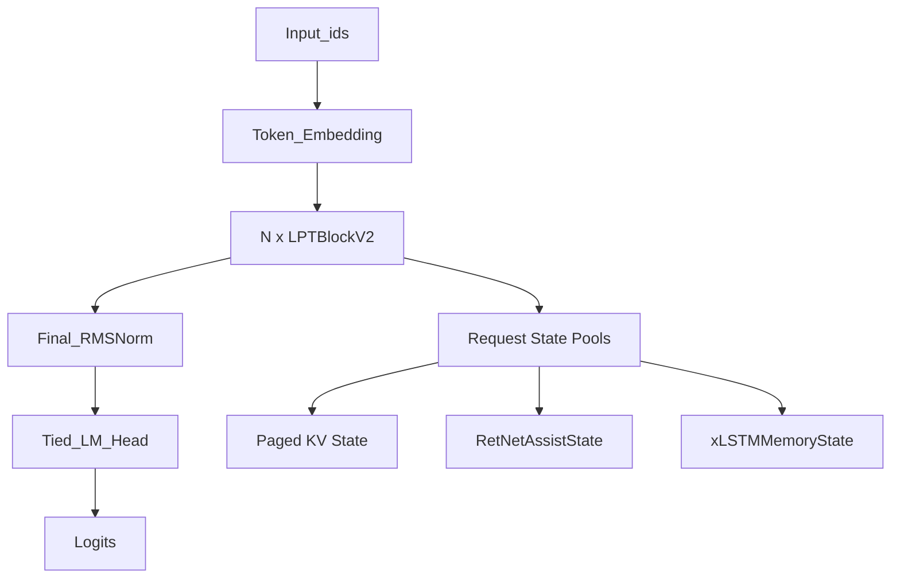
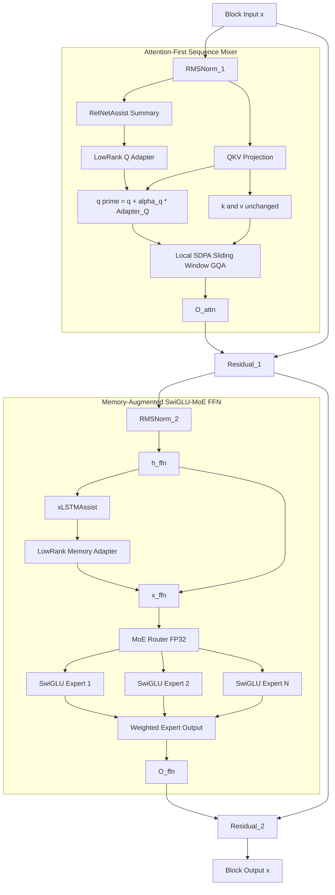
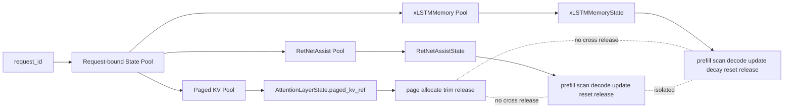

# LPT v2 模型定型方案

## 开发分支边界

- LPT v2 是独立模型开发分支，以 `architecture_version="lpt_v2"` 和 `model_config_schema_version=2` 作为唯一结构入口。
- LPT v2 不兼容 LPT v1 checkpoint、LPT v1 `ModelConfig`、旧参数名、旧训练 recipe 或旧推理加载路径。
- LPT v2 loader 对 schema、architecture version、block type、attention/cache backend、MoE/xLSTMMemory 配置执行严格校验。
- LPT v2 不提供自动迁移、参数名映射或隐式 fallback，以最干净的 v2 schema 实现训练、推理、评测和 checkpoint。
- 开发测试默认使用最小规格 `lpt_v2_dev_tiny`，功能闭环通过后再切换到更大规格。
- LPT v1 / ds-token 分支内容(`.tmp_lpt_v1_ds_archive`)只作为本地只读归档参考，归档目录不进入版本控制，也不得作为运行时 import 依赖。
- 若 LPT v2 需要复用 v1 基础件，必须从归档中复制到 v2 正式模块，并按 v2 命名、配置、状态和测试边界改造后再使用；禁止为了复用而保留 v1 兼容分支或跨目录依赖。

## 模型架构

LPT v2 定型为 `Attention-First + RetNetAssist-Q + Paged KV + Memory-Augmented SwiGLU-MoE`。

核心结构：

- `Local SDPA Attention` 是当前定型的唯一 sequence mixer 主干。
- `Paged KV Cache` 只保存局部窗口内真实 token 的 `K/V`。
- `Paged KV Cache` 只用于 prefill/decode 状态续接；训练 forward 固定关闭 KV cache，不向 page pool 写入训练 K/V。
- `RetNetAssist` 只维护轻量全局摘要，并通过低秩 `Q Adapter` 调制当前 token 的 `query`。
- `RetNetAssist` 不调制 `key/value`，不写入 Paged KV，不直接注入 block 输出。
- `RetNetAssist` 参数跨层共享，状态按启用层或 layer group 独立维护。
- `RetNetAssist` 与 `xLSTMAssist` 使用独立 request-bound state pool，Paged KV page 裁剪不触发 Assist state 释放或重置。
- `RetNetAssist` 只读取 Attention 前的归一化特征，`xLSTMAssist` 只读取 FFN 前的归一化特征，两条记忆路径不互相消费对方状态。
- FFN 层使用同质 `SwiGLU-MoE`，所有 MoE experts 都是无状态 SwiGLU。
- `SwiGLU-MoE` 运行时按 router top-k 稀疏执行，只计算当前 token 命中的 experts；未命中的 experts 不参与当前 batch 的前向与反向计算。
- `xLSTMAssist` 是 FFN 侧外挂记忆模块，在启用层确定性更新状态，并通过低秩 adapter 生成 `x_ffn`。
- `xLSTMAssist` 不作为 MoE expert 或 router target，不作为独立主干层，不进入 Paged KV，不影响 Attention cache。
- MoE router 与 SwiGLU experts 使用 memory-augmented `x_ffn`。

架构标识：

```text
architecture_version = "lpt_v2"
model_config_schema_version = 2
block_type = "lpt_attention_retnet_q_adapter"
sequence_mixer_mode = "local_attention_with_retnet_q_adapter"
default_model_size_preset = "lpt_v2_dev_tiny"
```

## LPT v2 架构全景图

```text
Input_ids
  │
  ▼
Token_Embedding
  │
  ├──────────────────────────────────────────────────────────────┐
  │                 循环 N 层：LPTBlockV2                         │
  ▼                                                              │
RMSNorm_1                                                        │
  │                                                              │
  ▼                                                              │
╔════════════════════════════════════════════════════════════════╗ │
║ Attention-First Sequence Mixer                                 ║ │
║ Local SDPA Attention 主干 + RetNetAssist Q-only 低秩辅助         ║ │
╠════════════════════════════════════════════════════════════════╣ │
║                                                                ║ │
║ [RetNetAssist，全局轻量摘要]                                  ║ │
║   s_t = SharedRetNetSummary(s_{t-1}, x_norm)                   ║ │
║   z_t = LowRankProject(s_t)                                    ║ │
║   参数: 跨层共享；支持按 layer group 共享                       ║ │
║   状态: 按启用层或 layer group 独立维护                        ║ │
║   Prefill: SP-compatible parallel/chunkwise scan                ║ │
║   Decode: recurrent update                                     ║ │
║   状态: RetNetAssistState                                      ║ │
║   边界: 不生成完整 RetNet 分支，不进入 Paged KV                 ║ │
║                                                                ║ │
║ [QKV Projection + Q Adapter]                                   ║ │
║   q, k, v = Linear_QKV(x_norm)                                 ║ │
║   q' = q + alpha_q_fp32 * Adapter_Q(z_t)                       ║ │
║   k  = k                                                       ║ │
║   v  = v                                                       ║ │
║   约束: 只改当前 q，不改 k/v，不回写已缓存 KV page               ║ │
║                                                                ║ │
║ [LocalSDPAAttentionMixer]                                      ║ │
║   位置: LongRoPE2                                              ║ │
║   注意力: sliding window causal GQA                            ║ │
║   后端: PyTorch SDPA                                           ║ │
║   状态: AttentionLayerState.paged_kv_ref                       ║ │
║   Paged KV: 只保存真实 token 的局部 K/V                         ║ │
║   输出: O_attn                                                 ║ │
╚════════════════════════════════════════════════════════════════╝ │
  │                                                              │
  ▼                                                              │
Residual_1: x = x + O_attn                                       │
  │                                                              │
  ▼                                                              │
RMSNorm_2                                                        │
  │                                                              │
  ▼                                                              │
╔════════════════════════════════════════════════════════════════╗ │
║ Memory-Augmented SwiGLU-MoE FFN Layer                          ║ │
║ 同质 MoE 专家 + xLSTM 外挂记忆辅助                              ║ │
╠════════════════════════════════════════════════════════════════╣ │
║ [xLSTMAssist，可选外挂记忆]                                    ║ │
║   h_ffn = RMSNorm_2(x)                                         ║ │
║   m_t = xLSTM(m_{t-1}, h_ffn)                                  ║ │
║   u_t = LowRankProject(m_t)                                    ║ │
║   x_ffn = h_ffn + beta_fp32 * Adapter_Mem(u_t)                 ║ │
║   Prefill: chunkwise recurrent scan                            ║ │
║   Decode: recurrent update                                     ║ │
║   连续性: prefill_to_decode                                    ║ │
║   状态: xLSTMMemoryState                                       ║ │
║                                                                ║ │
║ Router(input = x_ffn)                                          ║ │
║   logits 使用 FP32                                             ║ │
║   ├── SwiGLU Expert #1                                         ║ │
║   ├── SwiGLU Expert #2                                         ║ │
║   ├── ...                                                      ║ │
║   └── SwiGLU Expert #N                                         ║ │
║                                                                ║ │
║ xLSTMAssist 状态策略: selected_layers / every_n_layers         ║ │
║ xLSTMAssist 状态粒度: 按启用层独立                              ║ │
║ xLSTMAssist 遗忘策略: token interval decay + boundary zero reset║ │
╚════════════════════════════════════════════════════════════════╝ │
  │                                                              │
  ▼                                                              │
Residual_2: x = x + O_ffn                                        │
  │                                                              │
  └──────────────────────────────────────────────────────────────┘
  │
  ▼
Final_RMSNorm
  │
  ▼
Tied_LM_Head
  │
  ▼
Logits
```

## LPT v2 Mermaid 运行流程图


```mermaid
flowchart TD
    input["Input_ids"] --> embed["Token_Embedding"]
    embed --> blocks["N x LPTBlockV2"]
    blocks --> norm["Final_RMSNorm"]
    norm --> head["Tied_LM_Head"]
    head --> logits["Logits"]

    blocks --> state_pool["Request State Pools"]
    state_pool --> paged_kv["Paged KV State"]
    state_pool --> retnet_state["RetNetAssistState"]
    state_pool --> xlstm_state["xLSTMMemoryState"]
```

## LPTBlockV2 Mermaid 结构图


```mermaid
flowchart TD
    x0["Block Input x"] --> norm1["RMSNorm_1"]

    subgraph attn["Attention-First Sequence Mixer"]
        norm1 --> retnet["RetNetAssist Summary"]
        retnet --> q_adapter["LowRank Q Adapter"]
        norm1 --> qkv["QKV Projection"]
        qkv --> q_update["q prime = q + alpha_q * Adapter_Q"]
        q_adapter --> q_update
        qkv --> kv["k and v unchanged"]
        q_update --> local_attn["Local SDPA Sliding Window GQA"]
        kv --> local_attn
        local_attn --> o_attn["O_attn"]
    end

    o_attn --> res1["Residual_1"]
    x0 --> res1
    res1 --> norm2["RMSNorm_2"]

    subgraph ffn["Memory-Augmented SwiGLU-MoE FFN"]
        norm2 --> h_ffn["h_ffn"]
        h_ffn --> xlstm["xLSTMAssist"]
        xlstm --> mem_adapter["LowRank Memory Adapter"]
        h_ffn --> x_ffn["x_ffn"]
        mem_adapter --> x_ffn
        x_ffn --> router["MoE Router FP32"]
        router --> expert1["SwiGLU Expert 1"]
        router --> expert2["SwiGLU Expert 2"]
        router --> expertn["SwiGLU Expert N"]
        expert1 --> moe_out["Weighted Expert Output"]
        expert2 --> moe_out
        expertn --> moe_out
        moe_out --> o_ffn["O_ffn"]
    end

    o_ffn --> res2["Residual_2"]
    res1 --> res2
    res2 --> x1["Block Output x"]
```

## LPT v2 状态池隔离图


```mermaid
flowchart LR
    request["request_id"] --> pool["Request-bound State Pool"]

    pool --> kv_pool["Paged KV Pool"]
    pool --> ret_pool["RetNetAssist Pool"]
    pool --> mem_pool["xLSTMMemory Pool"]

    kv_pool --> kv_state["AttentionLayerState.paged_kv_ref"]
    ret_pool --> ret_state["RetNetAssistState"]
    mem_pool --> mem_state["xLSTMMemoryState"]

    kv_state --> kv_life["page allocate trim release"]
    ret_state --> ret_life["prefill scan decode update reset release"]
    mem_state --> mem_life["prefill scan decode update decay reset release"]

    kv_life -. no cross release .- ret_life
    kv_life -. no cross release .- mem_life
    ret_life -. isolated .- mem_life
```

## 配置字段

```text
model_size_preset = "lpt_v2_dev_tiny | lpt_v2_small | lpt_v2_base | lpt_v2_large"
default_model_size_preset = "lpt_v2_dev_tiny"
parameter_count_policy = "moe_aware"
parameter_count_modes = ["total_physical_params", "active_params_per_token", "shared_params", "expert_params", "router_params", "adapter_params", "state_runtime_bytes"]

attention_backend_policy = "auto"
attention_backend_priority = ["sdpa"]
attention_window_size = 2048 | 4096
attention_is_causal = true
attention_position_encoding = "longrope2"

cache_backend = "paged_kv"
kv_cache_scope = "local_real_tokens_only"
page_block_size = 256
cla_share_every_n_layers = 1

retnet_assist_enabled = true
retnet_assist_mode = "q_adapter"
retnet_assist_layers = "every_4_layers | selected_layers | all_layers"
retnet_parameter_sharing = "global | group"
retnet_state_sharing = "group | per_layer"
retnet_prefill_scan_policy = "sp_compatible_chunkwise_scan"
retnet_sequence_parallel_policy = "ring_state_handoff | disabled"
retnet_sp_handoff_metrics_enabled = true
retnet_state_lifecycle = "request_bound_state_pool"
retnet_state_dim = 64 | 128
retnet_adapter_rank = 16 | 32
retnet_adapter_target = ["q"]
retnet_adapter_alpha_q_init = 1e-4
retnet_adapter_alpha_q_dtype = "fp32"
retnet_adapter_alpha_q_trainable = true
retnet_k_adapter_enabled = false
retnet_context_adapter_enabled = false
retnet_context_adapter_alpha = 0.0 -> learnable
retnet_enters_paged_kv = false
retnet_kv_replacement = false
attention_logit_bias_from_retnet = false

ffn_type = "memory_augmented_swiglu_moe"
moe_num_experts = 8
moe_top_k = 2
moe_router_dtype = "fp32"
moe_load_balance_loss_enabled = true
moe_router_z_loss_enabled = true
moe_router_input_mode = "memory_augmented_input | ffn_norm_only_eval"

xlstm_memory_enabled = false | true
xlstm_memory_mode = "ffn_input_adapter"
xlstm_memory_layers = "disabled | all_layers | every_n_layers | every_2_layers | every_4_layers | selected_layers"
xlstm_memory_selected_layers = []
xlstm_memory_state_dim = 64 | 128
xlstm_memory_adapter_rank = 16 | 32
xlstm_memory_adapter_beta_init = 1e-4
xlstm_memory_adapter_beta_dtype = "fp32"
xlstm_memory_adapter_beta_policy = "fp32_sigmoid_clamped"
xlstm_memory_adapter_beta_range = [1e-5, 1.0]
xlstm_memory_as_router_target = false
xlstm_memory_gate_enabled = false
xlstm_memory_gate_mode = "input_conditioned_eval"
xlstm_memory_granularity = "selected_layers | every_n_layers | local_global_eval"
xlstm_memory_prefill_policy = "chunkwise_recurrent_scan"
xlstm_memory_state_continuity = "prefill_to_decode"
xlstm_memory_state_lifecycle = "request_bound_state_pool"
xlstm_memory_update_policy = "deterministic_on_enabled_layers"
xlstm_memory_state_policy = "window_decay_and_boundary_reset"
xlstm_memory_state_window_size = 4096 | 8192 | null
xlstm_memory_decay_counter_unit = "tokens"
xlstm_memory_state_decay_interval = 1024 | 2048
xlstm_memory_state_decay_factor = 0.95 | 0.98
xlstm_memory_reset_trigger_mode = ["boundary_metadata", "special_token", "session_event"]
xlstm_memory_reset_boundary_policy = ["document", "file", "chapter", "session_reset"]
xlstm_memory_boundary_token_ids = []
xlstm_memory_reset_action = "zero_state"
xlstm_memory_as_expert = false
xlstm_expert_count = 0
xlstm_as_standalone_block = false
moe_router_warmup_policy = "standard_balance_only"
```

## 配置约束

- `moe_router_input_mode` 是 Router 是否读取记忆调制输入的唯一控制项。
- `xlstm_memory_enabled=false` 时，`xlstm_memory_layers="disabled"`，`moe_router_input_mode="ffn_norm_only_eval"`。
- `xlstm_memory_enabled=true` 且启用层非空时，`moe_router_input_mode="memory_augmented_input"`。
- `xlstm_memory_layers="selected_layers"` 时必须配置 0 基索引的 `xlstm_memory_selected_layers`；其它策略下该字段必须为空。
- `every_n_layers` 是历史兼容别名，当前按每 1 层启用处理；正式层频率实验使用 `every_2_layers`、`every_4_layers` 这类显式策略。
- `xlstm_memory_as_router_target=false` 表示 xLSTMAssist 不参与 expert 选择目标，与 Router 输入模式独立。
- `retnet_state_sharing` 只允许 `group` 或 `per_layer`，所有 RetNetAssist state 都绑定 request state pool。
- `xlstm_memory_state_decay_interval` 按 token 计数触发；边界 reset 使用 `zero_state`。
- `Paged KV`、`RetNetAssistState`、`xLSTMMemoryState` 三类状态池独立分配、独立释放。
- `ModelConfig` 由 `model_size_preset` 展开为完整显式字段，checkpoint 保存展开后的完整配置和 preset 标识。
- 参数量统计统一使用 MoE-aware 口径，区分物理总参数、每 token 激活参数、共享参数、专家参数、router 参数、adapter 参数和运行态 state bytes。
- MoE experts 的物理参数按全部 experts 计入 `total_physical_params`，每 token 激活参数按 `top_k` 与实际启用专家计入 `active_params_per_token`。

## 训练运行约束

- 训练 forward 使用 `use_kv_cache=false`，不创建 `AttentionLayerState.paged_kv_ref`，也不保存 dense K/V state；prefill/decode 默认继续使用 KV cache。
- 训练 LM loss 使用分块 cross entropy，避免一次性构造完整 `batch * sequence_length * vocab_size` 的 FP32 logits 副本。
- MoE 前向只执行 router top-k 命中的 SwiGLU experts；参数统计仍按全部 experts 计算物理参数，激活参数和计算开销按 `top_k` 计算。
- 训练日志必须记录当前 batch 的 `sequence_length`；CUDA 训练时额外记录 `cuda_memory_allocated_mib`、`cuda_memory_reserved_mib` 和 `cuda_peak_memory_allocated_mib`，用于定位长样本触发的显存峰值。

## 模型规格预设

| preset | 用途 | layers | hidden_size | heads / kv_heads | experts / top_k | attention_window |
|---|---|---:|---:|---:|----------------:|---:|
| `lpt_v2_dev_tiny` | 默认开发测试 | 4 | 256 | 4 / 2 | 2 / 1 | 512 |
| `lpt_v2_small` | 单机功能验证 | 12 | 768 | 12 / 4 |  4 / 2 | 2048 |
| `lpt_v2_small_base` | 小规格单机主训练规格 | 24 | 1024 | 16 / 4 | 6 / 2 | 2048 |
| `lpt_v2_base` | 主训练规格 | 24 | 1536 | 16 / 4 | 8 / 2 | 4096 |
| `lpt_v2_large` | 扩展训练规格 | 32 | 2048 | 32 / 8 | 8 / 2 | 4096 |

规格约束：

- `lpt_v2_dev_tiny` 是代码开发、单元测试、shape 测试、checkpoint schema 测试的默认规格。
- 所有规格共享同一 `LPTBlockV2`、Attention backend、Paged KV、RetNetAssist、SwiGLU-MoE 与 xLSTMAssist 配置语义。
- 规格预设只负责生成初始 `ModelConfig`，训练恢复和推理加载以 checkpoint 内的完整 `model_config` 快照为准。

## 运行 Profile

- `lpt_v2_bootstrap`
  - Local Attention + SDPA + Dense KV。
  - `retnet_assist_enabled=false`。
  - `moe_num_experts=1`。
  - `xlstm_memory_enabled=false`。
  - `moe_router_input_mode="ffn_norm_only_eval"`。

- `lpt_v2_sdpa_local`
  - Local SDPA Attention + Dense KV。
  - 用于验证 SDPA 后端、窗口 mask、GQA、LongRoPE2。

- `lpt_v2_paged_kv`
  - Local SDPA Attention + Paged KV。
  - 用于验证分页缓存、释放、reset、window page 裁剪。

- `lpt_v2_assist`
  - Local SDPA Attention + Paged KV + Shared RetNetAssist Q Adapter。
  - `retnet_adapter_target=["q"]`。
  - `retnet_k_adapter_enabled=false`。

- `lpt_v2_base`
  - `lpt_v2_assist` + MoE SwiGLU。
  - `moe_num_experts=8`。
  - `xlstm_memory_enabled=false`。
  - `moe_router_input_mode="ffn_norm_only_eval"`。

- `lpt_v2_memory`
  - `lpt_v2_base` + xLSTMAssist FFN 输入外挂记忆。
  - 所有 MoE experts 仍为 SwiGLU。
  - `moe_router_input_mode="memory_augmented_input"`。
  - `xlstm_memory_state_continuity="prefill_to_decode"`。
  - 必须启用状态 decay、边界 reset、request state pool 和专项评测。

## 任务清单

## P0：配置与状态骨架

- [x] 1. 定义 `ModelConfig` v2 字段
  - 字段范围：`architecture_version`、`block_type`、`sequence_mixer_mode`、`attention_backend_policy`、`attention_window_size`、`cache_backend`、`page_block_size`、`retnet_assist_*`、`moe_*`、`xlstm_memory_*`。
  - 成功标准：配置可 JSON 序列化，checkpoint 可严格恢复，不兼容 schema 被明确拒绝。
  - 当前结果：`lpt_config/model_config.py` 已升级到 `model_config_schema_version=2`，新增 v2 架构、规格 preset、参数统计口径、Attention backend、Paged KV、RetNetAssist、MoE 与 xLSTMAssist 配置字段，并加入 v2 约束校验；checkpoint 继续按当前 schema 严格拒绝不兼容配置。

- [x] 2. 定义 `LayerStateV2`
  - 状态类型：`AttentionLayerState`、`RetNetAssistState`、`MoELayerState`、`xLSTMMemoryState`。
  - 成功标准：RetNetAssist state、Paged KV ref、xLSTMMemoryState 物理隔离；RetNetAssist/xLSTM state 支持 request_id 绑定和释放元数据；Paged KV 裁剪不会释放或重置 Assist state。
  - 当前结果：`lpt_model/state_v2.py` 已定义 request-bound 状态骨架、Paged KV 引用、Assist 释放元数据和裁剪接口；测试覆盖 Paged KV 裁剪不释放 RetNetAssist/xLSTM 状态。

- [x] 3. 定义 Attention backend 抽象
  - 支持：当前定型默认 `sdpa`；`flash_attention_3 / flash_attention_2` 只作为后续性能评估候选保留在 capability 描述中。
  - capability：training、prefill、decode_kvcache、paged_kv、sliding_window、GQA、LongRoPE2、dtype、platform。
  - 成功标准：后端选择可测试、可记录、可降级。
  - 当前结果：`lpt_runtime/attention_backend.py` 已定义后端 capability、环境探测、自动/固定策略选择和可落盘决策日志；`ModelConfig` 默认 priority 固定为 `("sdpa",)`，避免环境差异静默切换后端；测试覆盖 SDPA 默认、固定 FA 后端不静默降级和显式 capability 过滤。

- [x] 4. 固化 CLA 共享策略
  - 配置值：`cla_share_every_n_layers=1`。
  - 成功标准：v2 的 Attention 层不共享 KV。
  - 当前结果：`ModelConfig` v2 默认并强制 `cla_share_every_n_layers=1`，且 v2 主干 `layer_block_types` 必须全部为 `attention`；v1 Hybrid/RetNet 主干已移入本地归档目录，不再保留主线兼容配置。

- [x] 5. 定义 LPT v2 多规格 `ModelConfig` 预设
  - 范围：`lpt_v2_dev_tiny`、`lpt_v2_small`、`lpt_v2_base`、`lpt_v2_large`；默认 preset 为 `lpt_v2_dev_tiny`。
  - 成功标准：每个 preset 可展开为完整 `ModelConfig`；默认无参数运行使用最小规格；checkpoint 保存完整展开配置和 preset 标识。
  - 当前结果：`ModelConfig()` 默认展开为 `lpt_v2_dev_tiny`；`build_lpt_v2_model_config_preset()` / `ModelConfig.from_preset()` 支持四档规格展开，配置快照包含完整字段和 `model_size_preset` 标识。

- [x] 6. 实现 MoE-aware 模型参数统计器
  - 范围：统计 `total_physical_params`、`active_params_per_token`、`shared_params`、`expert_params`、`router_params`、`adapter_params`、`state_runtime_bytes`。
  - 成功标准：MoE experts 的物理参数按全部 experts 计入总参数；每 token 激活参数按 `top_k` 计入；报告能区分 Dense 层、Attention、RetNetAssist、SwiGLU experts、Router、xLSTMAssist 与 adapter 参数。
  - 当前结果：`lpt_model/parameter_count.py` 已实现 `estimate_moe_aware_parameter_counts()`，报告区分物理总参数、每 token 激活参数、共享参数、专家参数、router 参数、adapter 参数和运行态 state bytes，并提供模块级 breakdown。

## P1：主干模型实现

- [x] 7. 实现 `LPTBlockV2`
  - 范围：LocalAttentionMixer 主干 + Shared RetNetAssist Q Adapter + Memory-Augmented SwiGLU-MoE FFN 接口。
  - 成功标准：forward、prefill、decode 形状正确，状态更新正确。
  - 当前结果：`lpt_model/model_v2.py` 已实现 `LPTBlockV2` 与 `LPTV2`，支持 prefill/decode、训练禁用 KV cache、request-bound `LayerStateV2` 更新、Attention/RetNetAssist/MoE/xLSTM 状态组合和 tied LM head；新增测试覆盖 forward 形状、decode 续接、训练无 KV cache 和状态更新。

- [x] 8. 实现 Shared RetNetAssist
  - 范围：跨层共享参数、可选 group sharing、低维 state、按层或按 layer group 维护状态、SP-compatible parallel/chunkwise prefill、recurrent decode。
  - 成功标准：prefill 不走串行 token 循环；Sequence Parallel 下 state 依赖能沿切分边界传递；decode 可增量更新；`ring_state_handoff` 延迟和吞吐影响可报告。
  - 当前结果：`SharedRetNetAssist` 作为跨层共享模块接入每个 `LPTBlockV2`，prefill 使用向量化 `cumsum` 维护低维摘要，decode 通过上一轮 `RetNetAssistState` 增量更新；状态按 request/layer 绑定且独立于 Paged KV。真实跨 rank `ring_state_handoff` 指标仍留给后续分布式评测接入。

- [x] 9. 实现 Q-only Adapter
  - 公式：`q' = q + alpha_q * Adapter_Q(z_t)`。
  - 配置：`alpha_q` 使用 FP32 trainable scale，初始化为 `1e-4`，`k/v` 不改。
  - 成功标准：纯 Attention 初始行为可近似复现；BF16 混合精度下 alpha 不会停在 0；adapter alpha、范数、启用层可观测。
  - 当前结果：`QOnlyRetNetAdapter` 只调制当前 query，不修改 key/value，也不回写 KV cache；`alpha_q` 以 FP32 参数保存，并在模块 dtype 转换后保持 FP32。测试覆盖跨层共享 Assist、Q-only 配置约束和 FP32 scale。

- [x] 10. 实现 Local SDPA Attention
  - 范围：sliding window、causal、GQA、LongRoPE2、Dense KV / Paged KV materialize fallback。
  - 成功标准：SDPA 后端在 CPU/CUDA、FP32/FP16/BF16 下形状、窗口 mask、GQA、LongRoPE2 与 prefill/decode 行为可测。
  - 当前结果：`LocalAttentionMixerV2` 已实现 PyTorch SDPA 路径，覆盖 LongRoPE2、sliding-window causal mask、GQA、Paged KV 窗口裁剪和 Dense KV fallback；CUDA 实测通过 FP32、FP16、BF16 forward/backward。FA3/FA2 不再作为 P1 定型阻塞项，后移为 P3 可选性能评估。

- [x] 11. 接入 Paged KV Cache
  - 范围：block allocator、block table、cache seqlens、slot mapping、释放、reset、window page 裁剪。
  - 成功标准：单会话和多会话 decode 正确，无 page 泄漏；RetNetAssist 不进入 page 池；window page 裁剪不影响 RetNetAssistState 与 xLSTMMemoryState。
  - 当前结果：`PagedKVCache` 已实现轻量 page pool、layer block table、按窗口裁剪、request reset 与 dense cache fallback；Paged KV 只保存 prefill/decode 的局部 K/V，训练 forward 关闭 KV cache 且不分配 page，RetNetAssist/xLSTM 状态不进入 page 池。测试覆盖窗口裁剪、decode 续接、训练无 page 分配、reset 释放 page 且不释放 RetNetAssist。

- [x] 12. 引入同质 SwiGLU-MoE
  - 范围：先 `num_experts=1`，再 `num_experts=4/8`、top-k=2；所有 experts 均为 SwiGLU。
  - 成功标准：router 统计可落盘，checkpoint schema 能保存和恢复 experts。
  - 当前结果：`SwiGLUMoE` 已作为 v2 FFN 接入，router logits 使用 FP32，所有 expert 均为无状态 `SwiGLU`，支持 `moe_num_experts` 与 `moe_top_k`；前向只执行 top-k 命中的 experts，不再为未命中 experts 生成反向图；`MoELayerState` 记录 expert token counts、router entropy、load balance loss 和 router z-loss，配置快照可保存/恢复 expert 数与 top-k。

## P2：评测与治理

- [x] 13. 建立 LPT v2 对比基线
  - 对比项：`lpt_v2_bootstrap`、`lpt_v2_sdpa_local`、`lpt_v2_paged_kv`、`lpt_v2_assist`、`lpt_v2_base`、`lpt_v2_memory`。
  - 成功标准：输出统一 JSON / Markdown 报告。
  - 当前结果：`lpt_eval/profiles.py` 固化 6 个 v2-only profile，`lpt_eval/baseline.py` 与 `tools/run_lpt_v2_baselines.py` 可生成统一 JSON / Markdown 报告，覆盖 logits shape、next-token loss/PPL、Paged KV page/bytes、RetNet/xLSTM token count 和 MoE router 统计。

- [x] 14. 完成长上下文准入
  - 指标：needle、长文本 PPL、QA/retrieval、代码/数学、格式遵循。
  - 成功标准：证明 Q-only RetNetAssist 对局部窗口裁剪有收益，或明确关闭/降频。
  - 当前结果：`lpt_eval/long_context.py` 与 `tools/run_lpt_v2_long_context_eval.py` 已实现 needle、长文本 PPL、QA/retrieval 代理指标、code/math 代理指标、format following 代理指标和 Q-only RetNetAssist 机制差异报告，并支持真实 checkpoint 与 `needle_depth`。`lpt_eval/long_context_suite.py` 与 `tools/run_lpt_v2_long_context_suite.py` 已支持多 `seq_len / attention_window / needle_depth` 组合评测。当前随机初始化模型只允许输出机制准入结论；质量收益必须加载训练 checkpoint 后再正式判定，报告不会伪造收益。

- [x] 15. 完成资源指标准入
  - 指标：prefill tokens/sec、decode tokens/sec、首 token 延迟、每层耗时、显存峰值、训练 `sequence_length`、训练 CUDA allocated/reserved/peak memory、RetNetAssist state bytes、xLSTMMemoryState bytes、Paged KV page bytes、MoE router entropy、expert load balance loss、router z_loss。
  - 成功标准：RetNetAssist 额外开销可量化，当前配置收益大于成本。
  - 当前结果：`lpt_eval/resource.py` 与 `tools/run_lpt_v2_resource_report.py` 已输出 prefill/decode 吞吐、首 token 延迟、每层耗时、CUDA peak memory、RetNet/xLSTM state bytes、Paged KV page bytes 和 MoE router 指标；训练循环已输出 `sequence_length` 和 CUDA allocated/reserved/peak memory，用于定位长样本或大 vocab loss 触发的 OOM；收益大于成本的最终判定仍依赖训练后质量报告与资源报告联合评估。

- [x] 16. 实现 RetNetAssist State Pool
  - 范围：request_id 绑定、prefill/decode 状态切换、preempt 保留、reset/release 归还、连续批处理生命周期元数据。
  - 成功标准：多 request 混合 prefill/decode 时状态不串线；request 结束后无 RetNetAssist state 泄漏。
  - 当前结果：`lpt_model/state_pool_v2.py` 已实现 `RetNetAssistStatePool` 和生命周期元数据，支持 request_id 隔离、prefill/decode phase、preempt 保留、reset/release、runtime metadata；`LPTV2.prefill()` / `LPTV2.decode()` 接入状态池，测试覆盖多 request 混合 prefill/decode 与按 request release。

- [x] 17. 完成 checkpoint schema v2
  - 范围：architecture version、attention/cache backend、Paged KV runtime metadata、RetNetAssist state schema、MoE/xLSTM memory 配置。
  - 成功标准：loader 严格拒绝 schema 不匹配 checkpoint。
  - 当前结果：`lpt_model/checkpoint_v2.py` 已实现 `checkpoint_format="lpt_v2_checkpoint"`、`checkpoint_schema_version=2`、`architecture_version="lpt_v2"`、完整 `model_config` 快照、attention/cache/runtime metadata、LayerStateV2 schema 元数据和严格 loader；测试覆盖 schema/architecture 不匹配拒绝与保存加载 round-trip。

- [x] 18. 更新 `help/命令.md`
  - 范围：新增 v2 训练、推理、评测、SDPA、Paged KV、RetNetAssist、SwiGLU-MoE、xLSTMMemory 参数；FA2/FA3 仅作为后续可选性能评估参数记录。
  - 成功标准：正式命令与 CLI 参数一致。
  - 当前结果：`help/命令.md` 已同步 v2-only 训练 smoke、token-id 推理、profile 基线、长上下文准入、长上下文 suite、LongRoPE2 factor sweep、sequence packing benchmark、资源报告、checkpoint 保存/校验命令及参数；FA2/FA3 明确保留为 P3 后续性能评估项。

## P3：外挂记忆与扩展实验

### P3 单项分支实验规范

22、23、24、26、27 必须使用训练后的 `artifacts/lpt_v2/text_pretrain` 作为共同基座模型，分别建立单项实验分支继续训练，禁止在同一分支中同时打开多个机制后再归因。

统一分支规则：

- 基座 checkpoint：使用同一个已完成训练的 `artifacts/lpt_v2/text_pretrain` checkpoint，报告中必须记录绝对或仓库相对路径、schema、`global_step`、`optimizer_step`、`tokens_seen`、tokenizer metadata、source/eval manifest。
- 统一使用chat SFT 工作流训练，数据集配置:`data/manifests/chat_sft.json`
- 分支初始化：加载 base 可匹配权重，新模块按小 scale 或默认初始化；必须记录 missing/unexpected keys、初始化策略和配置 diff。
- 训练控制变量：数据集、tokenizer、训练 token 数、epoch/max_steps、learning rate schedule、batch size、gradient accumulation、sequence length、LongRoPE2 设置、seed、硬件和 dtype 保持一致。
- 对比方式：每个分支至少与同等训练预算的 base-continued 对照比较，避免把“多训练了一段”的收益误判为结构收益。
- 通过条件：质量收益、收敛稳定性、显存/吞吐成本和机制指标均满足报告标准后，才允许进入组合实验或主干候选。

单项分支矩阵：

| 任务 | 分支名建议 | 只允许变化的变量 | 必须对比的基线 |
|---|---|---|---|
| 22 | `exp_22_xlstm_memory_gate` | xLSTMAssist 输入 gate；输出 gate 只能作为独立子实验 | base-continued、无 gate xLSTM |
| 23 | `exp_23_xlstm_granularity` | xLSTM 启用层/状态粒度 | base-continued、默认 xLSTM memory |
| 24 | `exp_24_qk_adapter` | RetNetAssist 从 Q-only 扩展到 Q/K adapter | base-continued、Q-only RetNetAssist |
| 26 | `exp_26_retnet_layers_rank` | RetNetAssist 启用层策略或 rank；一次只改一个维度 | base-continued、当前 all_layers/rank16 |
| 27 | `exp_27_context_adapter` | RetNetContextAdapter 注入路径与 scale | base-continued、Q-only RetNetAssist |

每一项都必须生成独立实验报告，报告放在 `help/LPTv2扩展实验/` 下，命名建议：

```text
help/LPTv2扩展实验/22_xlstm_memory_gate/LPTv2_22_xlstm_memory_gate_实验报告.md
help/LPTv2扩展实验/23_xlstm_granularity/LPTv2_23_xlstm_granularity_实验报告.md
help/LPTv2扩展实验/24_qk_adapter/LPTv2_24_qk_adapter_实验报告.md
help/LPTv2扩展实验/26_retnet_layers_rank/LPTv2_26_retnet_layers_rank_实验报告.md
help/LPTv2扩展实验/27_context_adapter/LPTv2_27_context_adapter_实验报告.md
```

报告结构参考 v1 `GLM5.1及DS4的Tokenizer基准对比实验`，至少包含：

1. 摘要：一句话结论、是否进入下一阶段、核心收益/成本。
2. 实验目的：本项机制要回答的问题和不回答的问题。
3. 实验材料与环境：base checkpoint、分支初始化 checkpoint、数据 manifest、tokenizer metadata、硬件、dtype、依赖版本。
4. 方法：配置 diff、训练命令、评测命令、训练预算、随机种子、控制变量和失败重试策略。
5. 实验结果：训练/验证 loss、PPL、长上下文指标、资源指标、显存峰值、吞吐、router entropy、expert load balance loss、router z_loss、RetNet/xLSTM 状态与 adapter norm。
6. 讨论：收敛稳定性、质量收益归因、成本收益、退化样例、与 base-continued 的差异。
7. 结论：保留、放弃、继续扩大训练、进入组合实验四选一，并列出证据。
8. 附录：关键日志片段、checkpoint manifest、配置 JSON 摘要、命令记录和已知限制。

- [x] 19. 启用 xLSTMAssist 外挂记忆
  - 范围：FFN 输入 adapter、确定性启用层策略、低维 memory state、chunkwise recurrent prefill、prefill_to_decode 连续性、状态生命周期、窗口/重置策略、专项评测。
  - 成功标准：状态追踪类任务有可复现收益；不作为 MoE expert 或 router target；不污染 Attention/RetNetAssist 状态；prefill 不走不可控 Python 逐 token 循环。
  - 当前结果：`xLSTMMemoryAssist` 已作为 FFN 输入 adapter 接入 `LPTBlockV2`，使用向量化 chunkwise recurrent scan 维护低维 memory，支持 prefill_to_decode 连续性；`lpt_eval/memory.py` 与 `tools/run_lpt_v2_memory_eval.py` 提供 xLSTMAssist 专项评测，覆盖状态连续性、adapter 调制、Router 观测和 reset/decay 机制。xLSTM 仍不作为 MoE expert、router target 或独立 block，也不进入 Attention/Paged KV/RetNetAssist 状态。

- [x] 20. 实现 xLSTMAssist 状态池、衰减与边界重置
  - 范围：按 token interval 执行 `state *= decay_factor`，按 boundary metadata、special token、session event 执行 `zero_state` reset。
  - 成功标准：长文本状态污染、过度累积和显存占用可观测、可控制。
  - 当前结果：`xLSTMMemoryStatePool` 已实现 request_id 隔离、prefill/decode phase、preempt 保留、reset/release 与 runtime metadata；`xLSTMMemoryState` 记录 `decay_count`、`reset_count`、`last_reset_reason`、`last_decay_token_count` 和状态/adapter norm。模型 forward/prefill/decode 支持 `memory_boundary_metadata`、`xlstm_memory_boundary_token_ids` 和 `session_event` 三类 zero reset 触发。

- [x] 21. 实现 xLSTMAssist 输入适配器
  - 公式：`h_ffn = ffn_norm(x)`，`x_ffn = h_ffn + beta_fp32 * Adapter_Mem(u_t)`。
  - 配置：`beta=1e-4` FP32 trainable scale，effective beta 使用 FP32 sigmoid clamp。
  - 成功标准：标准 MoE 初始行为可近似复现；xLSTM memory adapter 的 beta、effective beta、范数、启用层可观测；Router 与 experts 使用 `x_ffn`，并提供 `ffn_norm_only_eval` 评估开关。
  - 当前结果：`xLSTMMemoryAssist` 使用 FP32 trainable raw beta，并通过 sigmoid range 映射保证初始 effective beta 约等于 `xlstm_memory_adapter_beta_init=1e-4`；状态记录 `effective_beta`、`memory_norm` 与 `adapter_delta_norm`。默认 memory 模式下 Router 与 SwiGLU experts 读取 `x_ffn`；`moe_router_input_mode="ffn_norm_only_eval"` 可在 xLSTM 继续更新状态时绕过 memory adapter 输入，用于评估对 MoE 路由和专家输出的影响。

- [x] 22. 评估 xLSTMAssist Memory Gate
  - 范围：输入记忆门控 `gate_m = sigmoid(W_gate(h_ffn))`，`x_ffn = h_ffn + beta_fp32 * Adapter_Mem(gate_m * u_t)`；输出门控评估 `O_ffn = gate_o ⊙ O_moe`。
  - 成功标准：基于训练后的 `artifacts/lpt_v2/text_pretrain` 建立 `exp_22_xlstm_memory_gate` 单项分支继续训练；只在状态追踪任务收益稳定且不造成 router collapse 时启用；输出门控不参与 expert 选择，仅做输出缩放，不计入省计算收益；必须产出对应实验报告。
  - 当前结果：已完成 `base_continued`、`exp_22_xlstm_no_gate`、`exp_22_xlstm_memory_gate` 三分支 chat SFT 对比，并完成带 `data/manifests/chat_sft_eval_exp22.json` 的完整 1164 step 补充实验。补实验显示 `base_continued_eval` 的 eval loss 最低，no-gate 次之，Memory Gate 最高；xLSTM 专项评测已通过机制观测，但 Memory Gate 未带来可验证质量收益，资源侧也没有足以抵消 eval 退化的稳定优势。结论为放弃当前输入 Memory Gate 方案，暂不默认启用，也不进入组合实验。

- [x] 23. 评估 xLSTMAssist 记忆粒度
  - 范围：`all_layers / every_2_layers / every_4_layers / selected_layers`、按启用层独立状态；local/global memory 留待模型 forward 接入后再做独立子实验。
  - 成功标准：基于训练后的 `artifacts/lpt_v2/text_pretrain` 建立 `exp_23_xlstm_granularity` 单项分支继续训练；每个分支 checkpoint 必须先通过只读 forward smoke，确认 logits finite、shape 正确、layer state 数量正确且 xLSTM state count 等于实际启用层数；再联合 eval loss、状态连续性、长上下文代理指标、吞吐和显存，找到质量收益与状态成本之间的最小可用配置；必须产出对应实验报告。
  - 当前结果：已完成 `base_continued`、`exp_23_xlstm_all_layers`、`exp_23_xlstm_every_2_layers`、`exp_23_xlstm_every_4_layers`、`exp_23_xlstm_selected_late_layers` 五分支 1164 step chat SFT 对比，并完成 checkpoint validate、真实 checkpoint forward smoke、长上下文代理、资源和 xLSTM 专项评测。`every_4_layers` 的 eval loss 最低，xLSTM state bytes 仅为全层方案的 25%，forward smoke 中 `xlstm_state_count=6/6`，资源与机制指标无阻塞异常，作为后续组合实验中的 xLSTM 记忆粒度候选；`every_2_layers` 保留为候补对照，`all_layers` 和 `selected_late_layers` 不进入后续组合实验。长上下文结果仍为 `close_or_debug`，因此本项不单独作为主干定型充分证据。

- [x] 24. 评估 K Adapter
  - 范围：比对 `q_adapter` 与 `qk_adapter`。
  - 成功标准：基于训练后的 `artifacts/lpt_v2/text_pretrain` 建立 `exp_24_qk_adapter` 单项分支继续训练；K 注入在 sliding window 下收益稳定且成本可控，才允许进入主干；必须产出对应实验报告。
  - 当前结果：已完成 `base_continued` 与 `exp_24_qk_adapter` 两分支 1164 step chat SFT 对比，并完成 checkpoint validate、真实 checkpoint forward smoke、长上下文代理和资源评测。Q/K 分支 eval loss 更低且 K adapter norm 可观测，但长上下文代理 loss 与 needle logprob 退化，router z-loss 明显升高；结论为暂不进入主干或组合实验，只作为归档对照保留。

- [ ] 25. 评估 RetNetAssist 参数与状态共享策略
  - 范围：参数 `global sharing / group sharing / per-layer`，状态 `group / per_layer`。
  - 成功标准：选择质量收益、状态语义和参数成本最优的共享策略。

- [ ] 26. 评估 RetNetAssist 启用层与 rank
  - 范围：`all_layers / every_2_layers / every_4_layers / selected_layers`，rank 8/16/32。
  - 成功标准：基于训练后的 `artifacts/lpt_v2/text_pretrain` 建立 `exp_26_retnet_layers_rank` 单项分支继续训练；一次只改启用层或 rank 一个维度，找到质量收益与计算成本的最小可用配置；必须产出对应实验报告。

- [ ] 27. 评估 RetNetContextAdapter
  - 范围：`x = x + alpha_context * Adapter_Context(z_t)` 或 FFN 输入调制，不新增第二套检索状态。
  - 成功标准：基于训练后的 `artifacts/lpt_v2/text_pretrain` 建立 `exp_27_context_adapter` 单项分支继续训练；若 Q-only 无法处理窗口外压缩内容，验证轻量上下文注入是否提升长上下文任务，且不破坏局部精确任务；必须产出对应实验报告。

- [ ] 28. 评估 CLA 共享
  - 范围：`cla_share_every_n_layers=2` 对照评估。
  - 成功标准：吞吐或显存收益大于质量损失，并通过 Paged KV alias/refcount/reset 测试。

- [ ] 29. 评估 prefix sharing 与 continuous batching
  - 范围：基于 Paged KV block table 做调度层扩展。
  - 成功标准：多会话吞吐提升，延迟、显存、page 复用指标可报告。

- [ ] 30. 评估 KV cache 量化
  - 范围：Paged KV page 级别量化，不影响 RetNetAssist state。
  - 成功标准：显存下降有报告，质量退化可量化。

- [ ] 31. 评估低秩统一状态 / MLA 类压缩
  - 范围：长期对照评估。
  - 成功标准：显存、吞吐、长上下文质量均优于当前 v2 主干，才允许进入下一轮定型讨论。
  
- [ ] 32. 评估 FA2/FA3 原生 Attention 后端
  - 范围：在具备对应依赖、CUDA 版本和 GPU 架构的 Linux 环境中接入 `flash_attention_2 / flash_attention_3` 原生 kernel，对比当前 SDPA 定型主干。
  - 成功标准：同权重同输入下 SDPA 与 FA logits 近似一致；sliding window、causal、GQA、LongRoPE2 行为一致；prefill/decode 吞吐、显存峰值和失败回退策略均有报告；收益明确大于环境复杂度后才允许重新进入主干。
